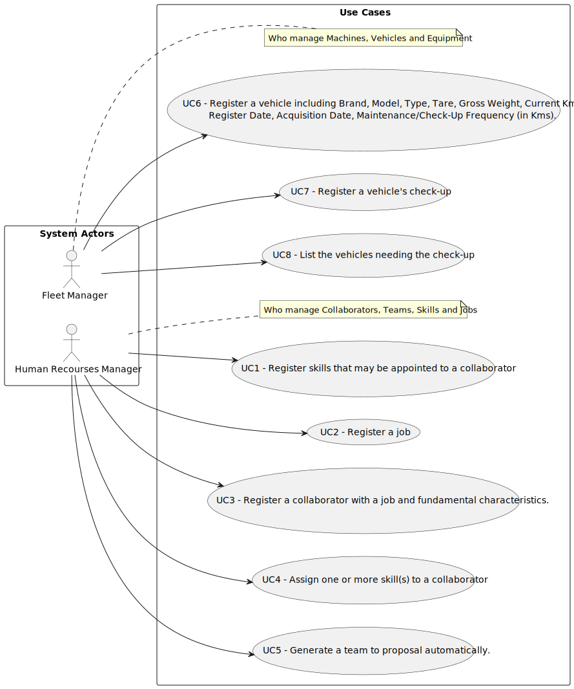

# Use Case Diagram (UCD)

**In the scope of this project, there is a direct relationship of _1 to 1_ between Use Cases (UC) and User Stories (US).**

However, be aware, this is a pedagogical simplification. On further projects and course units there may also exist _1 to N **and/or** N to 1_ relationships between UC and US.

**Insert below the Use Case Diagram in a SVG format**

**For each UC/US, it must be provided evidences of applying main activities of the software development process (requirements, analysis, design, tests and code). Gather those evidences on a separate file for each UC/US and set up a link as suggested below.**

# Use Cases / User Stories

| UC/US | Description                                                            |                   
|:------|:-----------------------------------------------------------------------|
| US001 | [Register a Skill](../../us001/01.requirements-engineering/Readme.md)                   |
| US002 | [Register a Job](../../../sprintA/us002/Readme.md)                     |
| US003 | [Register a Collaborator](../../us003/01.requirements-engineering/Readme.md)            |
| US004 | [Assign a skill to a Collaborator](../../us004/01.requirements-engineering/Readme.md)   |
| US005 | [Generate a Team Automatically](../../us005/01.requirements-engineering/Readme.md)      |
| US006 | [Register a Vehicle](../../../sprintA/us006/Readme.md)                 |
| US007 | [Register a Vehicle's Check Up](../../us007/01.requirements-engineering/Readme.md)      |
| US008 | [List the Vehicles needing Check-Up](../../us008/01.requirements-engineering/Readme.md) |

