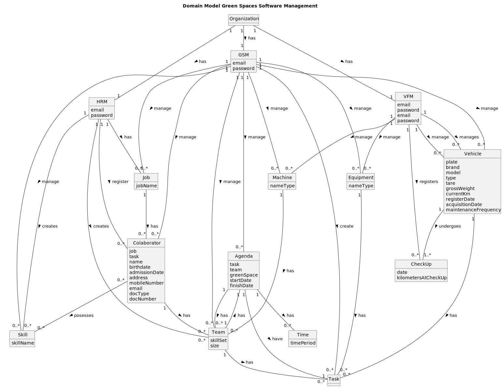
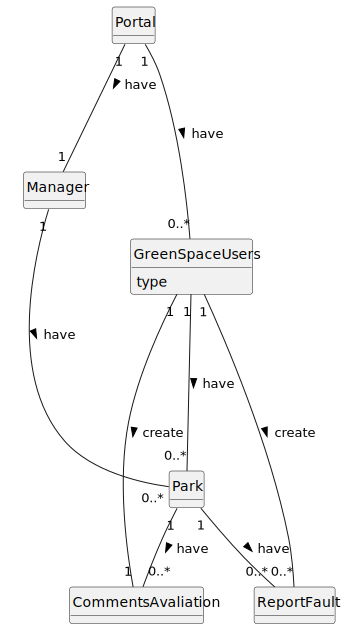

# OO Analysis

The construction process of the domain model is based on the client specifications, particularly focusing on the nouns (for _concepts_) and verbs (for _relations_) present in the specifications.

## Rationale to identify domain conceptual classes
To identify domain conceptual classes, we initiated by making a list of candidate conceptual classes inspired by the list of categories suggested in the book "Applying UML and Patterns: An Introduction to Object-Oriented Analysis and Design and Iterative Development".

### _Conceptual Class Category List_

**Business Transactions**

* Task
* Team 
* Vehicle
+ (User Portal)
Report Faults
---

**Transaction Line Items**

* Collaborator
* Equipment
* Job
+ (User Portal) CommentsAvaliation

---

**Product/Service related to a Transaction or Transaction Line Item**

* (Vehicles) Brand, Model, Type, Tare, Gross Weight, Current Km, Register Date, Acquisition Date, Maintenance/Check-up Frequency, characteristics,
* (Collaborators) Skills, name, date of birthday, admission date, address, contact (phoneNumber e email), ID card, ID card number
---

**Transaction Records**

(Green Space Management Software) 
* List Of Collaborators
* List of Vehicles
* Check-up Vehicles List
* Team List
* List of Tasks
* List of Jobs, List of Skills

(User Portal Application) 
* List Of Comments
* List of Report Faults

---  

**Roles of People or Organizations**

* Human Resources Manager
* Fleet Manager
* Green Spaces Manager
* Green Spaces Users

---

**Places**

* N/A

---

**Noteworthy Events**

* Management of Tasks
* Management of Vehicles and Equipment
* Management of Teams of collaborators
+ (User Portal) Management of Report Faults

---

**Physical Objects**

* Vehicles
* Equipments
* Machines

---

**Descriptions of Things**

* N/A

---

**Catalogs**

* Check-Up List
* Agenda
+ (User Portal) Report Faults

---

**Containers**

* Job's Category's

---

**Elements of Containers**

* (Job Category) Gardener, Bricklayer, Electrician,...

---

**Organizations**

* N/A
---

**Other External/Collaborating Systems**

* N/A

---

**Records of finance, work, contracts, legal matters**

* N/A

---

**Financial Instruments**

* N/A

---

**Documents mentioned/used to perform some work/**

* N/A

---

## Rationale to identify associations between conceptual classes

An association is a relationship between instances of objects that indicates a relevant connection and that is worth of remembering, or it is derivable from the List of Common Associations:

**HRM**
- **_HRM_** uses or manages **_Teams_**.
- **_HRM_** uses or manages **_Skills_**.
- **_HRM_** uses or manages **_Jobs_**.
- **_HRM_** uses or manages **_Collaborators_**.
---
**VFM**
- **_VFM_** uses or manages **_Vehicles_**.
- **_VFM_** uses or manages **_Machines_**.
- **_VFM_** uses or manages **_Equipment_**.
---
**GSM**
- **_GSM_** uses or manages **_Agenda_**.
- **_GSM_** uses or manages **_Teams_**.
- **_GSM_** uses or manages **_Tasks_**.
---
**HRM**, **VFM** and **GSM**

- **_Password_** is related with secure authentication for **_HRM_**, **_VFM_** and **_GSM_**.
- **_Email_** is a description of **_HRM_**, **_VFM_** and **_GSM_**.
---
**Vehicle**

- **_Plate_** is related with a unique identifier of **_Vehicle_**.
- **_Brand_** is related with a transaction (item) of **_Vehicle_**
- **_Model_** is related with a transaction (item) of **_Vehicle_**
- **_Type_** is related with a transaction (item) of **_Vehicle_**
- **_Tare_** is related with a transaction (item) of **_Vehicle_**
- **_Gross Weight_** is related with a transaction (item) of **_Vehicle_**
- **_Current KM_** is related with a transaction (item) of **_Vehicle_**
- **_Register Date_** is related with a transaction (item) of **_Vehicle_**
- **_Acquisition Date_** is related with a transaction (item) of **_Vehicle_**
- **_Maintenance/Check-in Frequency_** is related with a transaction (item) of **_Vehicle_**

---
**CheckUp**
- **_Date_** is recorded by **_CheckUp_**, marking the occasion the vehicle was inspected.
- **_KilometersAtCheckUp_** are captured by **_CheckUp_**, reflecting the mileage of the **_Vehicle_** at the time of the check up.
---
**Agenda**
- **_Task_**, **_Team_**, **_GreenSpace_**, **_StartDate_**, and **_FinishDate_** are components contained in **_Agenda_** known by **_GSM_**.
---
**Equipment**
- **_NameType_** is a description of **_Equipment_**.
---
**Machine**
- **_NameType_** is a description of **_Machine_**.
---
**Job**
- **_JobName_** is a description of **_Job_**.
---
**Team**
- **_SkillSet_** and **_Size_** are descriptions of **_Team_**.
---
**Collaborator**
- **_Job_**, **_Task_**, **_Name_**, **_Birthdate_**, **_AdmissionDate_**, **_Address_**, **_MobileNumber_**, **_Email_**, **_DocType_**, and **_DocNumber_** are personal details captured by **_Collaborator_**. Skills are possessed by **_Collaborator_** and known by **_HRM_**.
---
**Skill**
 
- **_skillName_** is a description of **_Skill_** 
---

| Concept (A)       | Association             | Concept (B)        |
|-------------------|:-----------------------:|-------------------:|
| Organization      | has                     | HRM                |
| Organization      | has                     | VFM                |
| Organization      | has                     | GSM                |
| HRM               | registers               | Collaborator       |
| HRM               | has                     | Job                |
| HRM               | creates                 | Team               |
| HRM               | creates                 | Skill              |
| VFM               | manages                 | Vehicle            |
| VFM               | manages                 | Equipment          |
| VFM               | manages                 | Machine            |
| VFM               | registers               | CheckUp            |
| GSM               | manages                 | Collaborator       |
| GSM               | manages                 | Vehicle            |
| GSM               | manages                 | Team               |
| GSM               | creates                 | Task               |
| GSM               | manages                 | Equipment          |
| GSM               | manages                 | Job                |
| GSM               | manages                 | Machine            |
| GSM               | manages                 | Agenda             |
| GSM               | manages                 | Skill              |
| Vehicle           | has                     | Task               |
| Vehicle           | undergoes               | CheckUp            |
| Equipment         | has                     | Task               |
| Collaborator      | possesses               | Skill              |
| Collaborator      | has                     | Team               |
| Job               | has                     | Collaborator       |
| Team              | has                     | Task               |
| Team              | has                     | Agenda             |
| Machine           | has                     | Team               |
| Agenda            | has                     | Team               |
| Agenda            | have                    | Task               |
| Agenda            | has                     | Time               |
| Manager           | have                    | Park               |
| Portal            | have                    | GreenSpaceUsers    |
| Portal            | have                    | Manager            |
| GreenSpaceUsers   | have                    | Park               |
| GreenSpaceUsers   | create                  | CommentsAvaliation |
| GreenSpaceUsers   | create                  | ReportFault        |
| Park              | have                    | CommentsAvaliation |
| Park              | have                    | ReportFault        |

## Domain Model

**Do NOT forget to identify concept attributes too.**

## Management Software

## User Portal

