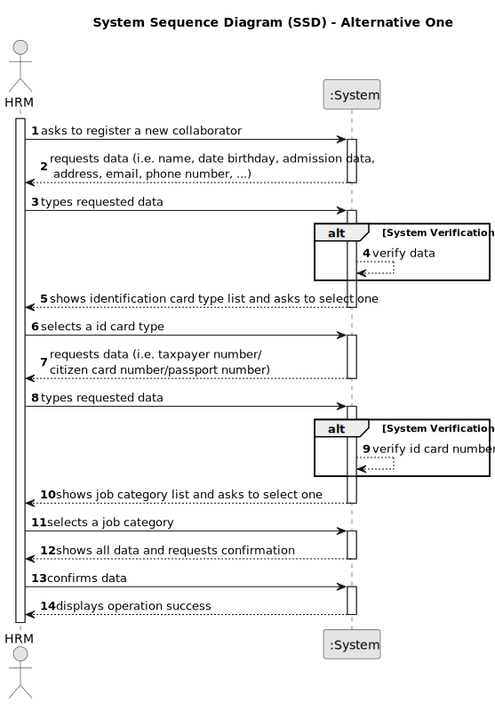
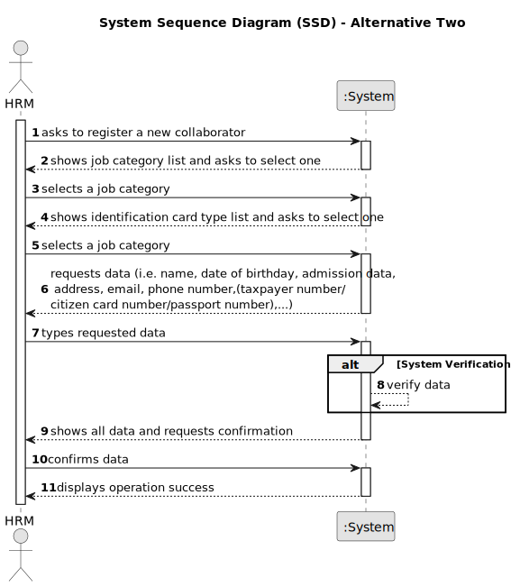

# US003 - Register a Collaborator with a job 

## 1. Requirements Engineering

### 1.1. User Story Description

As a Human Resources Manager, I want to register a collaborator with a job and fundamental characteristics.

### 1.2. Customer Specifications and Clarifications 

**From the specifications document:**

>   A person who is an employee of the organization and carries out design, construction and/or maintenance tasks for green areas, depending on their skills.

>	Each collaborator is characterized by having a name, birthdate, admission date, address, contact info (mobile and email), ID doc type and respective number should be provided by HRM

>	Thus, an employee has a main occupation (job) and a set of skills that enable him to perform/take on certain tasks/responsibilities, for example, driving vehicles of different types (e.g. light, or heavy), operating machines such as backhoes or tractors; tree pruning; application of agriculture phytopharmaceuticals.

**From the client clarifications:**

> **Question:** When creating a collaborator with an existing name or ID card number ... What the system do?
>
> **Answer:** It's not common and most improbable to have different individual with same name in the same context, however it’s ID documentation number should be unique for sure.

> **Question:**  Is there any limitation regarding the length of the name of the collaborator?
>
> **Answer:** According to the Portuguese law a name should contain at maximum six words;

> **Question:** What characteristics are important to success the register?
>
> **Answer:** The collaborator minimum essential data will be name, date of birth, date of admission, address, contact (telephone and email), identification document and number.

> **Question:** Should we consider valid only the birthdates in which the collaborator has more than 18 years?
>
> **Answer:** Yes

> **Question:** What should be the format for the phone number? 9 numbers?
>
> **Answer:** Validating 9 digits will be acceptable; validating with international format would be excelent;

> **Question:** What is the format for the numbers from the id doc types?
> 
> **Answer:** Each doc type has specific formats like taxpayer number, Citizen Card ou passport.

> **Question:** What should be the accepted format for the emails? Should only specific email services be accepted?
> 
> **Answer:** A valid email address consists of an email prefix and an email domain, both in acceptable formats.
The prefix appears to the left of the @ symbol. The domain appears to the right of the @ symbol.
For example, in the address example@mail.com, "example" is the email prefix, and "mail.com" is the email domain.

> **Question:** What is needed for the address ?  Street, zipcode and a city?
> 
>  **Answer:** That would be enough.

### 1.3. Acceptance Criteria

* **AC1:** The ID card number of the collaborator need to be unique in the system.
* **AC2:** The name of the collaborator can have maximum of 6 words.
* **AC3:** The age of the collaborator is mandatory be greater than 18.
* **AC4:** The email address need to have a prefix, "@" and a domain for example: "mail.com" (the domain need to have one ".")
* **AC5:** The phone number need to have 9 digits and can have an international validation.
* **AC6:** The collaborator must have at least the name, birthdate, admission date, address, contact info (mobile and email), ID doc type and respective number, should be provided by HRM
* **AC7:** When creating a collaborator with an existing reference, the system must reject such operation and the user must be able to modify the typed reference.

### 1.4. Found out Dependencies

* There is a dependency on "US002 - I want to register a job" as there must be at least one job category to classify the collaborator being register.

### 1.5 Input and Output Data

**Input Data:**

* Typed data:
    * a name
    * a date of birthday 
    * an admission data
    * an address street
    * an zipcode
    * an address city
    * an email
    * a phone number 
    * an ID doc type
    * a number of ID card (depend on ID doc type)
	
* Selected data:
    * a job category
    * a skill or a skill set (Not Mandatory)

**Output Data:**

* List of existing collaborators
* (In)Success of the operation

### 1.6. System Sequence Diagram (SSD)

**_Other alternatives might exist._**

#### Alternative One

#### Alternative Two

### 1.7 Other Relevant Remarks

* The register collaborator stays in a "not activate" state in order to distinguish from "activate" collaborators.