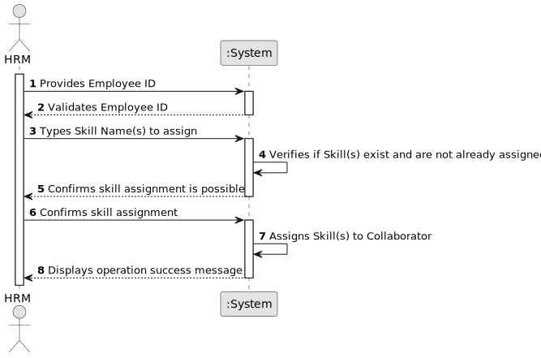

# US004 - To assign one or more skills to a collaborator.

## 1. Requirements Engineering

### 1.1. User Story Description

As an HRM, I want to assign one or more skills to a collaborator.

### 1.2. Customer Specifications and Clarifications 

**From the Specifications Document:**

> *...An employee has a main occupation (job) and a set of skills that enable him to perform/take on certain tasks/responsibilities...*

> *...Human Resources Manager (HRM) - a person who manages human resources and defines teams based on the needs of ongoing projects and the skills of the employees.*

**From the client clarifications:**

> **Question:** Is it required to categorize skills for specific jobs, or can any skill be linked to any employee?
>
> **Answer:** Skills can be <u>directly linked to employees based on their resumes (CV)</u>, without needing categorization.

> **Question:** Do we need any <u>proof</u>, like a certificate, to add a skill to an employee?
>
> **Answer:** <u>No proof or certificate</u> is needed.

> **Question:** Is there a <u>limit</u> to how many skills we can add?
>
> **Answer:** There's <u>no limit</u> on the number of skills.

> **Question:** Does an employee need certain <u>qualities</u> to get these skills added?
>
> **Answer:** <u>No special qualities</u> are needed to add skills.

> **Question:** Is it possible for a collaborator to <u>have no skills assigned</u>?
>
> **Answer:** <u>Yes</u>, it is possible.

### 1.3. Acceptance Criteria

* **AC1: Skill to Employee Linkage**
  - Skills can be associated with any employee based on their resume, without sorting into specific job categories.

* **AC3: No Certification Required for Skills**
  - Adding a skill to an employee's profile does not require proof or certification.

* **AC4: Unlimited Skill Addition**
  - There are no limits on the number of skills that can be added to an employee's profile.

* **AC5: No Special Qualities Needed for Skill Addition**
  - Skills can be added to any employee's profile without the need for the employee to possess certain predefined qualities.

### 1.4. Found out Dependencies

* There is a dependency on "<u>US001 - Register skills that a collaborator may have</u>", since skills need to be defined and available in the system to be assignable to collaborators.

* There is a dependency on "<u>US003 - Register a collaborator with a job and fundamental characteristics</u>", as a collaborator must be registered and have a job within the system before skills can be assigned.

### 1.5 Input and Output Data

#### **Input Data:**

* **Typed Data:**
  - **Employee ID (Number):** Utilizing the unique identifier of the employee registered in <u>US003</u> to ensure the correct collaborator is identified for skill assignment.
  - **Skill Name(s):** Name(s) of the skill(s) to be assigned to the collaborator, based on their resume (CV). Each skill listed must correspond to those predefined and available within the system, ensuring alignment with <u>US001</u>.

* **Selected Data:** n/a.

#### **Output Data:**

* **Confirmation of Skill Assignment:**
  - A success notification confirming that the skills have been successfully assigned to the collaborator.

* **Warnings or Errors (if applicable):**
  - Error messages for any issues encountered during the skill assignment process, such as non-existent employee/collaborator, snon-existent skills or duplications.

* **Operational Feedback:**
  - Overall status of the operation (success or failure), with immediate feedback to the HRM.

### 1.6. System Sequence Diagram (SSD)

