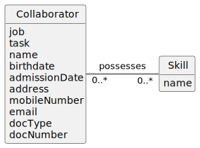

# US004 - To assign one or more skills to a collaborator.

## 2. Analysis

### 2.1. Relevant Domain Model Excerpt 

### 2.2. Other Remarks

In US001, the registration of new skills is a feature that necessitates the existence of a Skill entity independent of collaborators, thus allowing skills to be managed centrally and efficiently. The absence of an independent Skill class could result in redundancies and difficulties in skills control, such as identifying duplicate skills or managing the list of available skills for assignment.

In US004, assigning skills to a specific collaborator presupposes the existence of a predefined and validated set of skills within the system, suggesting again the importance of a well-defined and independent Skill entity. This entity will enable the system to verify whether a skill exists and whether it has not yet been assigned to the collaborator, ensuring the integrity and consistency of the data.

The lack of an independent Skill class could compromise the system's integrity in several ways, including:

- Difficulty in Skills Validation: It would become more complex to ensure that the skills assigned correspond to valid and recognized skills by the system.
    
- Inefficient Management: The absence of a centralized entity for skills would complicate the management and updating of existing skills in the system.
    
- Redundancy and Inconsistency: Data redundancies and inconsistencies in skill assignment could occur without a Skill entity to control verification and validation operations.

Thus, if the goal is to maintain the consistency and integrity of the system, as well as to enable effective management of the collaborators' skills, the Skill class is indeed crucial. 