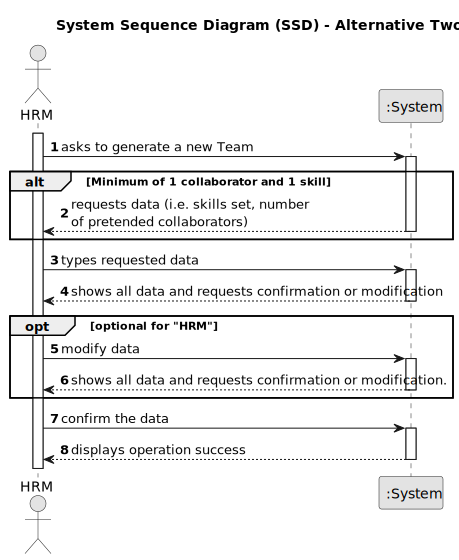
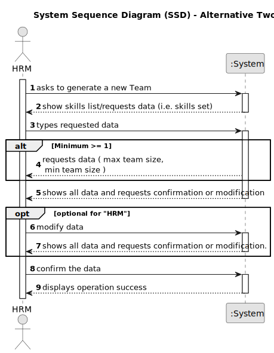

# US005 - Generate a Team Automatically

## 1. Requirements Engineering

### 1.1. User Story Description

As a Human Resources Manager, I want to generate a team to proposal automatically.

### 1.2. Customer Specifications and Clarifications 

**From the specifications document:**

> Teams are temporary associations of employees who will carry out a set of tasks in  one or more green spaces. When creating multipurpose teams, the number of members and the set of skills that must be covered are crucial.

> Each team is characterized by having skills needed to do a task.

> The maximum team size and the set of skills need to be supplied by
the HRM

**From the client clarifications:**

> **Question:** How does he manage the team if there are not enough employees?
>
> **Answer:** The system should provide information why it can't generate a team.

> **Question:** How does he propose a team, for what purpose? (Is there any predefinition)?
>
> **Answer:** There is no purpose, at least in this sprint.
The max size of the team (for instance 4) and the skill needed(example): 4 tree pruner and 1 light vehicle driver.
>Meaning that one team member have 2 skills.
> 
>As long as it is not published, access to the team is exclusive to the Human Resources Manager.

>  **Question:**  A collaborator can be in more than one team at the same time?
> 
>  **Answer:** No

### 1.3. Acceptance Criteria

* **AC1:** The maximum team size and the set of skills need to be supplied by the HRM
* **AC2:** If the system don't have sufficient collaborators to generate a Team, the system need to notify the situation.
* **AC3:** The system needs to authorize changes to the team by other employees but must always notify you in case of any incorrect situation.

### 1.4. Found out Dependencies

* There is a dependency on "US003 - I want to register a collaborator with a job and fundamental characteristics" as there must be at least 1 collaborator to generate the team automatically.
* There is a dependency on "US001 - I want to register skills that a collaborator may have" as there must be at least 1 skill to generate a team.

### 1.5 Input and Output Data

**Input Data:**

* Typed data:
    * a max size of the team
    * a min size of the team
	
* Selected data:
    * a skills set

**Output Data:**

* Warnings of In-success
* Team of collaborators - List (And the Skills of each Collaborator)
* (In)Success of the operation

### 1.6. System Sequence Diagram (SSD)

**_Other alternatives might exist._**

#### Alternative One

### 1.7 Other Relevant Remarks

* The created Team stays in a "not published" state in order to distinguish from "published" Teams.