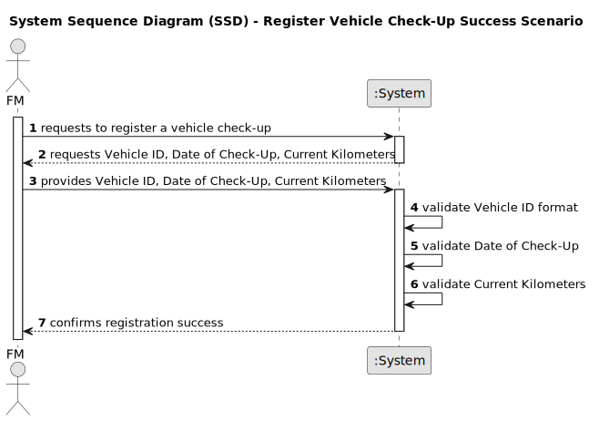

# US007 - To register a vehicle’s check-up.

## 1. Requirements Engineering

### 1.1. User Story Description

As an FM, I wish to register a vehicle’s check-up.

### 1.2. Customer Specifications and Clarifications 

**From the Specifications Document:**

<u>The document doesn't explicitly mention specific details about registering vehicle check-ups</u>. However, given the overall project scope and its link to the user story about vehicle check-up registration, the parts listed below are directly relevant:

> *Vehicles are needed to carry out the tasks assigned to the teams as well as to transport machines and equipment.*

> *Fleet Manager (FM) – a person who manages [...] vehicles, ensuring their good condition and assigning them to the tasks to be carried out.*

These points highlight the role of Fleet Managers and vehicles in task completion and equipment transport, pointing to the need for regular vehicle check-ups.

**From the client clarifications:**

> **Question:** What details are required to register a vehicle for a check-up?
>
> **Answer:** The details needed are the <u>Vehicle ID (i.e, Plate Number)</u>, the <u>Date of the check-up</u>, and the <u>current kilometers on the vehicle</u>.

> **Question:** What is the preferred unit of measurement for determining the frequency of check-ups (kilometers, months, etc.)?
>
> **Answer:** For the purposes of this project, only <u>kilometers</u> will be taken into account.

> **Question:** What are the criteria for validating a vehicle ID?
>
> **Answer:** <u>For vehicles after 2020</u>: the format should be <u>AA-00-AA</u>.  <u>For vehicles between 2005 and 2020</u>: the format is <u>00-AA-00</u>.  <u>For vehicles between 1992 and 2005</u>: the format is <u>00-00-XX</u>.

> **Question:** Can a vehicle undergo more than one check-up?
>
> **Answer:** <u>Yes</u>, a vehicle can have multiple check-ups.

### 1.3. Acceptance Criteria
* **AC1: Vehicle ID Validation**
  - The system must validate the Vehicle ID (Plate Number) according to the specified formats:
    - For vehicles after 2020: The format should be `AA-00-AA`.
    - For vehicles between 2005 and 2020: The format is `00-AA-00`.
    - For vehicles between 1992 and 2005: The format is `00-00-XX`.
  - The system should reject the registration if the Vehicle ID does not match the expected format based on the vehicle's registration date.

* **AC2: Mandatory Information for Registration**
  - The registration of a vehicle's check-up must include the following mandatory details:
    - Vehicle ID (i.e., Plate Number)
    - Date of the check-up
    - Current kilometers on the vehicle
  - The system must prompt the user to provide any missing information before proceeding with the registration.

* **AC3: Frequency of Check-Ups Based on Kilometers**
  - The system should allow multiple check-ups for a single vehicle.
  - The preferred unit of measurement for determining the frequency of check-ups is kilometers. The system should not enforce or suggest any specific frequency for check-ups, but must record the kilometers for each check-up.

* **AC4: Multiple Check-Ups for a Single Vehicle**
  - The system must support the registration of multiple check-ups for a single vehicle.
  - Each check-up entry for a vehicle must be identifiable and accessible for review or audit purposes.

* **AC5: Confirmation of Successful Registration**
  - Upon successful registration of a vehicle's check-up, the system must provide a confirmation message to the user indicating the successful capture of the check-up details.
  - The confirmation message should include a reference to the registered check-up details (e.g., check-up ID, date, and Vehicle ID) for user verification and record-keeping purposes.

* **AC6: Error Handling and User Feedback**
  - The system must provide clear and informative feedback for any errors encountered during the registration process (e.g., invalid Vehicle ID format, missing mandatory information).
  - The feedback should guide the user on how to correct the errors to successfully complete the registration.

### 1.4. Found out Dependencies

* There is a dependency on "<u>US06 - I wish to register a vehicle including Brand, Model, Type, Tare, Gross Weight, Current Km, Register Date, Acquisition Date, Maintenance/Check-up Frequency (in Kms).</u>" as a vehicle must be registered before a check-up can be recorded for it.

### 1.5 Input and Output Data

**Input Data:**

* **Typed Data**:
  - **Vehicle ID (Plate Number):** This must match the validation criteria appropriate to the vehicle's year of registration, with the assumption that the vehicle has been pre-registered in the system as delineated in <u>US006</u>.
  - **Date of Check-Up:** Should be logged as the date when the check-up occurred and must be chronologically subsequent to the date of the last registered check-up for the same vehicle.
  - **Current Kilometers:** Indicates the vehicle's odometer reading at the time of the check-up and must be greater than the reading recorded at the last check-up to ensure accurate tracking of vehicle usage and maintenance schedules.
* **Selected Data:** n/a.

**Output Data:**

* **Confirmation of Registration**:
  - A message confirming that the check-up details have been successfully logged for the vehicle, with validation against the most recent prior data from <u>US006</u>.

* **Warnings or Errors (if applicable)**:
  - Notifications of any input errors, such as an invalid Vehicle ID format, a check-up date that precedes the last recorded date, or an odometer reading that is less than or equal to the previous entry.

* **Operational Feedback**:
  - Clear indication of whether the check-up registration was successful or not. If unsuccessful, detailed feedback will be provided, highlighting the nature of the issue, such as attempting to register a check-up with a date earlier than the last check-up or an odometer reading that does not reflect an increase, and instructions for rectifying the data to enable a valid re-entry.

### 1.6. System Sequence Diagram (SSD)

