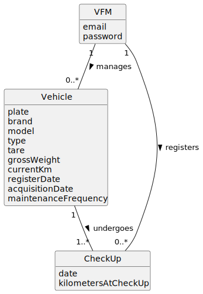

# US007 - To register a vehicle’s check-up.

## 2. Analysis

### 2.1. Relevant Domain Model Excerpt 

- **CheckUp**: Each check-up that is carried out on a vehicle. It contains details that are essential for keeping the vehicle in optimal condition:
  - `date`: The specific date when the check-up was performed.
  - `kilometersAtCheckUp`: The odometer reading of the vehicle at the time of the check-up, which helps to track when the next check-up is due.

### 2.2 Associations:

- **manages**: The VFM is in charge of the vehicles, ensuring they are kept in good condition and serviced regularly.

- **undergoes**: A relationship between each Vehicle and its CheckUps, showing that vehicles receive these periodic check-ups.

- **registers**: This indicates that the VFM is responsible for recording each CheckUp, documenting the state and servicing of vehicles in the fleet.
