#   
USER MANUAL

 

### 
Oriented by:

#### 
Sandra Luna

### Created by:

#### Francisco Oliveira
#### Inês Oliveira
#### Tomás Borges

 
 
 
 
 
 

## Table of Content

1. [Introduction](#introduction)

2. [System Overview](#system-overview)

3. [System Requirements](#system-requirements)

4. [Features](#features)
   1. [Unsigned Green Space User](#unsigned)
      1. Register
   2. [Green Space User](#signed)
   3. [Green Space Manager](#green-space-manager-gsm)
   4. [Human Resources Manager](#human-resources-manager-hrm)
      1. Register a Collaborator
      2. Register a Job Category
      3. Register a Skill
      4. Generate a Team of Collaborators
   5. [Vehicle and Equipment Fleet Manager](#vehicle-and-equipment-fleet-manager-vfm)
      1. Register a Vehicle
      2. Register a Maintenance Check-Up
      3. See the Vehicles Check-Up List

5. [Troubleshooting](#troubleshooting)

6. [Frequently Asked Questions](#frequently-asked-questions)

7. [Glossary](#glossary)

# Introduction

This guide is designed to help any user on how to effectively use this product. With clear and
simple guidelines, anyone will be able to understand and operate this product. The guide contains
guidelines, pictures, and diagrams designed to help the user follow the steps and be able to do
all the pretended tasks without needing help from the development team as the support of the
application use.

The product described in this user manual is an application used by a green space company to
manage their collaborators, machines, equipment and vehicles to their tasks with an easy and fast way to interact.
The application contains all the tools needed to manage, interact, or work with the
company without difficulties or mistakes. It helps both the company teams and the
managers of the company, or the ones who want to purchase a property.

This user manual has been provided to the user with the purpose of demonstrating
how to use the application designed for the Green Space Company.

This user manual is appointed to:

1. Unsigned Green Space User (UGSU)

In the Green Space Portal the GSU can:
* Register/Login himself on the application
* See all published Evaluations of the Green Spaces made by other users.

2. Signed Green Space User (GSU)

In the Green Space Portal the GSU can:
* Make an Evaluation of the Green Spaces with comments.
* Make report faults of malfunctions in some green space

3. Green Space Manager (GRM)

In the Green Space Portal the GRM can:
* Manage the Report Faults

In the Software Management System the HRM can:
* Manage the Tasks
* Attribute Teams, Vehicles and Equipment for the Tasks
* Manage Agenda of Tasks in the Green Space
* Access to Manage Vehicles, Collaborators, Jobs, Skills and Equipment. (HRM, VFM)

4. Human Resources Manager (HRM)

In the Software Management System the HRM can:
* Register a Collaborator
* Register a Job Category
* Register a Skill to be appointed to a Collaborator
* Appoint Skills to Collaborators
* Generate a Team of Collaborators
* Create a Team of Collaborators

5. Vehicle and Equipment Fleet Manager (VFM)

In the Software Management System the HRM can:
* Register a Vehicle
* Register Equipment
* Register a Check-Up of a Vehicle
* List all Vehicles needing Maintenance Check-Up

# System Overview

The Green Space Management System is a platform designed to ensure the efficient management of employees,
vehicles, equipment, tasks, collaborator teams, schedules, and more in green space environments. It enables detailed
registration and tracking of employees, including their assignments, skills, and availability. Additionally,
the system manages vehicle maintenance, including checklists and service records.
Necessary equipment for the maintenance of green spaces is also monitored, along with their conditions and maintenance
history. Task assignment has the ability to assign specific tasks to collaborator teams and track
their progress. The integrated schedule allows for efficient activity scheduling and management of important
events. In summary, the Green Space Management System offers a comprehensive and effective solution for all
management needs in green space environments.
Below is a figure that illustrates an overview of the application:

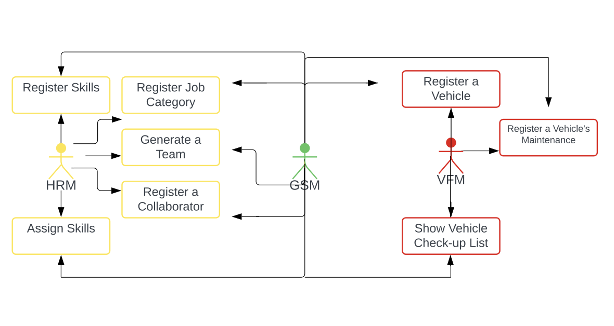
Image 1: General application diagram

# System Requirements

(N/A)

# Features
## Green Space User (GSU)
### Unsigned

When you open the User Portal app, there are four possible paths the unsigned user
can:
* Login - Login if he is already registered in the system.
* Register – The user can register himself in the application.
* Browse all the Green Spaces – The user can see all the information of the Green Spaces
* See Evaluations of Green Spaces – The user can see all the Evaluations of the Green Spaces, of other Users Registered

#### Register
##### Syntax Notes:
+ Name : Should contain at least 8 characters
+ Email : Should contain an e-mail prefix, before the "@" symbol, and e-mail domain, after the "@" symbol.
+ Password : Should contain at least 12 characters, with special characters included and upper case characters.

Step 1- Do login and enter your cards according syntax notes:
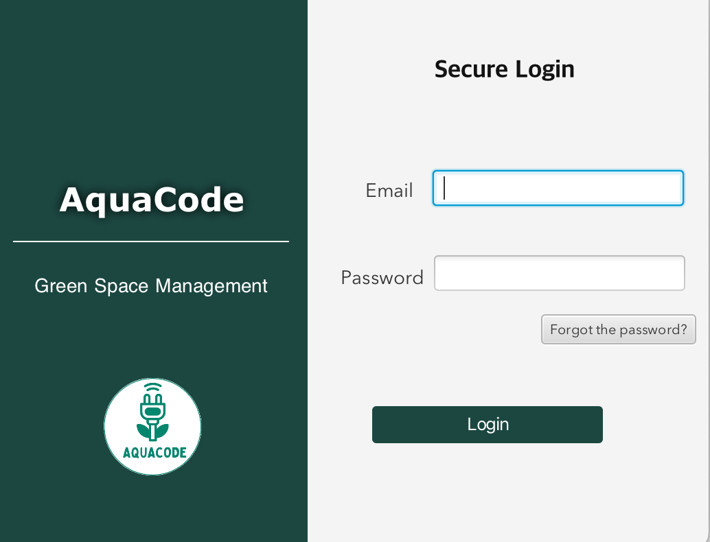
Image 2- Do login (login UI) 

### Signed

When you login in the User Portal app, there are four possible paths, the GSU
can:

* Browse all the Green Spaces – The user can access all the information of the Green Spaces
* See Evaluations of Green Spaces – The user can access all the Evaluations of the Green Spaces made by other registered users
* Register a Report Fault in a Green Space - The user can make a report fault of a malfunction of the Green Space
* Make an Evaluation of a Green Space - The user can make an Evaluation of a Green Space to comment something about it.

#### Register a Report Fault
##### Syntax Notes:

#### Make an Evaluation of a Green Space
##### Syntax Notes:

## Green Space Manager (GSM)

When you open and login in the User Portal app,(there are 2 possible paths) the GSM
can:

* See the Report Faults of the Green Spaces - The Manager can access the report faults made by the users of the Green Space
* See the Evaluations of Green Spaces - The Manager can access the Evaluations made by the users of the Green Spaces

When you open and login in the software, (there are 6 possible paths), the GSM can:

* Manage the Vehicles - The Manager can oversee and administer vehicles used for green space management.(including Check-Up List and Check Up register)
* Manage the Collaborators - The Manager can handle the administration and organization of collaborators involved in green space management.
* Manage the Jobs - The Manager can define and organize different job categories related to green space management.
* Manage the Skills - The Manager can oversee and modify skills related to green space management.
* Manage Teams - The manager can create teams according to the number of members (maximum and minimum team size) and the set of skills that employees have.
* Manage the equipment - The manager can can control the most used park equipment.

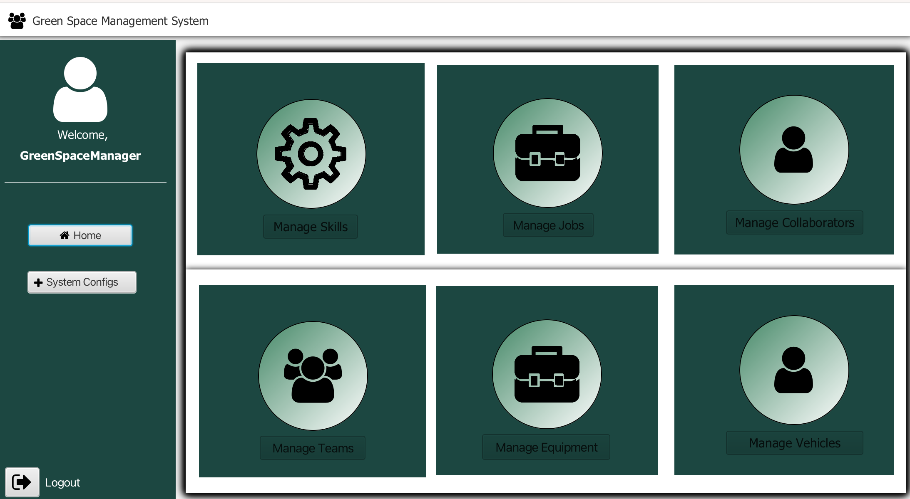
Image 3: GSM menu

If the GSM (or HRM) clicks on the "Manage Skills" option, it will enter this menu where it can register skills:
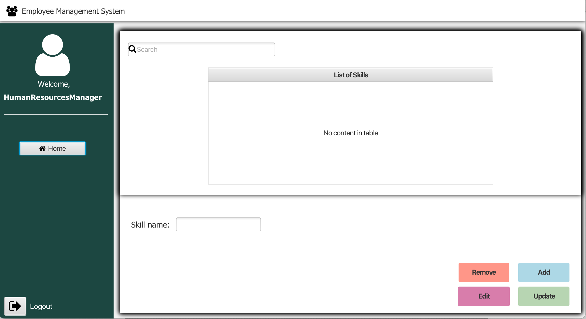
Image 4: "Manage Skills" option

If the GSM (or HRM) clicks on the "Manage Jobs" option, it will enter this menu where it can register jobs:
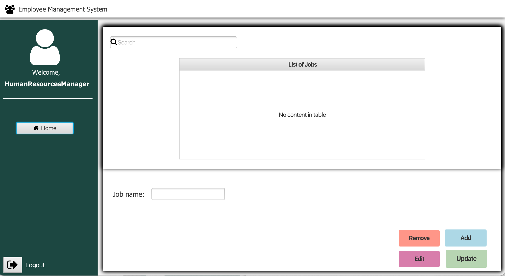
Image 5: "Manage Jobs" option

If the GSM (or HRM) clicks on the "Manage Collaborators" option, it will enter this menu where it can register collaborators:
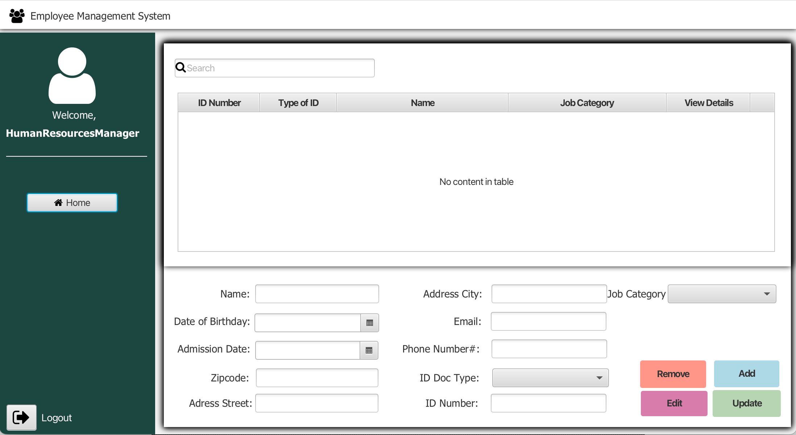
Image 6:"Manage Collaborators" option

If GSM (or HRM) clicks on the "view details" option, it will access a window in which, in addition to recording the characteristics of collaborators, it can assign skills to them.
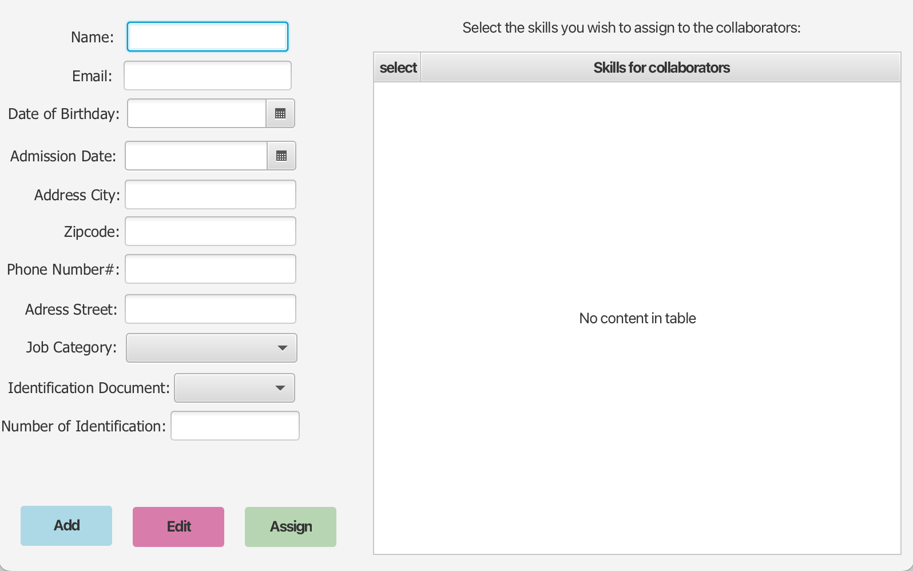
Image 7: Manage Collaborators- "View Details" option

If the GSM (or HRM) clicks on the "Manage Teams" option, it will enter this menu where he can see the teams that already exist.
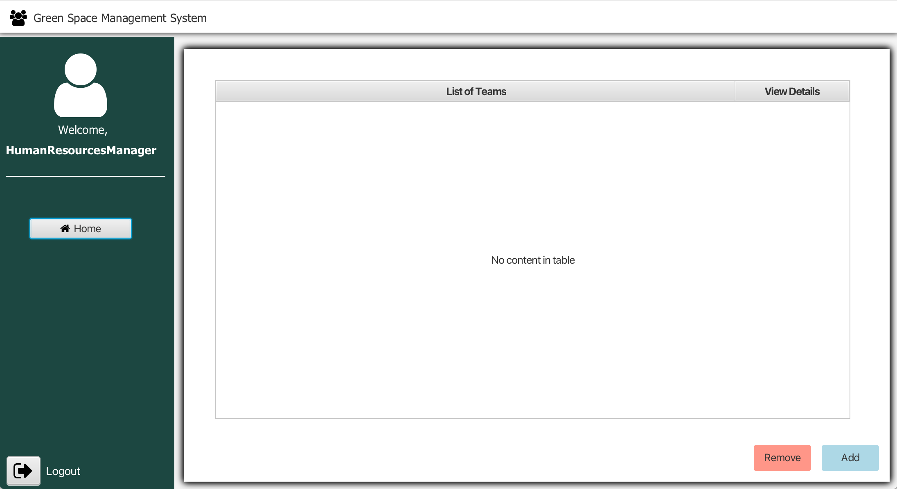
Image 8: "Manage Teams" option

If GSM (or HRM) clicks on the "view details" option, it will access a window in which, he can see the collaborators and their skills in the created team.
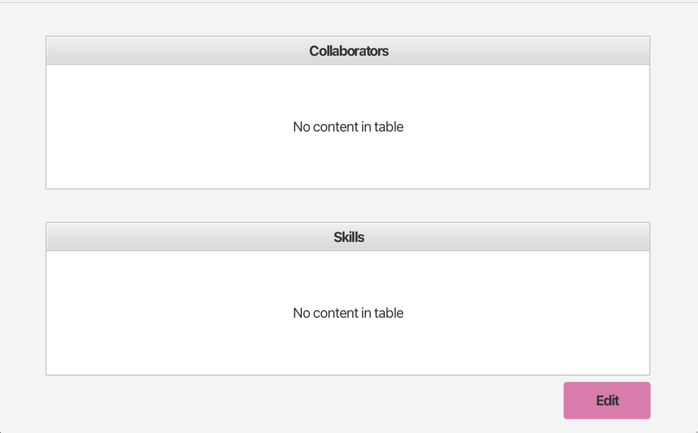
Image 8: Manage Teams- "View Details" option

If GSM (or HRM), in the Manage Teams menu, clicks on the "Add" button he can generate a team  according to the number of members (maximum and minimum team size) and the set of skills that collaborators have.
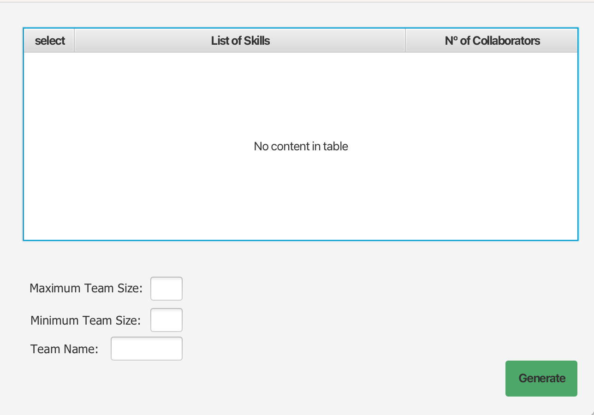
Image 9: Manage Teams- "Add" button (generate teams)

"Manage equipment" option- Next Sprint

If GSM ( or VFM) clicks on the "Manage Vehicles" option, it will enter this menu where he can see some vehicle characteristics.
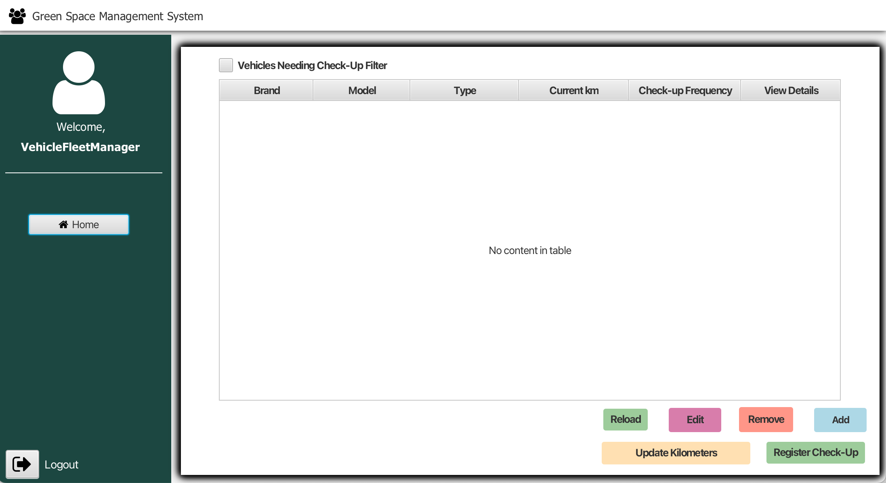
Image 10: "Manage Vehicle" option

If GSM (or VFM) clicks on the "view details" option, it will access a window in which he can edit vehicle characteristics as well as access and add information related to the vehicle check-up.
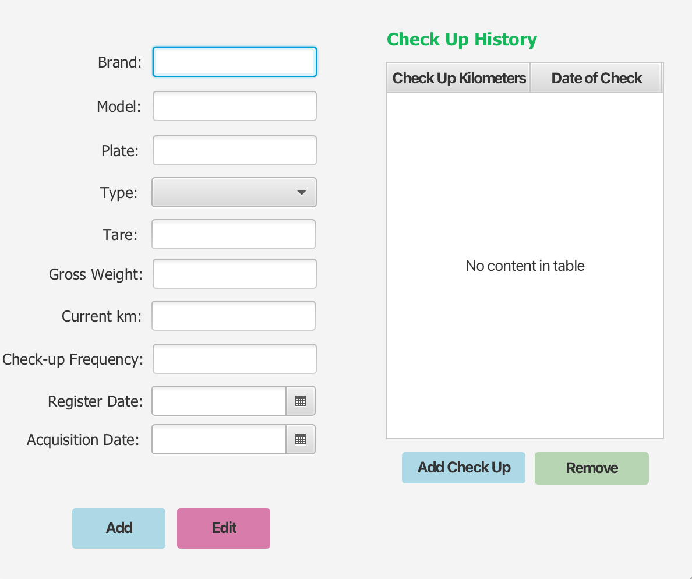
Image 11: Manage Vehicles- "View Details" option

If GSM (or VFM), in the Manage Vehicles menu clicks on the "Update kilometers" button it will access this window where he can update vehicle kilometers.
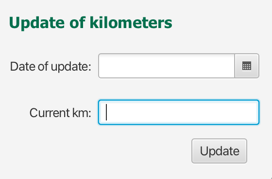
Image 12: Manage Vehicles- "Update kilometers" button

If GSM (or VFM), in the Manage Vehicles menu clicks on the "Register check-up" button, it will access this window where he can do the vehicle check-up.
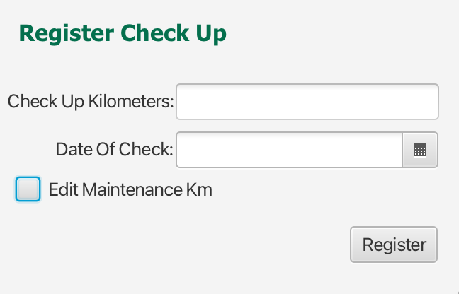
Image 13: Manage Vehicles- "Register check-up" button

## Human Resources Manager (HRM)

When you open and login in the Software,(there are 8 possible paths) the HRM can:

* See the Collaborators - The HRM can access the information of the Collaborators and edit them
* Register a Collaborator - The HRM can register a Collaborator to the System
* See the Job's Category List - The HRM can see the Job's Categories created
* Register a Job Category - The HRM can register a Job Category to be appointed to Collaborators in register
* See the Skill's Created - The HRM can manage skills in the system
* Register a Skill - The HRM can register a Skill to be appointed to Collaborators
* Create a Team of Collaborators - The HRM can create a Team of Collaborators
* Generate a Team of Collaborators - The HRM can generate a Team of Collaborators

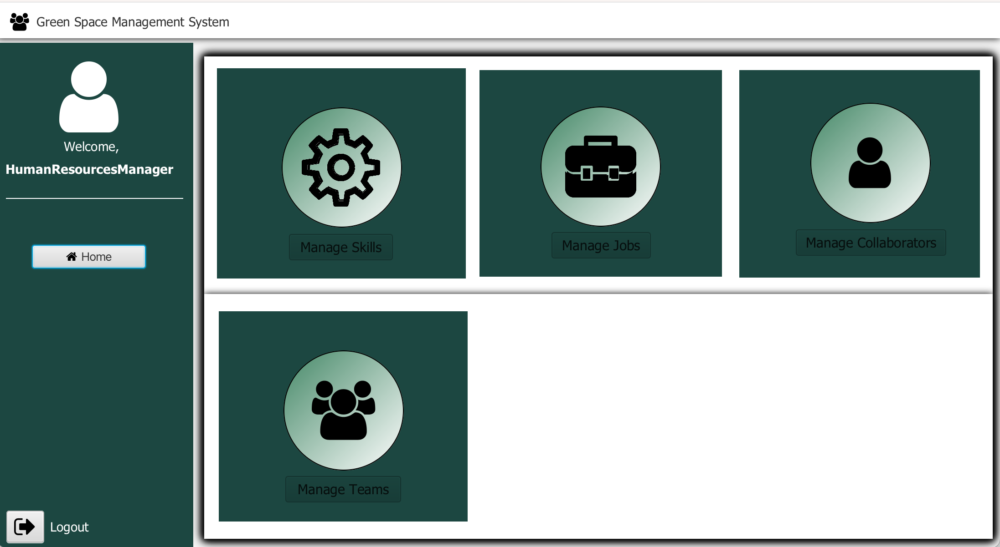
Image 14: HRM menu

#### Register a Collaborator
##### Syntax Notes:
+ Name : Can have maximum of 6 words.
+ Date of birthday  : The age of the collaborator is mandatory be greater than 18.
+ Admission data : Should contain at least 12 characters, with special characters included and upper case characters.
+ Address Street : (N/A)
+ Zipcode : (N/A)
+ Address City : (N/A)
+ Email : The email address need to have a prefix, "@" and a domain for example: "mail.com" (the domain need to have one ".")
+ Phone Number : Need to have 9 digits and have an international validation.
+ ID doc type : Taxpayer number, Citizen Card or Passport
+ Number of ID card : Need to be unique in the system and verified.
+ Job Category : It is mandatory to select a job category.
+ Skill(s) : Not Mandatory.

#### Register a Job Category
##### Syntax Notes:
+ Job Name : To register a job is mandatory input the job name.
+ Rejected Operation: When creating a job with an existing reference, the system must reject such operation.

#### Register a Skill
##### Syntax Notes:
+ Skill Name : To register a skill is mandatory input the skill name.
+ Rejected Operation: When creating a skill with an existing reference, the system must reject such operation.

#### Generate a Team of Collaborators
##### Syntax Notes:
+ Max Team Size : Contain the number maximum of collaborators that the team can have.
+ Min Team Size : Contain the number maximum of collaborators that the team can have. The minimum size is at least 1.
+ Skill Set : Should contain the skills that are needed to the team (not Mandatory)

#### Assign Skills to Collaborators
##### Process Overview
Assigning skills to collaborators is a straightforward process enabling Human Resources Managers (HRM) to tailor the workforce according to the project requirements and individual capabilities.

##### Steps for Assigning Skills
1. **Collaborator Identification:** Utilize the Employee ID to select the collaborator for skill assignment.
2. **Skill Selection:** Choose one or more skills from the list of predefined skills available within the system. These skills should align with the collaborator's qualifications and the needs of the company.
3. **Assignment:** After selecting the appropriate skills, assign them to the collaborator. The system will update the collaborator’s profile to reflect these new skills.

#### Important Considerations
+ **No Limit on Skills:** You can assign any number of skills to a collaborator, enhancing their versatility and value to the company.
+ **No Need for Certification:** Skills can be assigned based on the collaborator's resume (CV) and proficiencies, with no requirement for formal certification.
+ **Feedback and Confirmation:** Upon successful assignment, the system provides confirmation. If an issue arises (e.g., attempting to assign a non-existent skill), the system will offer clear feedback to rectify the situation.

## Vehicle and Equipment Fleet Manager (VFM)
When you open and login in the Software, (there are 8 possible paths) the HRM can:

* See the Vehicles - The VFM can see the information of the Vehicles registered on the System and edit them.
* Register a Vehicle - The VFM can register a new Vehicle for the System
* See the Equipment's - The VFM can see the information of the Equipment registered on the System and edit them.
* Register Equipment - The VFM can register new Equipment for the System
* See the Machines - The VFM can see the information of the Machines registered on the System and edit them.
* Register Machines - The VFM can register new Machine for the System
* Register a Maintenance Check-Up of a Vehicle - The VFM can register a Check-Up of a Vehicle
* See the Vehicles Check-Up List - The VFM can see the all Vehicles needing to make a check-up

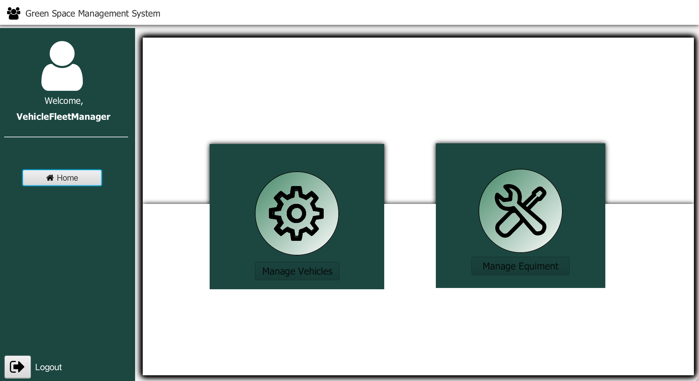
Image 15: VFM menu

#### Register a Vehicle
##### Syntax Notes:
+ Format Plate Number : AA-BB-00, AA-00-AS, 00-AA-00
+ Brand : It is the name brand of the vehicle, for example "Ford"
+ Model : It is the model of the vehicle, for example "F-150 Raptor"
+ Type : It is the type of vehicle, for example "Open Box"
+ Tare : It is the weight of an empty vehicle
+ Gros Weight : It is the total weight of a vehicle when is fully loaded with passengers, cargo or equipment.
+ Current KM : The current KM of the vehicle on that moment.
+ Register Date : When the vehicle was registered.
+ Acquisition Date :  Date of the vehicle acquisition
+ Maintenance/Check-Up Frequency : How many KM does the vehicle require maintenance.

#### Register a Maintenance Check-Up
##### Syntax Notes:
+ **Vehicle ID (Plate Number):** Must match the validation criteria appropriate to the vehicle's registration year. Formats include:
  - For vehicles after 2020: `AA-00-AA`
  - For vehicles between 2005 and 2020: `00-AA-00`
  - For vehicles between 1992 and 2005: `00-00-XX`
+ **Date of the Check-Up:** Should be the current date or a past date, not a future date.
+ **Current Kilometers:** The odometer reading at the time of the check-up. This must be greater than or equal to the last recorded odometer reading to ensure accurate tracking of vehicle usage.

##### Process Overview:
1. **Vehicle Identification:** Enter the Vehicle ID using the correct format based on the vehicle's registration date.
2. **Check-Up Date:** Input the date when the check-up was performed.
3. **Odometer Reading:** Record the current kilometers on the vehicle to monitor its usage and schedule future maintenance accordingly.
4. **Submission and Confirmation:** After entering the required details, submit the information. The system will validate the inputs and, if correct, register the check-up. A confirmation message will be displayed upon successful registration.

#### See the Vehicles Check-Up List
##### Syntax Notes Output:
+ The list will display vehicles that are within 5% of reaching their next scheduled maintenance check-up, based on the current odometer reading and the maintenance frequency specified during vehicle registration.
+ **Display Information Includes:**
  - Vehicle ID (Plate Number)
  - Brand and Model
  - Last Check-Up Date
  - Current Kilometers
  - Kilometers Until Next Check-Up
+ This feature enables proactive maintenance scheduling, ensuring that all vehicles remain in optimal condition and service disruptions are minimized.

# TroubleShooting

# Frequently asked questions

# Glossary

[View Glossary](01.requirements-engineering/glossary.md)

# Annexes
