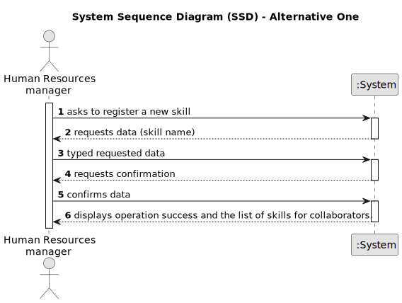

# US001 - Register skills for collaborators

## 1. Requirements Engineering

### 1.1. User Story Description

As a Human Resources Manager, I want to register skills that may be appointed to a collaborator.

### 1.2. Customer Specifications and Clarifications 

**From the specifications document:**

>	When creating multipurpose teams, the number of members and the set of skills that must be covered are crucial. 

>	Thus, an collaborator has a main occupation (job) and a set of skills that enable him to perform/take on certain tasks/responsibilities, for example, driving vehicles of different types , operating machines such as backhoes
or tractors; tree pruning; application of phytopharmaceuticals.

**From the client clarifications:**

> **Question:** Which are the skills accepted? Or should we enable the HRM to introduce anything as a skill?
>
> **Answer:** All, it's up to HRM to decide (special characters or algarisms should not be allowed in the skill name).
> 
> **Question:** Do I need to add skills by writing them or can I just give a file with all of the skills?
> 
> **Answer:** Both are acceptable since the business the same the crucial difference resides in the UX.
> 
> **Question:** Should the system able the HRM to introduce multiple skills in one interaction before saving all of them?
> 
> **Answer:** It's not required to do so.

### 1.3. Acceptance Criteria

* **AC1:** A skill name can’t have special characters or digits.
* **AC2:** All required fields must be filled in.
* **AC3:** To register a skill is mandatory input the skill name.
* **AC4:** When creating a skill with an existing name, the system must reject such operation.

### 1.4. Found out Dependencies

* Don't have any dependency with other's User Stories

### 1.5 Input and Output Data

**Input Data:**

* Typed data:
    * a skill name

**Output Data:**

* List of skills for collaborators
* (In)Success of the operation

### 1.6. System Sequence Diagram (SSD)

**_Other alternatives might exist._**

#### Alternative One

### 1.7 Other Relevant Remarks

N/A