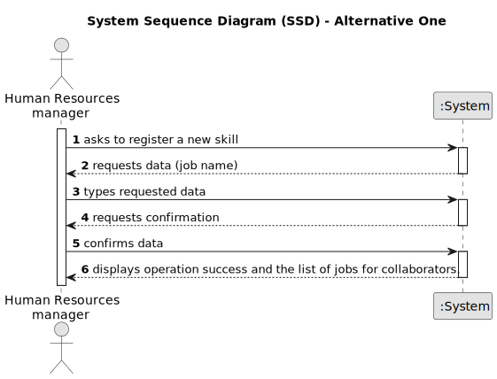

# US002 - Register a Job Category

## 1. Requirements Engineering

### 1.1. User Story Description

As a Human Resources Manager, I want to register a job.

### 1.2. Customer Specifications and Clarifications 

**From the specifications document:**

> Some job examples are designer, budgetist, gardener, electrician or bricklayer.

>	Thus, an collaborator has a main occupation (job) and a set of skills that enable him to perform/take on certain tasks/responsibilities, for example, driving vehicles of different types , operating machines such as backhoes
or tractors; tree pruning; application of phytopharmaceuticals.

**From the client clarifications:**

> **Question:** Should we add a description or anything atribute for the Job registration?
>
> **Answer:** Not need to, job is just a name;
> 
> **Question:** Can special characters and numbers be entered when registering a job?
> 
> **Answer:** No.

### 1.3. Acceptance Criteria

* **AC1:** A job name can’t have special characters or digits.
* **AC2:** All required fields must be filled in.
* **AC3:** To register a job is mandatory input the job name.
* **AC4:** When creating a job category with an existing reference, the system must reject such operation.

### 1.4. Found out Dependencies

* Don't have any dependency with other's User Stories

### 1.5 Input and Output Data

**Input Data:**

* Typed data:
    * a job name

* Selected data:
    * none

**Output Data:**

* List of jobs for collaborators
* (In)Success of the operation

### 1.6. System Sequence Diagram (SSD)

**_Other alternatives might exist._**

#### Alternative One

### 1.7 Other Relevant Remarks

N/A