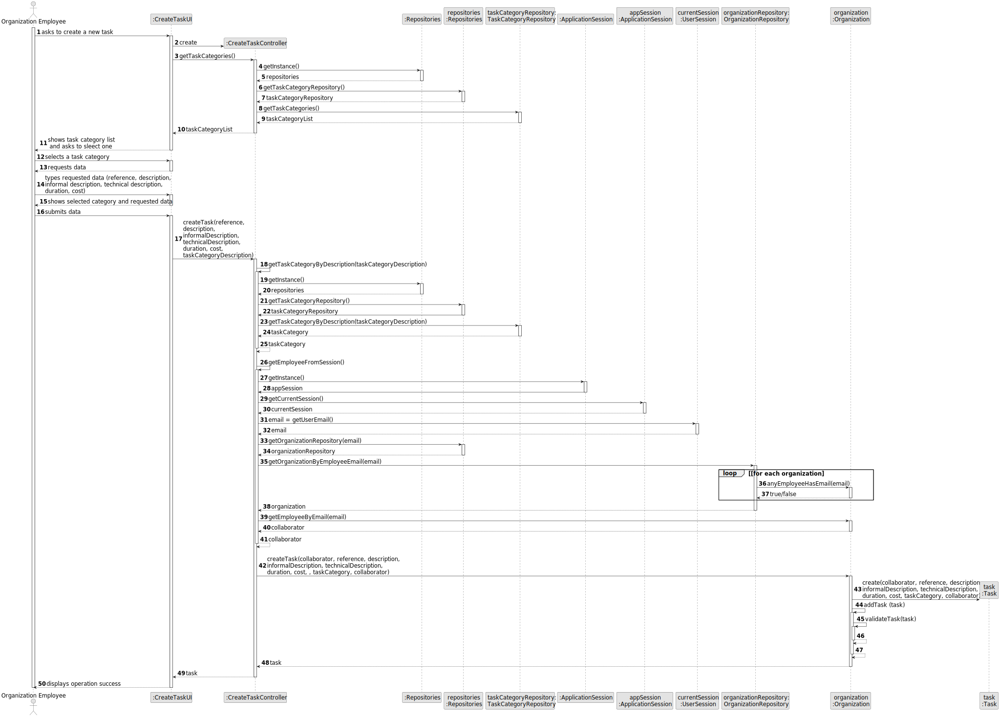
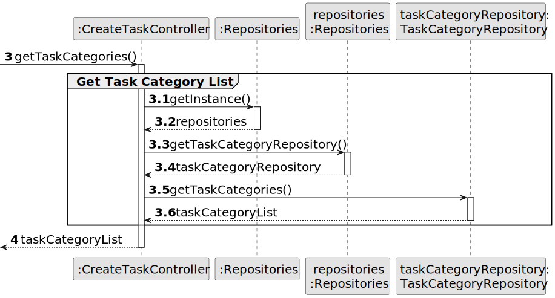

# US002 - Register a Job 

## 3. Design - User Story Realization 

### 3.1. Rationale

_**Note that SSD - Alternative One is adopted.**_

| Interaction ID                                                            | Question: Which class is responsible for...                       | Answer                        | Justification (with patterns)                                                                                 |
|:--------------------------------------------------------------------------|:------------------------------------------------------------------|:------------------------------|:--------------------------------------------------------------------------------------------------------------|
| Step 1: 	asks to register a new job    		                                 | ... instantiating the class that handles the UI?                  | RegisterJobCategoryUI         | Pure Fabrication: there is no reason to assign this responsibility to any existing class in the Domain Model. |
| 			  		                                                                   | ... interacting with the actor?                                   | RegisterJobCategoryUI         | Controller                                                                                                    |
| Step 2: requests data (job name)		  		                                    | ... displaying the form for the actor to input data?              | Organization                  | IE: cf. A&A component documentation.                                                                          |
| Step 3: types requested data 	 	  		                                      | ... validating input data? ... temporarily keeping input data?    | UserSession                   | IE: cf. A&A component documentation.                                                                          |
| Step 4: requests confirmation	                                            | ... display request confirmation? 							                         | RegisterJobCategoryUI         | Pure Fabrication: The UI class is responsible for displaying results to the user.                             |
| Step 5: confirms data	  		                                                | 	... validating the data locally (mandatory data)?					           | RegisterJobCategoryController | Controller                                                                                                    |
| 	                                                                         | ...... creating the job object?						                             | RegisterJobCategoryUI         | IE: is responsible for user interactions.                                                                     |
| Step 6: displays operation success and the list of jobs for collaborators.| ... informing operation success?	                                 | RegisterJobCategoryUI         | Pure Fabrication: The UI class is responsible for displaying results to the user.                                                                                              |
| 		                                                                        | ... saving the created data (the list of jobs)?	                  | JobCategoryRepository         | IE: knows all its skills.                                                                                     |

### Systematization ##

According to the taken rationale, the conceptual classes promoted to software classes are: 

* Organization
* Job

Other software classes (i.e Information Expert) identified:

* Repositories
* DocTypeRepository
* JobCategoryRepository

Other software classes (i.e. Pure Fabrication) identified: 

* CreateJobUI  
* CreateJobController

## 3.2. Sequence Diagram (SD)

### Full Diagram

This diagram shows the full sequence of interactions between the classes involved in the realization of this user story.

### Split Diagrams

The following diagram shows the same sequence of interactions between the classes involved in the realization of this user story, but it is split in partial diagrams to better illustrate the interactions between the classes.

It uses Interaction Occurrence (a.k.a. Interaction Use).

**Get Job Category List Partial SD**

**Get Job Category Object**

**Get Employee**

**Create Job**

## 3.3. Class Diagram (CD)

