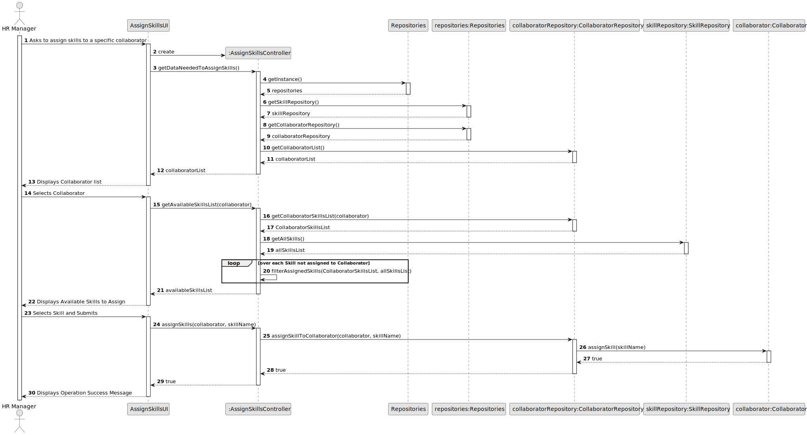
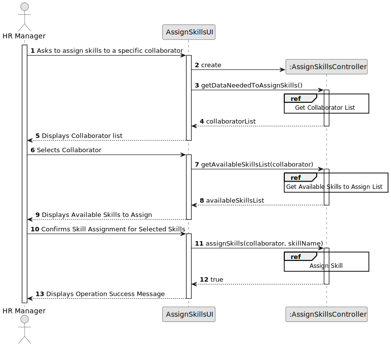
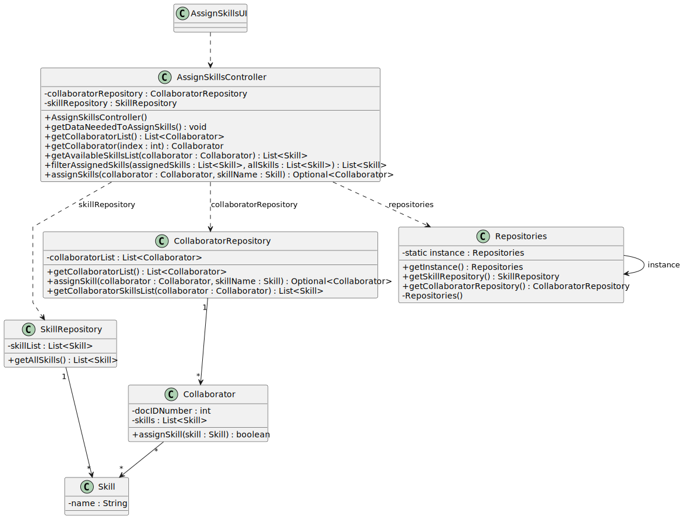

# US004 - Assign Skills to a Collaborator

## 3. Design - User Story Realization 

### 3.1. Rationale

| Interaction ID | Question: Which class is responsible for...                                | Answer                            | Justification (with patterns)                                                                                    |
|:---------------|:----------------------------------------------------------------------------|:----------------------------------|:-----------------------------------------------------------------------------------------------------------------|
| Step 1 ("Asks to assign skills to a specific collaborator")     | ... interacting with the actor?  | AssignSkillsUI                    | Pure Fabrication: there is no reason to assign this responsibility to any existing class in the Domain Model.    |
| Step 2 ("Displays Collaborator ID list")                          | ... coordinating the assignment of skills? | AssignSkillsController            | Controller: Acts as a controller to handle the assignment of skills.                                             |
| Step 3 ("Selects Collaborator ID number")                         | ... showing the list of Collaborator IDs? | CollaboratorRepository            | Information Expert: CollaboratorRepository knows and provides all collaborator IDs.                              |
| Step 4 ("Displays all Skills Already Assigned to that Collaborator and the Available Skills to Assign") | ... selecting a Collaborator ID?  | Collaborator                      | Information Expert: the selected Collaborator object will hold and manage its own data including ID.             |
| Step 5 ("Selects Skill Name(s) to assign and confirms")           | ... displaying currently assigned skills and available skills? | SkillRepository                   | Information Expert: SkillRepository is responsible for knowing and displaying all skills.                        |
| Step 6 ("Assigns Skill(s) to the Collaborator")                   | ... selecting and confirming skill(s) to assign? | Collaborator                      | Information Expert: Collaborator needs to manage its skills, so it adjusts its state based on assigned skills.   |
| Step 7 ("Displays operation success message")                     | ... assigning the skills to the collaborator and saving this state? | Collaborator                      | Information Expert: Collaborator object is responsible for managing its list of skills.                          |
| Step 8 ("Operation success feedback")                             | ... informing of operation success? | AssignSkillsUI                    | Pure Fabrication: there is no direct domain model entity that can provide UI interaction feedback.               |

### Systematization

According to the rationale taken, the conceptual classes promoted to software classes are:

- **CollaboratorRepository** (Creator, Information Expert)
- **Collaborator** (Information Expert)
- **SkillRepository** (Information Expert)

Other software classes identified:
- **AssignSkillsUI** (Pure Fabrication)
- **AssignSkillsController** (Controller)

## 3.2. Sequence Diagram (SD)

### Full Diagram

This diagram shows the full sequence of interactions between the classes involved in the realization of this user story.

### Split Diagrams

The following diagram shows the same sequence of interactions between the classes involved in the realization of this user story, but it is split in partial diagrams to better illustrate the interactions between the classes.

It uses Interaction Occurrence (a.k.a. Interaction Use).

**Get Job Category List Partial SD**

**Register a Collaborator Partial SD**

## 3.3. Class Diagram (CD)

