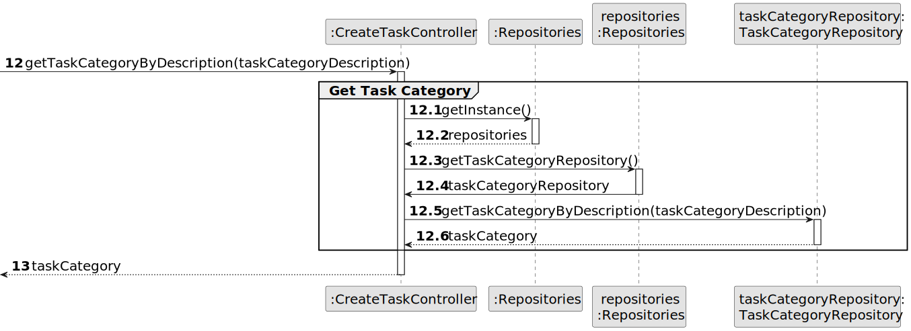

# US004 - To assign one or more skills to a collaborator.

## 3. Design - User Story Realization

### 3.1. Rationale

| Interaction ID                               | Question: Which class is responsible for...                                        | Answer                   | Justification (with patterns)                                                                                                                                                                                                                       |
|----------------------------------------------|-------------------------------------------------------------------------------------|--------------------------|----------------------------------------------------------------------------------------------------------------------------------------------------------------------------------------------------------------------------------------------------|
| Step 1: Actor Interaction                   | ... interacting with the actor?                                                     | AssignSkillsUI           | Pure Fabrication: the UI is specifically created to handle interactions between the system and the actor.                                                                                                                                          |
| Step 1: Skill Assignment Coordination       | ... coordinating the skill assignment process?                                      | AssignSkillsController   | Controller: acts as a mediator between the UI and the domain model to handle the assignment process.                                                                                                                                               |
| Step 2: Provide Employee IDs                | ... providing the list of Employee IDs?                                             | CollaboratorRepository   | Information Expert: the repository has the knowledge about the employees and is responsible for providing their IDs.                                                                                                                                |
| Step 2: Display Employee IDs                | ... displaying the Employee ID list to the HR Manager?                              | AssignSkillsUI           | Pure Fabrication: the UI handles the representation and display of data to the user.                                                                                                                                                               |
| Step 3: Process Employee ID Selection       | ... processing the selection of Employee ID?                                        | AssignSkillsUI           | Pure Fabrication: the UI is responsible for capturing user inputs.                                                                                                                                                                                |
| Step 3: Retrieve Employee Details           | ... retrieving specific employee details based on the selected ID?                  | AssignSkillsController   | Information Expert: the controller requests the data from the repositories as it knows which class to call for specific information.                                                                                                               |
| Step 4: Determine Skills for Assignment     | ... determining the skills already assigned and available to assign?                | CollaboratorRepository   | Information Expert: has the knowledge of which skills are assigned to employees.                                                                                                                                                                   |
| Step 4: Display Skills for Assignment       | ... displaying assigned and available skills to the HR Manager?                     | AssignSkillsUI           | Pure Fabrication: the UI is tasked with displaying information to the user.                                                                                                                                                                       |
| Step 5: Capture Skill Assignment Confirmation| ... capturing the confirmation of skill assignment?                                 | AssignSkillsUI           | Pure Fabrication: the UI handles direct interaction for confirmations and commands from the user.                                                                                                                                                  |
| Step 5: Validate Skill Selection            | ... validating the skill selection?                                                | AssignSkillsController   | Controller: is responsible for validating data before any operations are performed.                                                                                                                                                               |
| Step 6: Assign Skill to Employee            | ... assigning the selected skill to an employee?                                    | Collaborator             | Information Expert: the Collaborator class has the expertise to manage its own skills.                                                                                                                                                            |
| Step 6: Coordinate Skill Assignment         | ... coordinating the skill assignment to the collaborator?                          | AssignSkillsController   | Controller: orchestrates the interaction between the UI and the Collaborator class to assign skills.                                                                                                                                               |
| Step 7: Operation Success Feedback          | ... informing the HR Manager of successful operation?                               | AssignSkillsUI           | Pure Fabrication: UI is the point of interaction that provides feedback to the user.                                                                                                                                                              |

### Systematization

According to the taken rationale, the conceptual classes promoted to software classes are:

- Organization
- Task

Other software classes (i.e. Pure Fabrication) identified:

- CreateTaskUI
- CreateTaskController

## 3.2. Sequence Diagram (SD)

_**Note that SSD - Alternative Two is adopted.**_

### Full Diagram

This diagram shows the full sequence of interactions between the classes involved in the realization of this user story.

### Split Diagrams

The following diagram shows the same sequence of interactions between the classes involved in the realization of this user story, but it is split in partial diagrams to better illustrate the interactions between the classes.

It uses Interaction Occurrence (a.k.a. Interaction Use).

**Get Task Category List Partial SD**

**Get Task Category Object**

**Get Employee**

**Create Task**

## 3.3. Class Diagram (CD)

