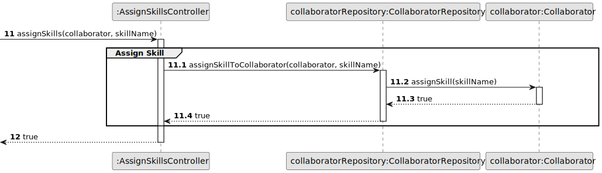
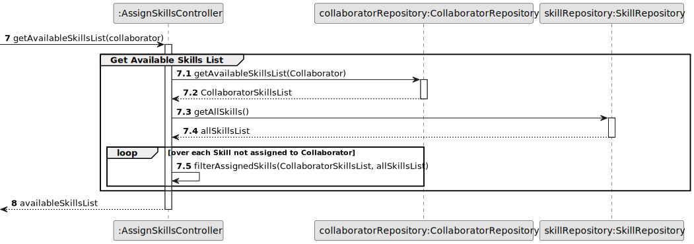
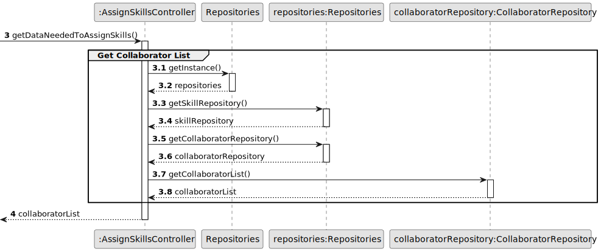

# US004 - Assign Skills to a Collaborator

## 3. Design - User Story Realization 

### 3.1. Rationale

| SSD Interaction ID | Question: Which class is responsible for...                                | Answer                        | Justification (with patterns)        |
|--------------------|----------------------------------------------------------------------------|-------------------------------|--------------------------------------|
| 1: Asks to assign skills to a specific collaborator | fetching the collaborator list? | `AssignSkillsController`        | **Controller**: The `AssignSkillsController` retrieves the list of collaborators by calling the `CollaboratorRepository`, acting as the mediator to ensure the UI doesn't directly interact with the data layer. |
| 2: Displays collaborator list | displaying the collaborator list? | `AssignSkillsUI`               | **Pure Fabrication**: The `AssignSkillsUI` is solely responsible for displaying the collaborator list to the HR Manager, separating the UI concerns from the business logic. |
| 3: Selects collaborator | receiving selection of collaborator? | `AssignSkillsUI`               | **Pure Fabrication**: Once the HR Manager selects a collaborator, the `AssignSkillsUI` captures this input and forwards it to the controller for further processing. |
|| fetching collaborator and all skills? | `AssignSkillsController`        | **Controller**: The `AssignSkillsController` coordinates obtaining collaborator/all skills for the selected collaborator, using the ``CollaboratorRepository``/`SkillRepository` to gather unassigned skills. |
|| filtering out already assigned skills to identify those that are unassigned/available to the collaborator? | `AssignSkillsController`        | **Controller**|
| 4: Displays Available Skills to Assign | displaying unsigned/available skills to the collaborator? | `AssignSkillsUI`        | **Pure Fabrication** |
| 5: Selects Skill and Submits | handling the skill selection and assignment process? | `AssignSkillsController`        | **Controller**: Upon receiving the selected skills, the `AssignSkillsController` manages the assignment process by communicating with the `CollaboratorRepository` to update the collaborator's skills. |
| 6: Displays operation success message | confirming and displaying the success of the skill assignment? | `AssignSkillsUI`               | **Pure Fabrication**: The `AssignSkillsUI` provides feedback to the HR Manager by displaying a success message, concluding the user interaction within the UI. |

### Systematization

Software classes (i.e. **Pure Fabrication**) identified: 

* AssignSkillsUI

Other software classes (i.e. **Controller**) identified: 

* AssignSkillsController

Other software classes (i.e. **Information Expert**) identified: 

* CollaboratorRepository
* SkillRepository  
* Collaborator

## 3.2. Sequence Diagram (SD)

### Full Diagram

This diagram shows the full sequence of interactions between the classes involved in the realization of this user story.

### Split Diagrams

**Assign Skill**

**Get Available Skills List**

**Get Collabotor List**

## 3.3. Class Diagram (CD)

