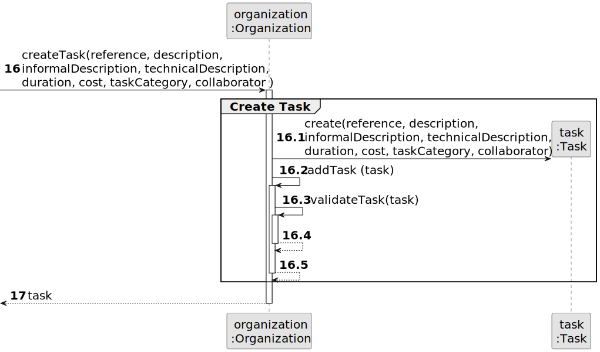

# US006 - Register a Vehicle 

## 3. Design - User Story Realization 

### 3.1. Rationale

_**Note that SSD - Alternative One is adopted.**_

| Interaction ID                                     | Question: Which class is responsible for...         | Answer                  | Justification (with patterns)                                                                                |
|:---------------------------------------------------|:----------------------------------------------------|:------------------------|:-------------------------------------------------------------------------------------------------------------|
| Step 1: Ask to register a vehicle. 		              | ...interacting with the actor?                      | CreateVehicleUI         | Pure Fabrication                                                                                             |
| 			  		                                            | ...coordinating the US?                             | CreateVehicleController | Controller                                                                                                   |
| 			  		                                            | ... knowing the user using the system?        	     | UserSession             |                                                                                                              | |
| Step 2: Request Data  		                           | ...displaying the form for the actor to input data? |                         |                                                                                                              |
| Step 3: Types Requested Data 		                    | ...validating input data?                           | CreateVehicleUI         | Pure Fabrication                                                                                             |
| 		                                                 | ...temporarily keeping input data?                  | System                  |                                                                                                              |
| Step 4: Shows all data and request confirmation 		 | ...display all data?                                | Task                    |                                                                                                              |
| 		                                                 | ...display request confirmation?  							           |                         |                                                                                                              |              
| Step 5: Confirms data  		                          | ...accepts confirmation?                            |                     |                                                                                                              |                                           |                                                                                      | 
| 			  		                                            | ...saving the created data?                         | Vehicle                 |                                                                                                              | 
| Step 6: Display operation success  		              | ...informing operation success?                     | CreateTaskUI            | IE: is responsible for user interactions.                                                                    | 

### Systematization ##

According to the taken rationale, the conceptual classes promoted to software classes are: 

* Organization
* Task

Other software classes (i.e. Pure Fabrication) identified: 

* CreateVehicleUI  
* CreateVehicleController

## 3.2. Sequence Diagram (SD)

_**Note that SSD - Alternative Two is adopted.**_

### Full Diagram

This diagram shows the full sequence of interactions between the classes involved in the realization of this user story.

### Split Diagrams

The following diagram shows the same sequence of interactions between the classes involved in the realization of this user story, but it is split in partial diagrams to better illustrate the interactions between the classes.

It uses Interaction Occurrence (a.k.a. Interaction Use).

**Get Task Category List Partial SD**

**Get Task Category Object**

**Get Employee**

**Create Task**

## 3.3. Class Diagram (CD)

