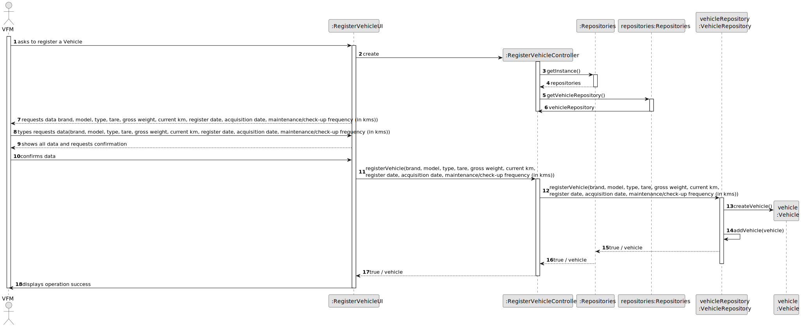
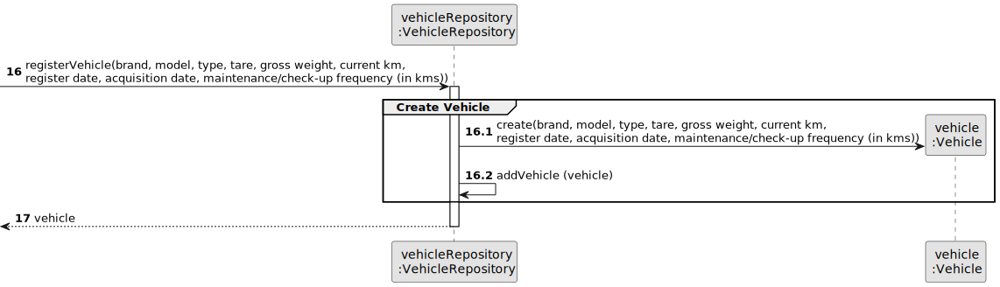
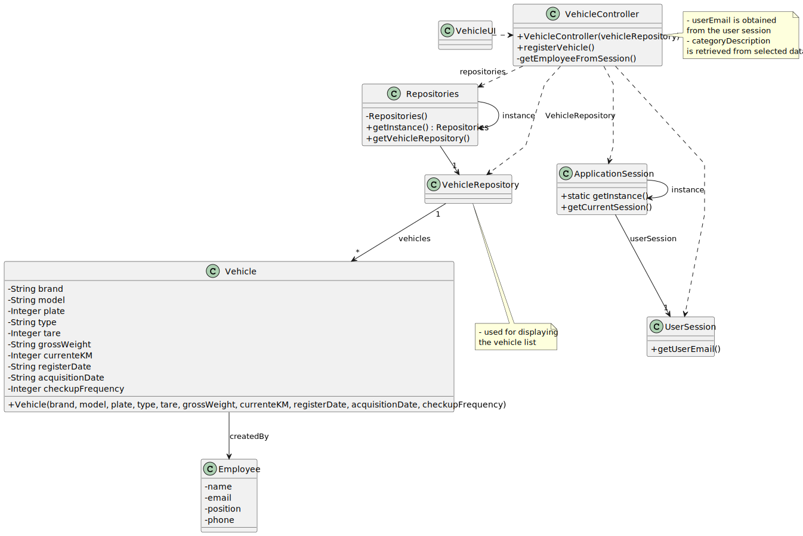

# US006 - Register a Vehicle 

## 3. Design - User Story Realization 

### 3.1. Rationale

_**Note that SSD - Alternative One is adopted.**_

| Interaction ID                      | Question: Which class is responsible for...               | Answer            | Justification (with patterns)                                     |
|:------------------------------------|:----------------------------------------------------------|:------------------|:------------------------------------------------------------------|
| Step 1: Ask to register a vehicle?	| ... initiating the vehicle registration process?          | VehicleUI         | Pure Fabrication (a UI class created to handle user interaction)|
| Step 2: getInstance()		       | ... obtaining the singleton instance of the Repositories? | Repositories      | Creator (creates and manages instances of objects)          |                                                |                                                      |             |                                           |
| Step 3: createVehicle() 		       | ... creating a vehicle                                    | Vehicle           | Creator (creates a new instances of the vehicle)               |
| Step 4: addVehicle()                | ...add a vehicle?                                         | VehicleRepository | Information Expert                                                |                                                                                      | 
| Step 5: confirms data               | ...ask to confirm data                                    | VehicleUI         | Pure Fabrication (a UI class created to handle user interaction). | 

### Systematization ##

According to the taken rationale, the conceptual classes promoted to software classes are(i.e. Creator):

* VehicleRepository
* Vehicle

Other software classes

* RegisterVehicleUI
* RegisterVehicleController
* Repositories

## 3.2. Sequence Diagram (SD)

_**Note that SSD - Alternative Two is adopted.**_

### Full Diagram

This diagram shows the full sequence of interactions between the classes involved in the realization of this user story.

### Split Diagrams

The following diagram shows the same sequence of interactions between the classes involved in the realization of this user story, but it is split in partial diagrams to better illustrate the interactions between the classes.

It uses Interaction Occurrence (a.k.a. Interaction Use).

**Register Vehicle Partial SD**

## 3.3. Class Diagram (CD)

