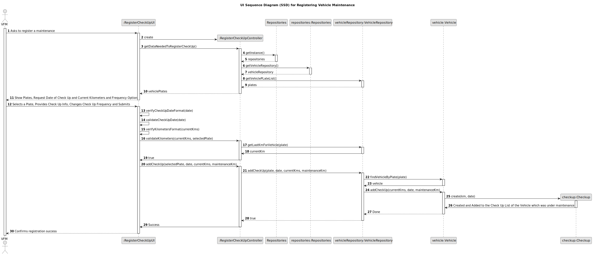
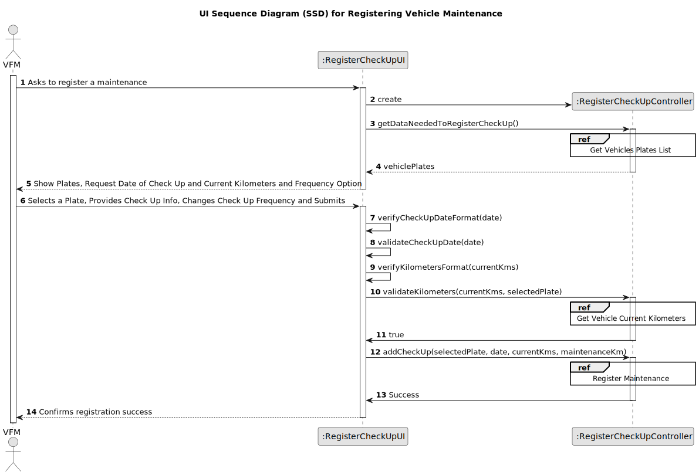
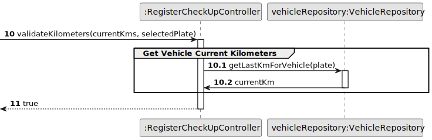
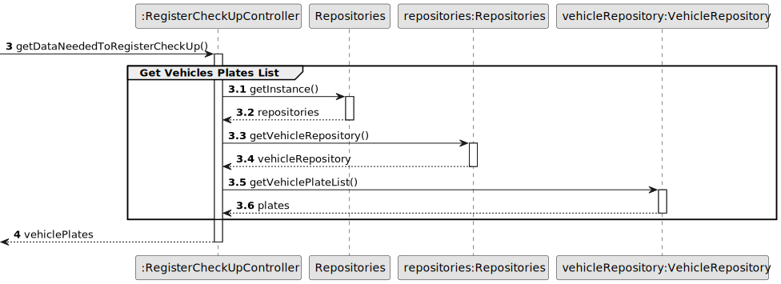
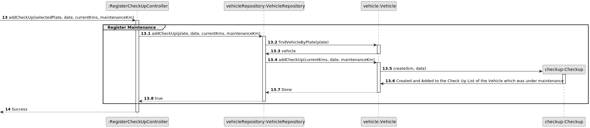
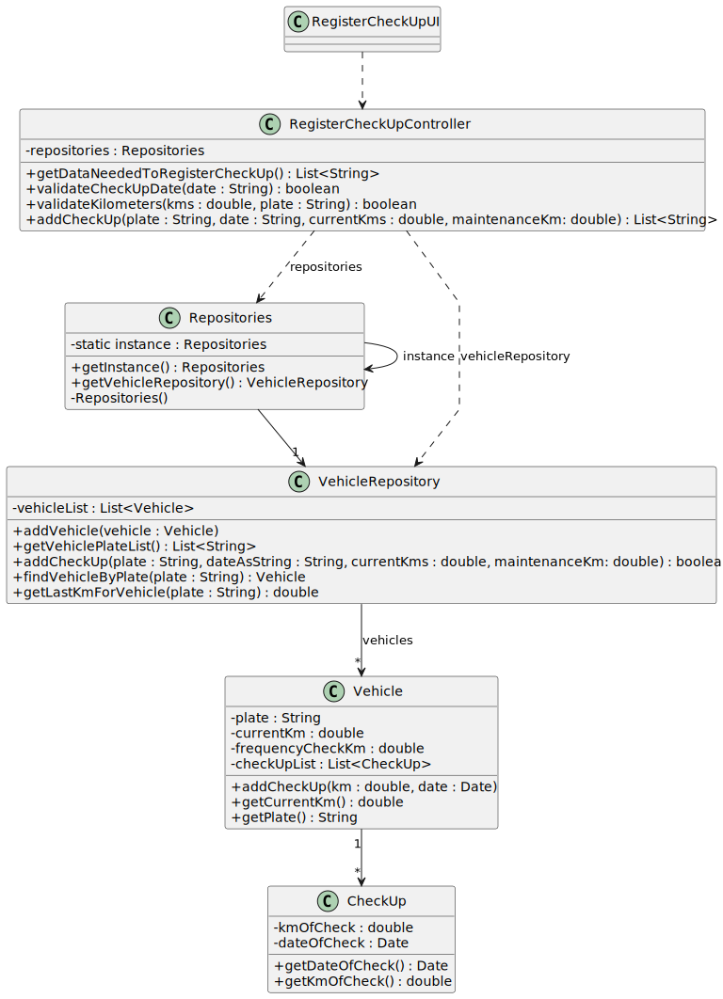

# US007 - To register a vehicle’s maintenance.

## 3. Design - User Story Realization

### 3.1. Rationale

| SSD Interaction ID | Question: Which class is responsible for...                                | Answer                    | Justification (with patterns)        |
|--------------------|----------------------------------------------------------------------------|---------------------------|--------------------------------------|
| 1: Asks to register a maintenance | fetching the list of vehicle plates? | RegisterCheckUpController         | **Controller**: the `RegisterCheckUpController` calls the `VehicleRepository` to fetch the list of vehicle plates, acting as the coordinator for data retrieval necessary for the user scenario, thus ensuring that the UI does not directly access the data layer and maintains a clean separation of concerns. |
| | showing the list of vehicle plates? | RegisterCheckUpUI         | **Pure Fabrication**: The `VehicleRepository` is responsible for providing the list of vehicle plates as it holds the necessary data, aligning with its role as an information holder. |
| 2: Show Plates, Request Date of Check-Up and Current Kilometers and Frequency Option | displaying the vehicle plates, and requesting date, kilometers, and asking if the user want to change the kms Check Up frequency? | RegisterCheckUpUI         | **Pure Fabrication** |
| 3: Selects a Plate, Provides Check-Up Info, Changes Check-up Frequency and Submits | verifying Date of Check-Up Format? | RegisterCheckUpUI         | **Pure Fabrication**: The `RegisterCheckUpUI` checks that the CheckUp date format is correct without involving other classes, reducing coupling|
| | validating Date of Check-Up? | RegisterCheckUpUI         | **Pure Fabrication**: The `RegisterCheckUpUI` validates the maintenance date entered, checking that it is not a future date without involving other classes, reducing coupling|
| | verifying Current Kilometers format? | RegisterCheckUpUI         | **Pure Fabrication**: The `RegisterCheckUpUI` checks that the kilometre format is correct without involving other classes, reducing coupling|
| | validating Current Kilometers? | RegisterCheckUpController         | **Controller**: The `RegisterCheckUpController` is responsible for validating the entered kilometers, as it can access the last mileage recorded for the vehicle concerned. This ensures that the new mileage reading exceeds the previously noted figure.|
|| retrieving the vehicle object by plate? | VehicleRepository | **Information Expert**: The `VehicleRepository` serves as the primary access point for vehicle information, which can then be used by other classes to manage check-up records or access specific vehicle properties like the latest kilometers recorded.|
| | creating the CheckUp Object? | Vehicle         | **Creator** |
| 4: Confirms registration success | confirming the success of the registration process?                           | RegisterCheckUpUI         | **Pure Fabrication**: the `RegisterCheckUpUI` informs the user about the successful registration|

### Systematization

Software classes (i.e. **Pure Fabrication**) identified: 

* RegisterCheckUpUI

Other software classes (i.e. **Controller**) identified: 

* RegisterCheckUpController

Other software classes (i.e. **Information Expert**) identified: 

* VehicleRepository  

Other software classes (i.e **Creator**) identified:

* Vehicle

## 3.2. Sequence Diagram (SD)

### Full Diagram

This diagram shows the full sequence of interactions between the classes involved in the realization of this user story.

### Split Diagrams

**Get Vehicle Current Kilometers**

**Get Vehicles Plates List**

**Register Maintenance**

## 3.3. Class Diagram (CD)

