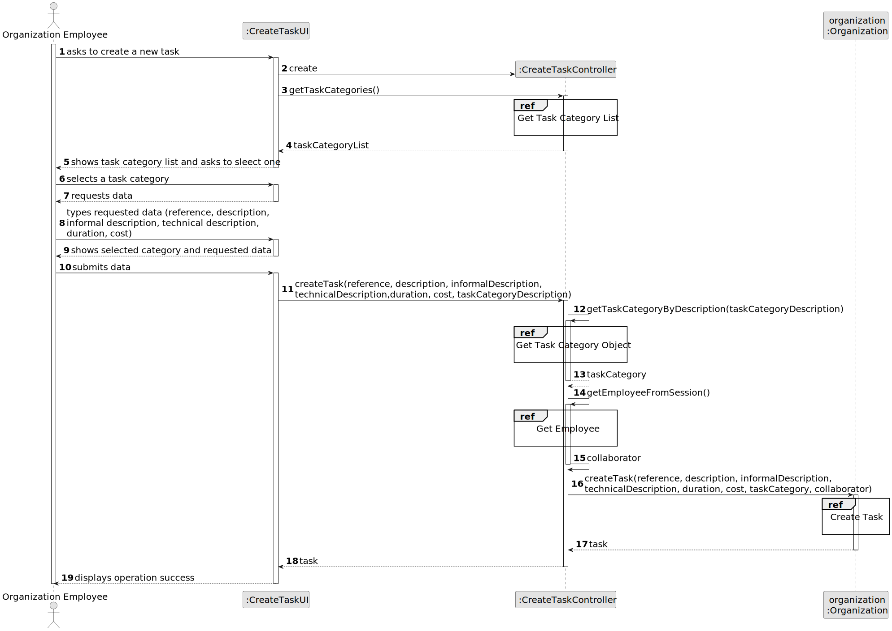
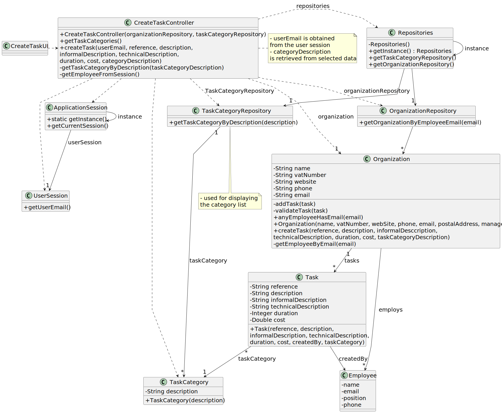

# US004 - To assign one or more skills to a collaborator.

## 3. Design - User Story Realization

### 3.1. Rationale

| SSD Interaction ID | Question: Which class is responsible for... | Answer | Justification (with patterns) |
|--------------------|---------------------------------------------|--------|------------------------------|
| Step/Msg 1: Asks to register a maintenance | ... initiating the maintenance registration process? | RegistMaintenanceUI | Pure Fabrication (a UI class created to handle user interaction) |
| Step/Msg 4: getInstance() | ... obtaining the singleton instance of the Repositories? | Repositories | Creator (creates and manages instances of objects) |
| Step/Msg 6: checkVFManager(userEmail) | ... validating if the user is an authorized vehicle fleet manager? | CollaboratorRepository | Information Expert (the repository contains information about collaborators) |
| Step/Msg 7: isVFM(userEmail) | ... determining if the email belongs to a vehicle fleet manager? | VFM | Information Expert (the VFM class knows about its own authorization status) |
| Step/Msg 11: getVehiclePLateList() | ... retrieving the list of vehicle plates? | VehicleRepository | Information Expert (the repository contains information about vehicle plates) |
| Step/Msg 16: Verify Date of Maintenance Format and Validate Date | ... validating the format and date of maintenance? | RegistMaintenanceUI | Pure Fabrication (a UI class created to handle validation in the UI layer) |
| Step/Msg 19: addMaintenance(Plate, Date, CurrentKms) | ... adding a new maintenance record? | RegistMaintenanceController | Controller (controls the flow of the application process) |
| Step/Msg 20: updateVehicleMaintenanceList(Date, CurrentKms) | ... updating the vehicle with a new maintenance checkup? | Vehicle | Information Expert (the Vehicle class knows how to update its own maintenance list) |
| Step/Msg 22: createCheckup(Date, CurrentKms) | ... creating a new checkup record? | Checkup | Creator (creates new instances of the Checkup object) |
| Step/Msg 25: Shows error, invalid input | ... displaying error messages for invalid inputs? | RegistMaintenanceUI | Pure Fabrication (a UI class created to interact with the user about errors) |
| Step/Msg 26: Confirms registration success | ... informing the fleet manager of the successful registration? | RegistMaintenanceUI | Pure Fabrication (a UI class responsible for notifying the user of system states) |

### Systematization

According to the taken rationale, the conceptual classes promoted to software classes are:

- Organization
- Task

Other software classes (i.e. Pure Fabrication) identified:

- CreateTaskUI
- CreateTaskController

## 3.2. Sequence Diagram (SD)

_**Note that SSD - Alternative Two is adopted.**_

### Full Diagram

This diagram shows the full sequence of interactions between the classes involved in the realization of this user story.

### Split Diagrams

The following diagram shows the same sequence of interactions between the classes involved in the realization of this user story, but it is split in partial diagrams to better illustrate the interactions between the classes.

It uses Interaction Occurrence (a.k.a. Interaction Use).

**Get Task Category List Partial SD**

**Get Task Category Object**

**Get Employee**

**Create Task**

## 3.3. Class Diagram (CD)

