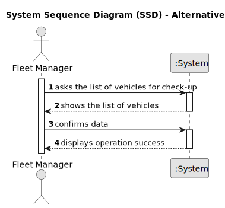

# US008 - Show Vehicle Check-Up List

## 1. Requirements Engineering

### 1.1. User Story Description
As an FM, i want to list the vehicle's needing the check-up

### 1.2. Customer Specifications and Clarifications
**From the specifications document:**

>	Each vehicle has a time to check-up. 

>	Only, FM and Administration have access to check-up time of the vehicles.

**From the client clarifications:**

> **Question:** What are the requests data to list the vehicles needing the check-up? Type of vehicle, Current Km and Maintenance/Check-up Frequency (in Kms) are sufficient?
>
> **Answer:** 
Current Km and Maintenance/Check-up Frequency (in Kms) are sufficient, yes;
he list must contain all vehicles that have already exceeded the number of km required for the inspection or those that are close to it.
For example:
a vehicle that made the checkup at 23500 and has a checkup frequency of 10000km.
a) If it currently has 33600 (exceeded) or
b) 33480 (there is a difference minor than 5% of the number of kms of the checkup frequency).
The list must clearly identify the vehicles through: plate number, brand, model and the that justified the checkup need.

### 1.3. Acceptance Criteria

* **AC1:** The vehicles data need at least have the plate number.
* **AC2:** The vehicles that appear, have a difference minor than 5% of the number of kms of the checkup frequency.
* **AC3:** The report should have the data concerning the vehicle description (Plate, Brand, Model and Current Kms) and the Checkup related data.

### 1.4. Found out Dependencies
There is dependency on:
* "US06 - As an FM, I wish to register a vehicle including Brand, Model, Type, Tare,
  Gross Weight, Current Km, Register Date, Acquisition Date, Maintenance/Check-
  up Frequency (in Kms)."

### 1.5 Input and Output Data

**Selected data:**

* Sorting Options:
  * Closer of check-up date

**Output Data:**

*  List of vehicle's needing check-up (plate number, brand, model, current kms, frequency, last checkup kms, next checkup (optimal) kms)
* Success of the operation

### 1.6. System Sequence Diagram (SSD)

### 1.7 Other Relevant Remarks
* XXX