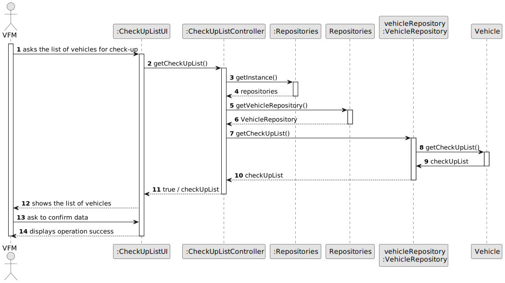
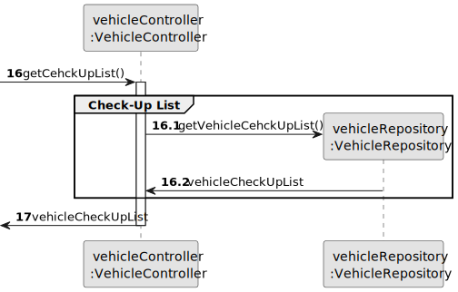
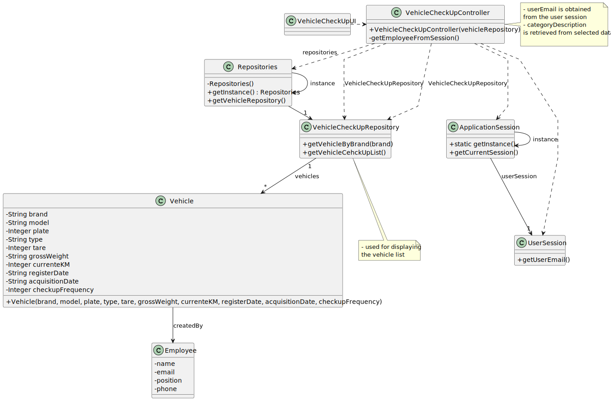

# US008 - Show Vehicle Check-Up List

## 3. Design - User Story Realization

### 3.1. Rationale

_**Note that SSD - Alternative One is adopted.**_

| Interaction ID                                    | Question: Which class is responsible for...               | Answer            | Justification (with patterns)                                                                                 |
|:--------------------------------------------------|:----------------------------------------------------------|:------------------|:--------------------------------------------------------------------------------------------------------------|
| Step 1: ask the list of vehicles for check-up  		 | ...initiating the process of showing the list of vehicles | CheckUpListUI     | Pure Fabrication: there is no reason to assign this responsibility to any existing class in the Domain Model. |
| Step 2: getInstance()  		                         | ...obtaining the singleton instance of the Repositories?  | Repositories      | Creator (creates and manages instances of objects) |
| Step 3: getVehicleCheckUpList()                   | ...retrieving the list of vehicle plates?                 | VehicleRepository | Information Expert (the repository contains information about vehicle plates)| 
| Step/Msg 4: ask to confirm data                   | ...asking to confirm the data display                     | CheckUpListUI     | Pure Fabrication (a UI class responsible for notifying the user of system states) |

### Systematization ##

According to the taken rationale, the conceptual classes promoted to software classes are(i.e. Creator):

* VehicleRepository
* Vehicle

Other software classes

* CheckUpListUI
* CheckUpListController
* Repositories

## 3.2. Sequence Diagram (SD)

_**Note that SSD - Alternative Two is adopted.**_

### Full Diagram

This diagram shows the full sequence of interactions between the classes involved in the realization of this user story.

### Split Diagrams

The following diagram shows the same sequence of interactions between the classes involved in the realization of this
user story, but it is split in partial diagrams to better illustrate the interactions between the classes.

It uses Interaction Occurrence (a.k.a. Interaction Use).

**Show List of Cehck-Up List Partial SD**

## 3.3. Class Diagram (CD)

