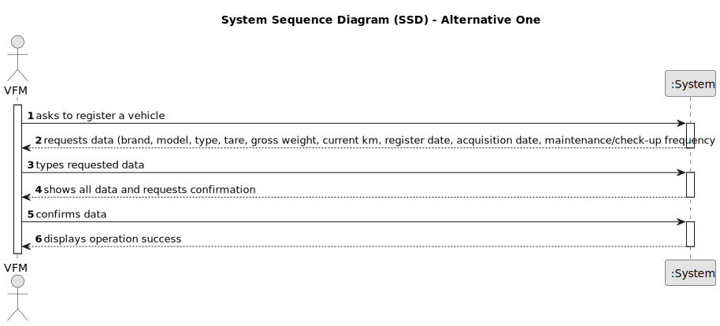

# US006 - Register a Vehicle 

## 1. Requirements Engineering

### 1.1. User Story Description

As a GSM, I want to know the exact costs referring to water consumption of specific green space so that I may manage these expenses efficiently

### 1.2. Customer Specifications and Clarifications 

**From the specifications document:**

> Therefore, within this US, the aim is to carry out a statistical analysis concerning the water consumption costs in all parks.
The ”WaterUsed.csv” file provide the necessary data to carry out the study. This file records daily water consumption (in m3) since the day each park opened. The amount paid for water is 0.7 €/m3, up to a consumption of 50 m3 , with a fee of 15% added for higher consumption levels.

> The data file contains records of the following information: ”Park Identification”, ”Year”, ”Month”, ”Day”, ”Consumption”. Consider this
data in order to obtain the following outcomes

> Barplot representing monthly water consumption, as a result of
the following specifications given by the user: time period (StartMonth, EndMonth) and park identification.

> Average of monthly costs related to water consumption as a result of the following specifications given by the user: number of parks to be analyzed, and park identification.

> Consider the water consumption of every day that is recorded. The aim is to analyze and compare statistical indicators between the park with the highest and lowest water consumption. For these two parks, perform the following tasks and compare results:
> 
> * Calculate the mean, median, standard deviation, and the coefficient of skewness
> * Build relative and absolute frequency tables (classified data), considering 5 classes
> * Check if the data has outliers, using the outlier definition as values that deviate from the median by more than 1.5 times the interquartile range.
> * Graphically represent data through histograms with 10 classes.

**From the client clarifications:**

> **Question:** 
> 
> **Answer:** 

> **Question:** 
> 
> **Answer:**  

> **Question:** 
>
> **Answer:** 

### 1.3. Acceptance Criteria

* **AC1:** The barplot need to have the park identification and start month and end month.
* **AC2:** 
* **AC3:** 

### 1.4. Found out Dependencies

N/A

### 1.5 Input and Output Data

**Input Data:**
* Data File
  * Contains Records:
    * ”Park Identification”
    * ”Year” 
    * ”Month”
    * ”Day”
    * ”Consumption"

**Output Data:**
* Barplot representing monthly water consumption
* Average of monthly costs related to water consumption
* Histograms with 10 classes
* Display confirmation success

### 1.6. System Sequence Diagram (SSD)
#### Alternative One

#### Alternative Two

### 1.7 Other Relevant Remarks

N/A