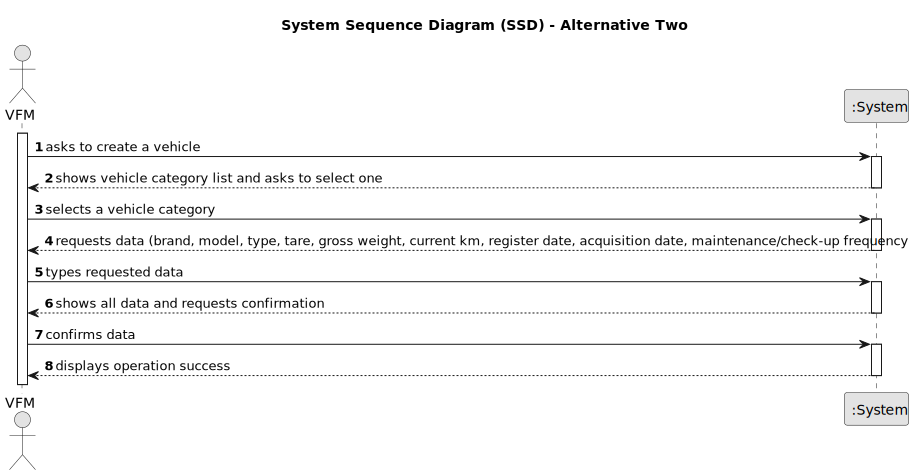

# US016 - Register a Vehicle 

## 1. Requirements Engineering

### 1.1. User Story Description

As a GSM, I want to import a .csv file containing lines with:
Water Point X, Water Point Y, Distance
into a unique data structure.

### 1.2. Customer Specifications and Clarifications 

**From the specifications document:**

>	Each vehicle is characterized by only take the team or mixed, light or heavy, open box, closed vans or trucks.

**From the client clarifications:**

> **Question:** Should the application identify a registered vehicle by a serial number or other attribute?
>
> **Answer:** By plate id.

> **Question:** Should the application a group the vehicles by their brand, serial number or other attribute?
>
> **Answer:**  No requirements were set concerning groups of vehicles;

> **Question:** For the application to work does the FM need to fill all the attributes of the vehicle?
>
> **Answer:** Yes, besides the vehicle plate

### 1.3. Acceptance Criteria

* **AC1:** All required fields must be filled in.
* **AC2:** When creating a vehicle with an existing reference, the system must reject such operation and the user must be able to modify it.
* **AC3:** When introducing a plate, the system must ask first the register date, so that can change the format of the plate.

### 1.4. Found out Dependencies

N/A

### 1.5 Input and Output Data

**Input Data:**

* Typed data:
    * brand
    * model 
    * type
    * tare
    * gross weight
    * current km
    * register date 
    * acquisition date
    * maintenance/check-up frequency (in kms)
	
* Selected data:
    * vehicle category

**Output Data:**

* Display confirmation success

### 1.6. System Sequence Diagram (SSD)
#### Alternative One

#### Alternative Two

### 1.7 Other Relevant Remarks

N/A