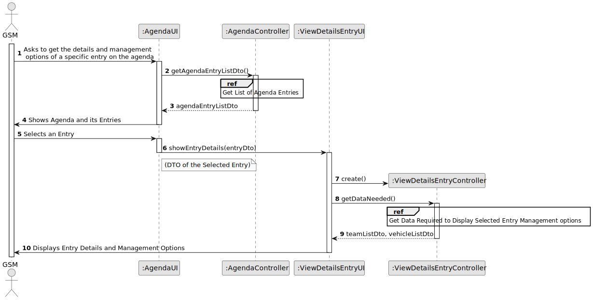
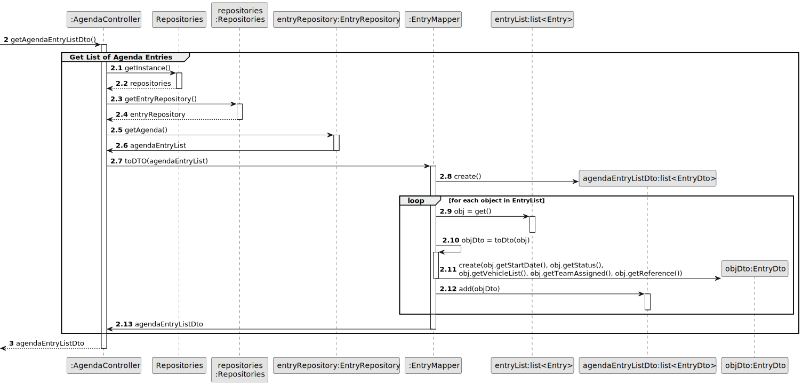
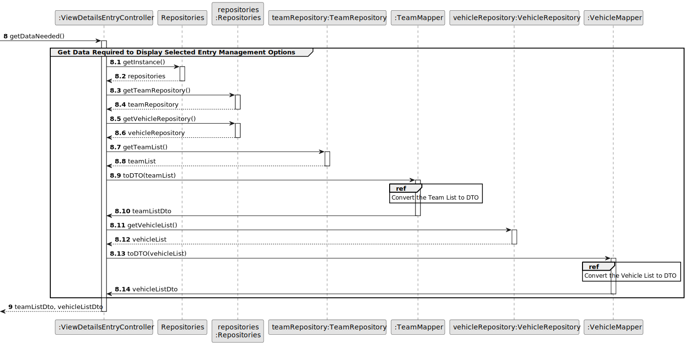
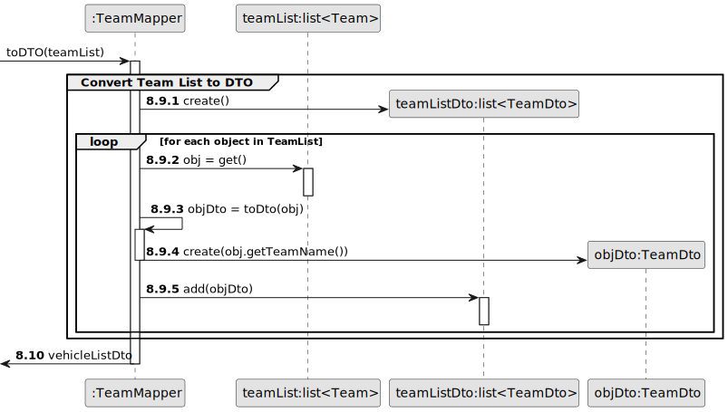
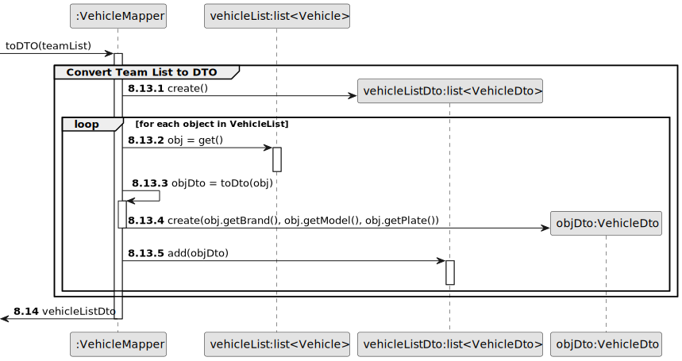
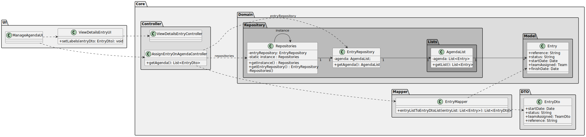

# Reference

## 3. Design - User Story Realization

### 3.1. Rationale

| SSD Interaction ID                                                                                  | Question Which class is responsible for...                                      | Answer                    | Justification (with patterns)                                                                                                                                                                                                                                                                                                                         |
|----------------------------------------------------------------------------------------------------|----------------------------------------------------------------------------------|---------------------------|----------------------------------------------------------------------------------------------------------------------------------------------------------------------------------------------------------------------------------------------------------------------------------------------------------------------------------------------------------|
| 1: Asks to get the details and management options of a specific entry on the agenda     | handling the request to get all the agenda entries? | AgendaController                 |  **Controller**: The `:AgendaController` handles the request to retrieve all agenda entries, coordinating the necessary operations between the UI and the data layer without performing business logic or data retrieval itself.                                                                                       |
| 1 | retrieving the agenda entries?                                                   | EntryRepository           | **Information Expert** The `EntryRepository` class holds the data about agenda entries, making it responsible for retrieving this information.                                                                                                                                                                                                         |
|1 | converting agenda entries to DTOs?                                               | EntryMapper               | **Pure Fabrication** The `EntryMapper` is a utility class specifically created to convert domain objects to DTOs, promoting **low coupling** by handling transformations outside of the business logic.                                                                                                                                                     |
| 2: Shows Agenda and its Entries                                                        | displaying the agenda and its entries?                                           | AgendaUI                 | **Pure Fabrication** The `AgendaUI` displays the agenda entries, handling the user interface responsibilities without involving other classes.                                                                                               |
| 3. Selects an Entry                                                                    | selecting a specific entry?                                                      | AgendaUI                 | **Pure Fabrication**: The `:AgendaUI` handles the user's selection of a specific entry.                                                                                                                                                                                                       |
| 3 | showing details of the selected entry?                                           | ViewDetailsEntryUI       | **Pure Fabrication**: The `ViewDetailsEntryUI` opens a new window to display the details of the selected entry.                                                                                                         |
| 3                                                                 |handling the request to retrieve necessary data for entry details?                                     | ViewDetailsEntryController| **Controller** The `:ViewDetailsEntryController` handles the request to retrieve necessary data for entry details, ensuring that the appropriate data is fetched from the repositories and provided to the UI without directly interacting with the business logic.                                                                                                                                   |
| 3                                                        | retrieving the list of teams?                                                    | TeamRepository            | **Information Expert** The `TeamRepository` holds the data about teams, making it the expert on retrieving this information.                                                                                                                                                                                                                           |
|3                                                       | converting the team list to DTOs?                                                | TeamMapper                | **Pure Fabrication** The `TeamMapper` is a utility class specifically created to convert domain objects to DTOs, promoting low coupling by handling transformations outside of the business logic.                                                                                                                                          |
| 3                                                        | retrieving the list of vehicles?                                                 | VehicleRepository         | **Information Expert** The `VehicleRepository` holds the data about vehicles, making it the expert on retrieving this information.                                                                                                                                                                                                                     |                                                           |
| 3                                              | converting the vehicle list to DTOs?                                             | VehicleMapper             | **Pure Fabrication** The `VehicleMapper` is a utility class specifically created to convert domain objects to DTOs, promoting low coupling by handling transformations outside of the business logic.                                                                                                                                                   |
| 4: Displays Entry Details and Management Options                                      | displaying the entry details and management options?                             | ViewDetailsEntryUI       | **Pure Fabrication** The `ViewDetailsEntryUI` handles the display of entry details and management options, keeping the responsibility for user interface interactions separate from the business logic and data access layers.                                                                                                                          |

### Systematization

Software classes (i.e. **Pure Fabrication**) identified

* AgendaUI
* ViewDetailsEntryUI
* EntryMapper
* TeamMapper
* VehicleMapper

Other software classes (i.e. **Controller**) identified

* AgendaController
* ViewDetailsEntryController

Other software classes (i.e. **Information Expert**) identified

* EntryRepository
* TeamRepository
* VehicleRepository

## 3.2. Sequence Diagram (SD)

### Full Diagram

This diagram shows the full sequence of interactions between the classes involved in the realization of this user story.

### Split Diagrams

**Get List of Agenda Entries**

**Get Data Required to Display Selected Entry Management Options**

**Convert Team List to DTO**

**Convert Vehicle List to DTO**

## 3.3. Class Diagram (CD)

