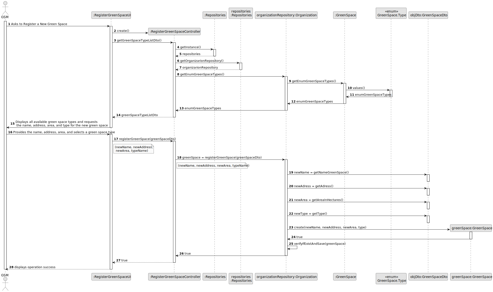
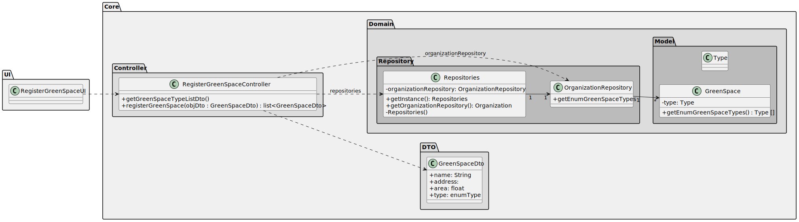

# US020 - Register a Green Space

## 3. Design - User Story Realization 

### 3.1. Rationale

_**Note that SSD - Alternative One is adopted.**_

| Interaction ID                                                                                                             | Question: Which class is responsible for...                          | Answer                       | Justification (with patterns)                                                                                                             |
|:---------------------------------------------------------------------------------------------------------------------------|:---------------------------------------------------------------------|:-----------------------------|:------------------------------------------------------------------------------------------------------------------------------------------|
| Step 1: asks to register a new green space 		                                                                              | 	... interacting with the actor?                                     | RegisterGreenSpaceUI         | Pure Fabrication: there is no reason to assign this responsibility to any existing class in the Domain Model.                             |
| 			  		                                                                                                                    | 	... coordinating the US?                                            | RegisterGreenSpaceController | Controller                                                                                                                                |
| 			  		                                                                                                                    | ... saving green space tyes?                                         | Organization                 | Creator (Rule 1): in the DM Organization                                                                                                  |
| 		                                                                                                                        						                                                                                                                                                                                               
| Step 2: Displays all available green space types and requests the name, address, area, and type for the new green space 		 | 	...returning green space type list?	                                | GreenSpaceController         | Controller                                                                                                                                |
| 	                                                                                                                          | 	...displaying all available green space types?                      | GreenSpaceUI                 |                                                                                                                                           |
| 	                                                                                                                          | 	... saving green space types?                                       | Organization                 |                                                                                                                                           |
| Step 3:Provides the name, address, area, and selects a green space type		                                                  | 	...providing the name, area, address and select a green space type? | GSM                          | GSM                                                                                                                                       |
|                                                                                                                            | 	... saving the name, area and address                               | Organization                 |                                                                            |
| 		                                                                                                                         | 	... verifying if the green space exits and save the data?			        | Organization                 |                                                                              |
| Step 4: displays operation success		                                                                                       | ... informing operation success?                                     | RegisterGreenSpaceUI         | Pure Fabrication: The RegisterGreenSpaceUI presents feedback to the user, maintaining separation of concerns between UI and business logic| 
 		                                                                                                          
### Systematization ##

Software classes (i.e. **Pure Fabrication**) identified

* RegisterGreenSpaceUI

Other software classes (i.e. **Controller**) identified

* RegisterGreenSpaceController

Other software classes (i.e. **Information Expert**) identified

* Organization
* GreensSpace

## 3.2. Sequence Diagram (SD)

_**Note that SSD - Alternative Two is adopted.**_

### Full Diagram

This diagram shows the full sequence of interactions between the classes involved in the realization of this user story.

## 3.3. Class Diagram (CD)

