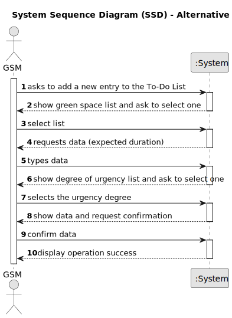

# US021 - Add a new entry to the To-Do List.

## 1. Requirements Engineering

### 1.1. User Story Description

As a GSM, I want to add a new entry to the To-Do List.

### 1.2. Customer Specifications and Clarifications 

**From the specifications document:**

**From the client clarifications:**

> **Question:** If there are multiple GSM in the system, can a GSM create an entry for a Green Space managed by another GSM?
> **Answer:** No

> **Question** For a regular task, should the GSM define the frequency in which the tasks needs to be performed?
> **Answer:** Not yet
 
> **Question** Should the to-do entries be unique or can a GSM repeat the same to-do entry, for the same Green Space, multiple times
> **Answer:** Yes; Assuming the previous task with same description was previously processed and is not open anymore.

> **Question** If the To-Do entry is assigned to the Agenda, should it be removed for the To-Do entry, if it only occasional?
> **Answer:** Should change the status to processed.

> **Question** What are the details the GSM needs to input, other than the Green Space, frequency, estimated duration?Title and description are required?
> **Answer:** Title and description could be useful.

> **Question** Should the GSM define the skills needed for a To-Do entry?
> **Answer:** No but maybe it should be done for type of task (or similar)

### 1.3. Acceptance Criteria

* **AC1:** The new entry must be associated with a green space managed by the GSM.
* **AC2:** The green space for the new entry should be chosen from a list presented to the GSM.

### 1.4. Found out Dependencies

* There is a dependency on "US20 - As a Green Space Manager (GSM), I want to register a green space (garden, medium-sized park or large-sized park) and its respective area."

### 1.5 Input and Output Data

**Input Data:**

* Typed data:
    * state
    * green space
    * title
    * description
    * approximate expected duration
    * degree of urgency

* Selected data:
    * urgency degree

**Output Data:**
* **Confirmation of adding a new entry**
  - A success notification confirming that the entry was successfully added.

### 1.6. System Sequence Diagram (SSD)

**_Other alternatives might exist._**

#### Alternative One

#### Alternative Two

### 1.7 Other Relevant Remarks

