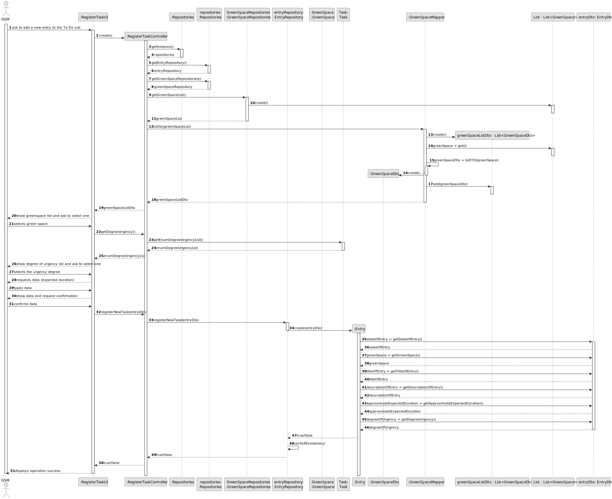
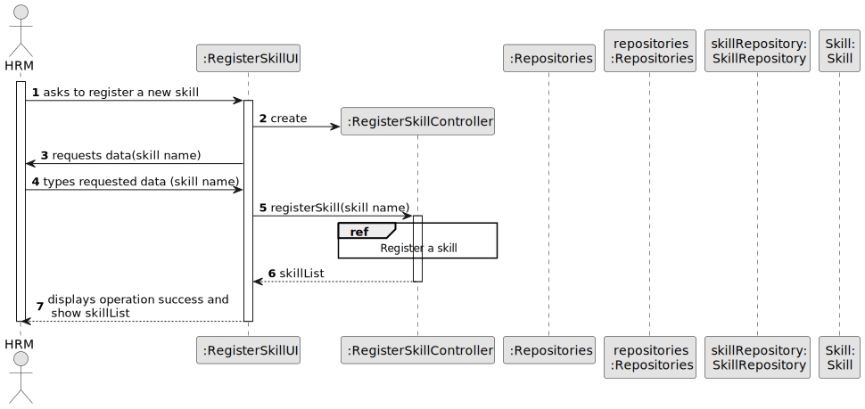
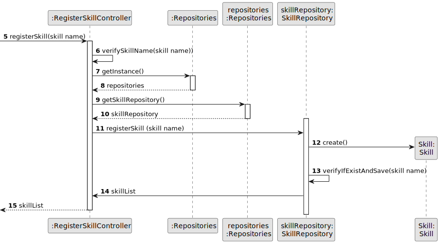
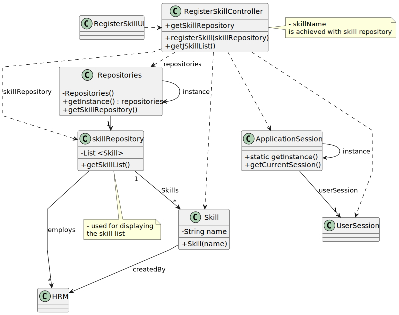

# US025 - Add a new Entry to the To-Do List

## 3. Design - User Story Realization 

### 3.1. Rationale

_**Note that SSD - Alternative One is adopted.**_

| SSD Interaction ID                    | Question: Which class is responsible for... | Answer                 | Justification (with patterns)                                                                                                                                                                                                  |
|---------------------------------------|---------------------------------------------|------------------------|--------------------------------------------------------------------------------------------------------------------------------------------------------------------------------------------------------------------------------|
| 1: createRegisterTaskController()     | create the controller                       | RegisterTaskController | **Controller**: The `:RegisterTaskController` handles the request to add a new controller, coordinating the necessary operations between the UI and the data layer without performing business logic or data retrieval itself. |
| 2: getInstance()                      | get the instance of repository              | Repositories           | **Information Expert**: The `Repositories` knows how to extract the information, as it holds the knowledge of data and structure.                                                                                              |
| 3: getEntryRepository()               | get the entry repository                    | Repositories           | **Information Expert**: The `Repositories` knows how to extract the information, as it holds the knowledge of data and structure.                                                                                              |
| 4: getGreenSpacesRepository()         | get the green space repository              | Repositories           | **Information Expert**: The `Repositories` knows how to extract the information, as it holds the knowledge of data and structure.                                                                                              |
| 5: getGreenSpaceList()                | get green space list                        | GreenSpace             | **Information Expert**: The `GreenSpace` knows how to extract the the green space list, as it holds the knowledge of data and structure.                                                                                       |                                                                                                                                                                                                                                   |
| 7: toDto(greenSpaceList)              | who creates the dto with the data           | GreenSpaceMapper       | **Creator**: The `GreenSpaceMapper` is responsible for create the dto with the data.                                                                                                                                           |
| 9: greenSpace = getGreenSpace()       | providing the green space                   | GreenSpace             | **Information Expert**: The `GreenSpace` contains the information, making it the expert on providing this piece of information when needed.                                                                                    |
| 10: greenSpaceDto = toDto(greenSpace) | create the green space dto                  | GreenSpaceMapper       | **Pure Fabrication**: The `GreenSpaceMapper` is a utility class created to handle data transformation tasks, such as create the green space DTO, without adding complexity to the business logic.                |
| 11: add(GreenSpaceDto)                | add the green space Dto                     | GreenSpaceDto          | **Information Expert**: The `GreenSpaceDto` class knows how to assign a team to itself, as it holds the data and methods for managing its state.                                                                               |
| 12: getDegreeUrgency()                | get the degree urgency                      | RegisterTaskController | **Controller**: The `RegisterTaskController` class knows about its collaborators and their contact details, making it the expert on sending notifications to its members.                                                      |
| 13: getEnumDegreeUrgencyList()        | get the enum degree urgency list            | Task                   | **Information Expert**: The `Task` class knows its own email address, making it the expert on providing this piece of information.                                                                                             |
| 15: create(entryDto)                  | create the entry                            | Entry                  | **Creator**: The `Entry` knows which email service is currently in use, making it the expert on providing this instance.                                                                                                       |

### Systematization ##

According to the taken rationale, the conceptual classes promoted to software classes are: 

* Organization
* Skill

Other software classes (i.e Information Expert) identified:

* Repositories
* DocTypeRepository
* SkillCategoryRepository

Other software classes (i.e. Pure Fabrication) identified:

* CreateSkillUI
* CreateSkillController

## 3.2. Sequence Diagram (SD)

_**Note that SSD - Alternative Two is adopted.**_

### Full Diagram

This diagram shows the full sequence of interactions between the classes involved in the realization of this user story.

### Split Diagrams

The following diagram shows the same sequence of interactions between the classes involved in the realization of this user story, but it is split in partial diagrams to better illustrate the interactions between the classes.

It uses Interaction Occurrence (a.k.a. Interaction Use).

**Get Task Category List Partial SD**

## 3.3. Class Diagram (CD)

