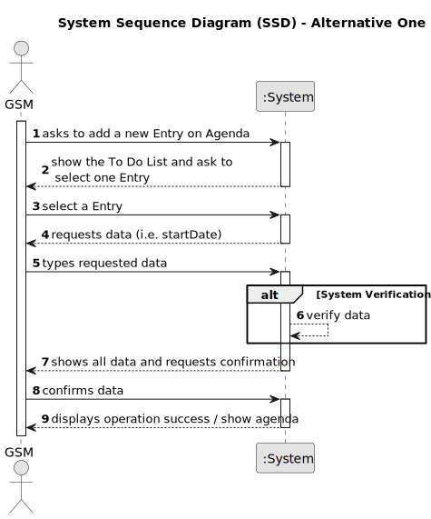
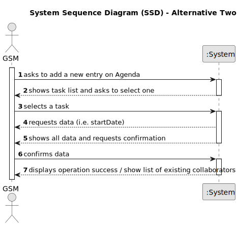

# US022 - Add a new entry in Agenda

## 1. Requirements Engineering

### 1.1. User Story Description

As a GSM, I want to add a new entry in the Agenda.

### 1.2. Customer Specifications and Clarifications 

**From the specifications document:**

> In the daily management, the GSM uses two essential tools: the Agenda and the Task List (aka To-Do List).

> The Agenda is made up of entries that relate to a task (which was previously in the To-Do List), the team that will carry out the task, the vehicles/equipment assigned to the task, expected duration, and the status (Planned, Postponed, Canceled, Done).

> The Agenda is a crucial mechanism for planning the week’s work. Each entry in the Agenda defines a task (that was previously included in the to-do list). A team will carry out that task in a green space at a certain time interval on a specific date. Comparatively analyzing the Agenda entries and the pending tasks (to-do list) allows you to evaluate the work still to be done, the busyness of the week, and the work performed by a team in a green space at a determined time interval and on a specific date.
 

**From the client clarifications:**

> **Question:** To add an entry in Agenda is needed to selected what data? Date?
>
> **Answer:** The start date only is enough because you have the time expected for the task

> **Question:** It is possible to add an entry for more than one day? Like, if one task need more than one/two days is needed to add the entry for more than one day?
>
> **Answer:** Yes, with the time expected you can consider that one task can need more than one day to taken care.

> **Question:** Can I add an entry that has a time period that already have an existing entry in the Agenda?
>
> **Answer:** Yes, because:
a) there are many parks to manage
b) different tasks can be executed at same time in the same park.

> **Question:** How many hours work a Team by day, to consider, how many days need to be taken care of to complete the task? And how much time needs to be taken into consideration for the transport distance to the location of the task?
>
> **Answer:** 

### 1.3. Acceptance Criteria

* **AC1:** The new entry must be associated with a green space managed by the GSM.
* **AC2:** The new entry must exist in the To-Do list.

### 1.4. Found out Dependencies

* There is a dependency on "US021 -  I want to add a new entry to the To-Do List" the entry must be existent in To-Do List.

### 1.5 Input and Output Data

**Input Data:**

* Selected data:
  * Task
  * Start-Date 

**Output Data:**

* **Confirmation of add entry successfully:**
  - A success notification confirming that the entry has been added.
* **Warnings or Errors (if applicable):**
  - Error messages for any issues encountered during the add of the entry.
* **Operational Feedback:**
  - Overall status of the operation (success or failure), with immediate feedback.

### 1.6. System Sequence Diagram (SSD)

**_Other alternatives might exist._**

#### Alternative One

#### Alternative Two

### 1.7 Other Relevant Remarks

N/A