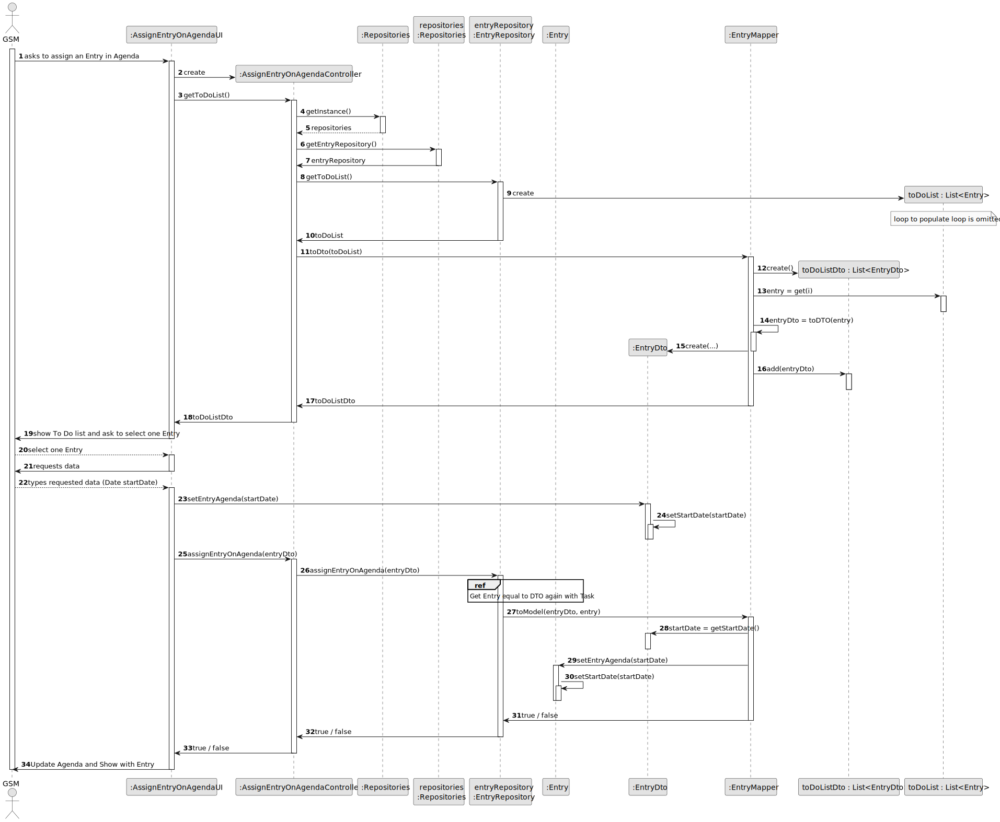
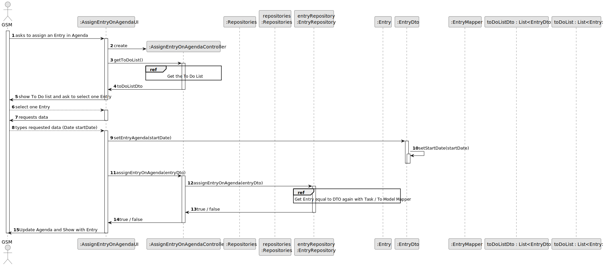
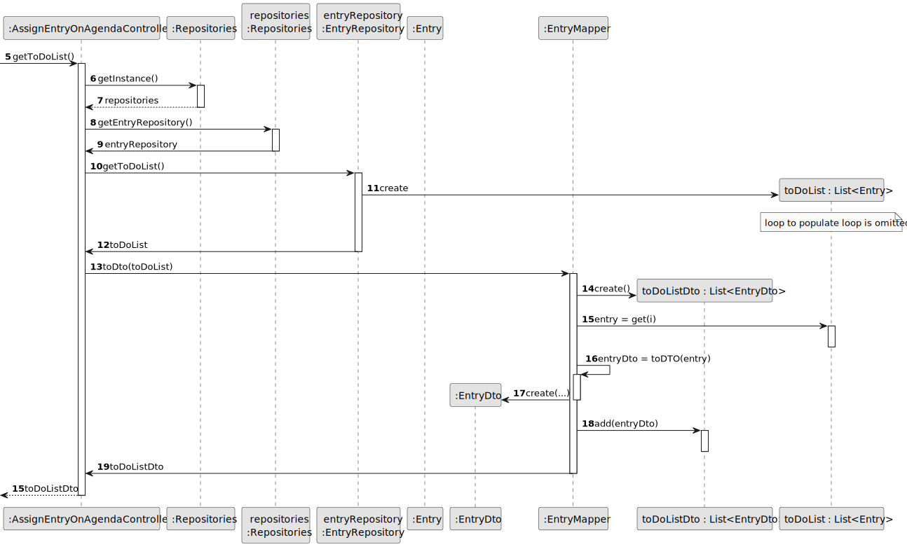
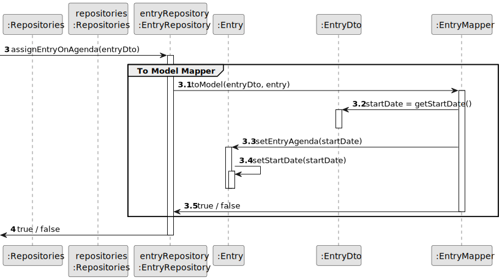
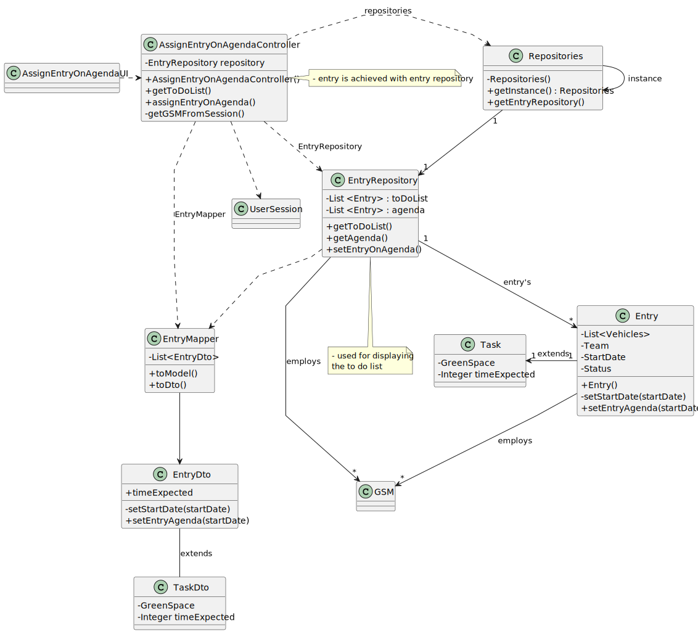

# US022 - Add a new entry in Agenda

## 3. Design - User Story Realization 

### 3.1. Rationale

_**Note that SSD - Alternative Two is adopted.**_

| Interaction ID | Question: Which class is responsible for...        | Answer                        | Justification (with patterns)                                                                                 |
|:---------------|:---------------------------------------------------|:------------------------------|:--------------------------------------------------------------------------------------------------------------|
| Step 1  		     | 	... interacting with the actor?                   | AssignEntryOnAgendaUI         | Pure Fabrication: there is no reason to assign this responsibility to any existing class in the Domain Model. |
| 			  		        | 	... coordinating the US?                          | AssignEntryOnAgendaController | Controller                                                                                                    |
| 			  		        | ... set the Entry?                                 | EntryRepository               | Creator (Rule 1): in the DM CollaboratorRepository.                                                           |
| 		             | 							                                            |                               |                                                                                                               |
| Step 2  		     | 	...saving the inputted data?                      | Entry                         | IE: object created in step 1 has its own data.                                                                |
| Step 3  		     | 	... validating startDate (local validation)? 				 | EntryRepository               | IE:  the status have the verification and attribution method by omission.                                     |
| Step 4  		     | 	... validating data (local validation)?           | Entry                         | IE: owns its data.                                                                                            | 
|                | 	... validating all data (global validation)?      | EntryRepository               | IE: knows all Entry's.                                                                                        | 
| Step 5		       | 	... saving the set Entry?                         | EntryRepository               | IE: owns all entry. (Agenda and To Do List)                                                                   | 
| Step 6  		     | 	... informing operation success?                  | AssignEntryOnAgendaUI         | IE: is responsible for user interactions.                                                                     | 

### Systematization ##

According to the taken rationale, the conceptual classes promoted to software classes are(i.e. Creator): 

* EntryRepository
* Entry
* Task

Other software classes (i.e Information Expert) identified:

* Repositories
* EntryRepository

Other software classes (i.e. Pure Fabrication) identified: 

* AssignEntryOnAgendaUI  
* AssignEntryOnAgendaController

Other software classes (i.e. Use of Data Transfer Objects (DTO)) identified:

* EntryDTO
* TaskDTO

## 3.2. Sequence Diagram (SD)

_**Note that SSD - Alternative One is adopted.**_

### Full Diagram

This diagram shows the full sequence of interactions between the classes involved in the realization of this user story.

### Split Diagrams

The following diagram shows the same sequence of interactions between the classes involved in the realization of this user story, but it is split in partial diagrams to better illustrate the interactions between the classes.

It uses Interaction Occurrence (a.k.a. Interaction Use).

**Get To Do List Partial SD**

**EntryDto To Entry SD**

## 3.3. Class Diagram (CD)

