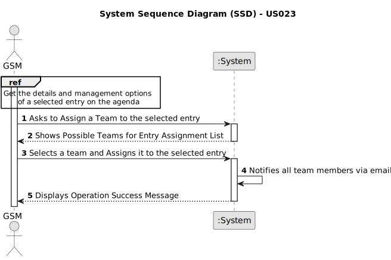
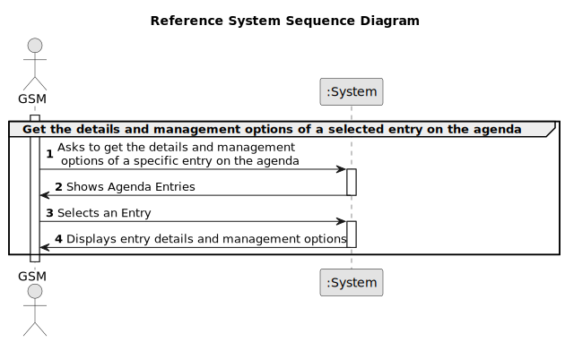

# US023 - To Assign a Team to an entry in the Agenda

## 1. Requirements Engineering

### 1.1. User Story Description

As a GSM, I want to assign a Team to an entry in the Agenda

### 1.2. Customer Specifications and Clarifications 

**From the Specifications Document:**

> *The Agenda is a crucial mechanism for planning the week’s work. Each entry in the Agenda defines a task (that was previously included in the to-do list). A team will carry out that task in a green space at a certain time interval on a specific date. Comparatively analyzing the Agenda entries and the pending tasks (to-do list) allows you to evaluate [...] the work performed by a team in a green space at a determined time interval and on a specific date.*

**From the client clarifications:**

<u>A team can be assigned to multiple entries</u>. However, <u>an agenda entry cannot have more than one team assigned to it.</u>

### 1.3. Acceptance Criteria
* **AC1: Notification to Team Members**
  - The system must send a message to all team members informing them about the assignment.

* **AC2: Configurable Email Services**
  - Different email services can be used to send the message.
  - These services must be defined through a configuration file to allow the use of different platforms (e.g., Gmail, DEI’s email service, etc.).

* **AC3: Pre-selection of Agenda Entry**
  - The user must first navigate to the agenda and select an entry before they can assign a team to it.

### 1.4. Found out Dependencies

* There is a dependency on **US22 - As a GSM, I want to add a new entry in the Agenda**. Before a team can be assigned to an agenda entry, the entry itself must exist. Thus, the functionality to add new entries must be in place and operational.

* There is a dependency on **US05 - As an HRM, I want to generate a team proposal automatically**. This functionality supports the creation of teams based on required skills and team size, which is a prerequisite for assigning teams to agenda entries.
### 1.5 Input and Output Data

* **Selected Data:**
  - **Team:** The GSM selects a specific team from a list of available teams. This assumes that teams have been generated based on required skills and team size as described in <u>US05</u>.
  - **Agenda Entry:** The GSM selects an entry in the agenda to which the team will be assigned. This assumes that the agenda entry has been previously created and is valid for assignment as outlined in <u>US22</u>.

**Output Data:**

* **Confirmation of Assignment:**
  - A message confirming that the team has been successfully assigned to the selected agenda entry.

### 1.6. System Sequence Diagram (SSD)

To avoid redundancy and ensure consistency across multiple user stories that share the **AC3: Pre-selection of Agenda Entry**, we have created a **Reference System Sequence Diagram**. This reference diagram, included at the beginning of the **System Sequence Diagram**  **- US023**, illustrates the essential step of selecting an agenda entry to retrieve its details and management options, before assigning a team. 

The reference diagram that illustrates the process of pre-selecting an agenda entry to obtain its details and management options is presented below.

**IMPORTANT NOTE:** In the last step of the **Reference System Sequence Diagram**, the system displays the management options of an entry, so it displays all the available teams, because viewing all the available teams and assigning one to an entry is one of the management options of an entry.