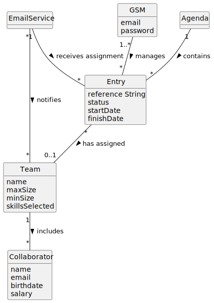
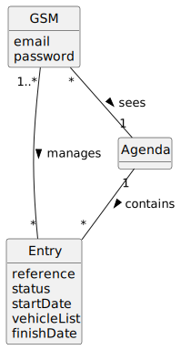

# US023 - To Assign a Team to an entry in the Agenda

## 2. Analysis

### 2.1. Relevant Domain Model Excerpt 

Reference Domain Model:

- **Entry**: Represents each task or activity scheduled in the agenda. It includes essential details for its management and execution:
  - `reference`: A unique identifier for the entry.
  - `status`: The current state of the entry (e.g., planned, completed).
  - `startDate`: The date when the entry is scheduled to begin.
  - `vehicleList`: A list of vehicles assigned to the entry.
  - `finishDate`: The date when the entry is expected to be completed.

- **GSM**: The Green Space Manager responsible for managing entries and teams. Key attributes include:
  - `email`: The GSM's email address for communication and notifications.
  - `password`: The GSM's password for system access.

- **Team**: Represents a group of collaborators assigned to tasks. Important attributes include:
  - `name`: The name of the team.
  - `collaborators`: The members of the team.
  - `maxSize`: The maximum number of members in the team.
  - `minSize`: The minimum number of members in the team.
  - `skillsSelected`: The skills required for the team members.

### 2.2 Associations:

- **manages**: This association indicates that the GSM is responsible for managing no entries or multiple entries. Each GSM can manage multiple entries and each entry can be managed by multiple GSMs.

- **has assigned**: This association shows that an entry can have a team assigned to it. An entry can have 0 or 1 team, and each team can be assigned to multiple entries.