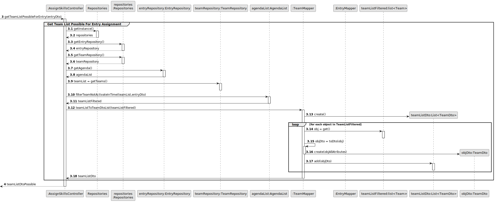
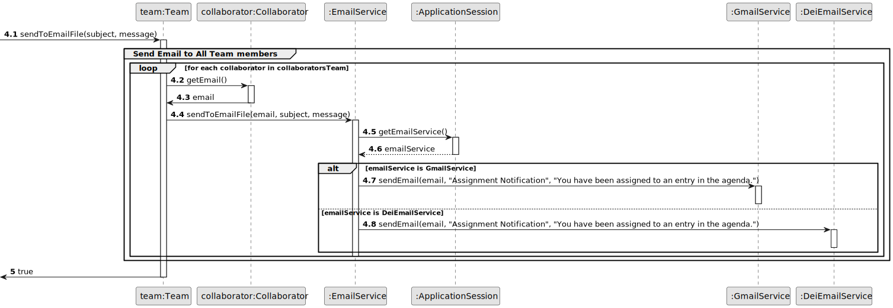
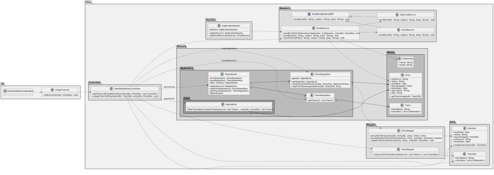

# US023 - To Assign a Team to an entry in the Agenda

---

Please first read the **Design - User Story Realization of the Reference System Sequence Diagram** document to understand how the program allows you to select an entry from the agenda in order to assign a team to it. You can access the reference document [here](../../reference/03.design/Readme.md).

---

## 3. Design - User Story Realization

### 3.1. Rationale
| SD Interaction ID | Question: Which class is responsible for... | Answer | Justification (with patterns) |
|-------------------|---------------------------------------------|--------|------------------------------|
| 1: Asks to Assign a Team to the Selected Entry | handling the user's request to assign a team to a selected entry? | ViewDetailsEntryAgendaUI | **Pure Fabrication**: The `ViewDetailsEntryAgendaUI` manages user interaction to keep the UI logic separate from the business logic, ensuring high cohesion and low coupling. |
| 1 | delegating the request to get possible teams for the entry? | ViewDetailsEntryController | **Controller**: The `ViewDetailsEntryController` coordinates the process, delegating the request to appropriate handlers, ensuring separation of concerns and central control. |
| 1 | fetching the agenda list from the entry repository? | EntryRepository | **Information Expert**: The `EntryRepository` holds the agenda data and is responsible for providing it. |
| 1 | fetching the list of teams from the team repository? | TeamRepository | **Information Expert**: The `TeamRepository` holds the team data and is responsible for providing it. |
| 1 | filtering the team list based on the entry time? | AgendaList | **Information Expert**: The `AgendaList` knows the details and logic for filtering teams based on their activation times. |
| 1 | converting the filtered team list to a list of DTOs? | TeamMapper | **Pure Fabrication**: The `TeamMapper` converts team entities to DTOs, separating transformation logic from business logic. |
| 2: Shows possible Teams for Entry Assignment List | displaying the possible teams for entry assignment to the user? | AssignTeamUI | **Pure Fabrication**: The `AssignTeamUI` presents the list of possible teams to the user, maintaining separation of concerns. |
| 3: Selects a Team and Assigns it | handling the user's selection of a team and assignment to an entry? | AssignTeamUI | **Pure Fabrication**: The `AssignTeamUI` manages user interaction for team selection and assignment, ensuring UI responsibilities are distinct from business logic. |
| 3 | delegating the request to assign the selected team to the entry? | ViewDetailsEntryController | **Controller**: The `ViewDetailsEntryController` manages the assignment process, ensuring central control and coordination. |
| 3 | delegating the task to update the entry in the repository? | EntryRepository | **Information Expert**: The `EntryRepository` manages data persistence and is responsible for updating the entry with the assigned team. |
| 3 | converting the entry DTO to an entry entity? | EntryMapper | **Pure Fabrication**: The `EntryMapper` handles the transformation of entry DTOs to domain entities, ensuring separation of concerns. |
| 3 | updating the team and vehicles in the entry? | EntryMapper | **Pure Fabrication**: The `EntryMapper` updates the entry based on the provided DTO, applying domain logic appropriately. |
| 3 | preparing the email content for sending? | EmailService | **Pure Fabrication**: The `EmailService` prepares and sends the email content, managing the email-sending logic. |
| 3 | sending the email using an external service? | SomeEmailService | **Polymorphism**: The `SomeEmailService` implements the external email sending functionality, handling the necessary details for email transmission. |
| 4: Displays Operation Success Message | displaying the operation success message to the user? | AssignTeamUI | **Pure Fabrication**: The `AssignTeamUI` presents feedback to the user, maintaining separation of concerns between UI and business logic. |

### Systematization

Software classes (i.e. **Pure Fabrication**) identified

* ViewDetailsEntryAgendaUI
* TeamMapper
* AssignTeamUI
* EntryMapper
* EmailService

Other software classes (i.e. **Controller**) identified

* ViewDetailsEntryController

Other software classes (i.e. **Information Expert**) identified

* EntryRepository
* TeamRepository
* AgendaList

Other software classes (i.e. **Polymorphism**) identified
* SomeEmailService¹

## 3.2. Sequence Diagram (SD)

### Full Diagram

This diagram shows the full sequence of interactions between the classes involved in the realization of this user story.

### Split Diagrams

**Get details and management options of a selected entry on the agenda**

**Get Team List Possible for Entry Assignment**

**Send Email To All Team Members**

## 3.3. Class Diagram (CD)

## Other Relevant Remarks

¹ The `SomeEmailService` class, referenced in this document and in the sequence diagram, represents a generalisation of specific email service implementations within the system. This class implements the `SendEmailExternalAPI` interface, which defines the contract for sending emails. In practice, SomeEmailService can be one of several concrete classes, such as `GmailService` or `DeiEmailService`.