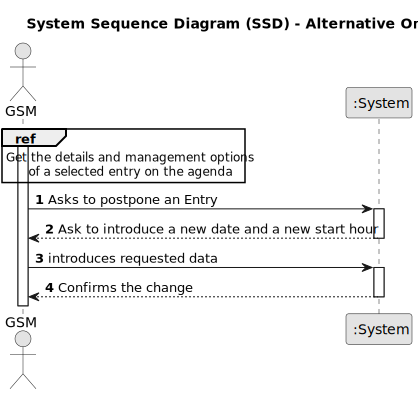

# US024 - Postpone an entry in the Agenda to a future date

## 1. Requirements Engineering

### 1.1. User Story Description

As a GSM, I want to Postpone an entry in the Agenda to a future date.

### 1.2. Customer Specifications and Clarifications

**From the specifications document:**

> The Agenda is a crucial mechanism for planning the week’s work. Each entry in the Agenda defines a task (that was previously included in the to-do list). A team will carry out that task in a green space at a certain time interval on a specific date. Comparatively analyzing the Agenda entries and the pending tasks (to-do list) allows you to evaluate the work still to be done, the busyness of the week, and the work performed by a team in a green space at a determined time interval and on a specific date.
The Agenda is made up of entries that relate to a task (which was previously in the To-Do List), the team that will carry out the task, the vehicles/equipment assigned to the task, expected duration, and the status (Planned, Postponed, Canceled, Done).

**From the client clarifications:**

> **Question:**
>
> **Answer:**

### 1.3. Acceptance Criteria

* **AC1:**
* **AC2:**

### 1.4. Found out Dependencies

* There is a dependency on "US022 - As a GSM,I want to add a new entry in the Agenda" since it is necessary to first register a new entry in the calendar to be able to postpone it to a future date.

### 1.5 Input and Output Data

**Input Data:**

* Typed data:
  * future date

* Selected data:
  * Agenda entry

**Output Data:**
* **Confirmation of Postpone:**
  - A success notification confirming the future date.
* **Warnings or Errors (if applicable):**
  - Error messages for any issues encountered when postponing an Agenda entry.
* **Operational Feedback:**
  - Overall status of the operation (success or failure), with immediate feedback to the GSM.

### 1.6. System Sequence Diagram (SSD)

**_Other alternatives might exist._**

#### Alternative One

### 1.7 Other Relevant Remarks
N/A