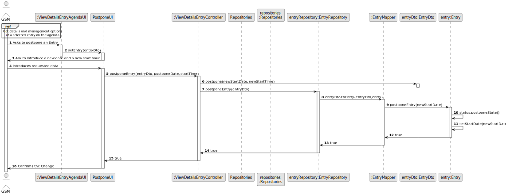
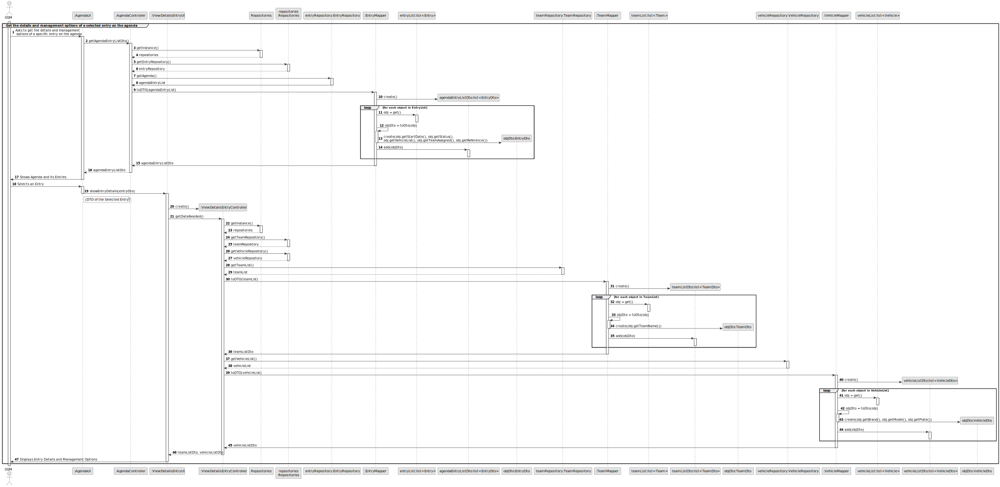
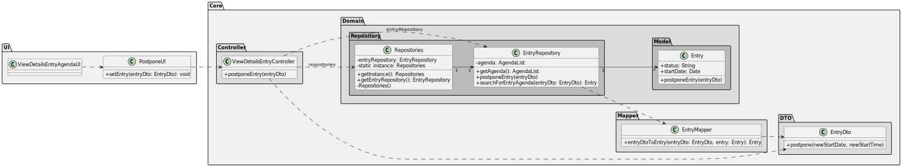

# US024 - Register skills for collaborators

## 3. Design - User Story Realization 

### 3.1. Rationale

_**Note that SSD - Alternative One is adopted.**_

 | SD Interaction ID                                   | Question: Which class is responsible for...                | Answer                     | Justification (with patterns)                                                                                                                                                  |
|-----------------------------------------------------|------------------------------------------------------------|----------------------------|--------------------------------------------------------------------------------------------------------------------------------------------------------------------------------|
| 1: Asks to Postpone an Entry                        | handling the user's request to postpone an entry?          | ViewDetailsEntryAgendaUI   | **Pure Fabrication**: The `ViewDetailsEntryAgendaUI` manages user interaction to keep the UI logic separate from the business logic, ensuring high cohesion and low coupling.  |
|                                                     | delegating the request to get possible postpone an entry?  | ViewDetailsEntryController | **Controller**: The `ViewDetailsEntryController` coordinates the process, delegating the request to appropriate handlers, ensuring separation of concerns and central control. |
|                                                     | fetching the agenda list from the entry repository?        | EntryRepository            | **Information Expert**: The `EntryRepository` holds the agenda data and is responsible for providing it.                                                                       |
| 2: Ask to introduce a new date and a new start hour | asking a new date and a new start hour?                    | PostponeUI                 | **Pure Fabrication**: The `PostponeUI` asks for introduce data, maintaining separation of concerns.                                                                            |
| 3: introduces requested data                        | delegating the request to postpone the entry?              | ViewDetailsEntryController               | **Controller**: The `ViewDetailsEntryController` manages the postpone process, ensuring central control and coordination.                                                      |
| 3                                                   | delegating the task to update the entry in the repository? | EntryRepository            | **Information Expert**: The `EntryRepository` manages data persistence and is responsible for updating the entry with the assigned team.                                       |
| 3                                                   | converting the entry DTO to an entry entity?               | EntryMapper                | **Pure Fabrication**: The `EntryMapper` handles the transformation of entry DTOs to domain entities, ensuring separation of concerns.                                          |
| 3                                                   | updating the entry with the new start date?                | Entry              |                                                                                                                                                                                |
| 4: Confirms the Change                              | confirms the change                                        | PostponeUI                 | **Pure Fabrication**: The `PostponeUI` presents feedback to the user, maintaining separation of concerns between UI and business logic.                                        |
                                                                                                                                                                                                                                                                                 

### Systematization ##

Software classes (i.e. **Pure Fabrication**) identified

* ViewDetailsEntryAgendaUI
* PostponeUI
* EntryMapper

Other software classes (i.e. **Controller**) identified

* ViewDetailsEntryController

Other software classes (i.e. **Information Expert**) identified

* EntryRepository

## 3.2. Sequence Diagram (SD)

_**Note that SSD - Alternative Two is adopted.**_

### Full Diagram

This diagram shows the full sequence of interactions between the classes involved in the realization of this user story.

### Split Diagram
**Get details and management options of a selected entry on the agenda**

## 3.3. Class Diagram (CD)

