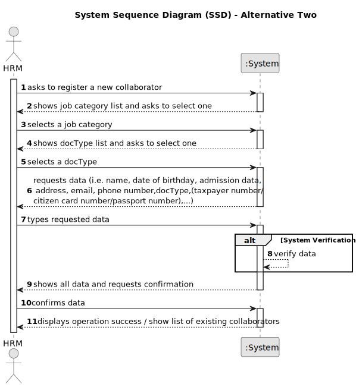

# US025 - Cancel an entry in the Agenda

## 1. Requirements Engineering

### 1.1. User Story Description

As a GSM, I want to Cancel an entry in the Agenda.

### 1.2. Customer Specifications and Clarifications 

**From the specifications document:**

**From the client clarifications:**

### 1.3. Acceptance Criteria

* **AC1:** A canceled entry should not be deleted but rather change its state

### 1.4. Found out Dependencies

* There is a dependency on "US002 - I want to register a job" as there must be at least one job category to classify the collaborator being register.

### 1.5 Input and Output Data

**Input Data:**

* Typed data:
    * 
	
* Selected data:
    * 

**Output Data:**

* **Confirmation of cancel entry in the Agenda:**
  - A success notification confirming that the collaborator have been successfully registed.

### 1.6. System Sequence Diagram (SSD)

**_Other alternatives might exist._**

#### Alternative One

#### Alternative Two

### 1.7 Other Relevant Remarks