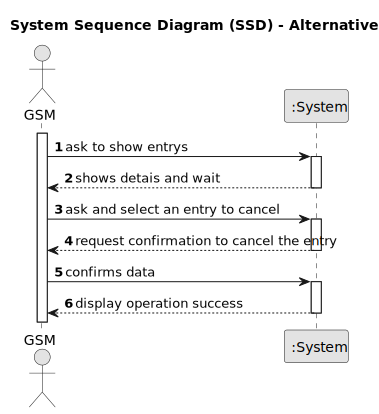

# US025 - Cancel an entry in the Agenda

## 1. Requirements Engineering

### 1.1. User Story Description

As a GSM, I want to Cancel an entry in the Agenda.

### 1.2. Customer Specifications and Clarifications

**From the client clarifications:**

> **Question:** As far as I understand, when a GSM wants to cancel a task or a Collaborator wants to record the completion of a task, the task just changes its status in the Agenda to "Canceled" or "Done", respectively.
So, my question is the following: does the task associated with the Agenda entry in which this happens remain in the To-do List or can it be removed, unlike what happens in the Agenda? Or even, would this process be different between a completed task and a canceled task?

> **Answer:** Yes.
I suppose when a task goes to the Agenda, it leaves the To-Do list but maybe a different flow could be considered.

> **Question:** When a task is cancelled, is it possible to put it back on the agenda again later?

> **Answer:** Yes

> **Question:** When we cancel a task, do we move it again to the To-Do List?

> **Answer:** No

### 1.3. Acceptance Criteria

* **AC1:** A canceled entry should not be deleted but rather change its state

### 1.4. Found out Dependencies

* There is a dependency on "US022 -  As a GSM, I want to add a new entry in the Agenda"

### 1.5 Input and Output Data

* Selected data:
    * entry

**Output Data:**

* **Confirmation of canceled entry in the Agenda:**
  - A success notification confirming that the entry is canceled.

### 1.6. System Sequence Diagram (SSD)

**_Other alternatives might exist._**

#### Alternative One

