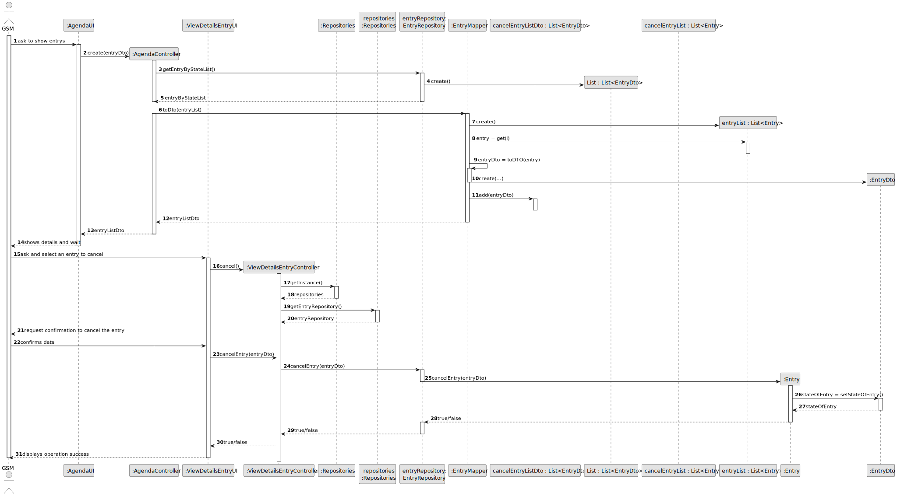
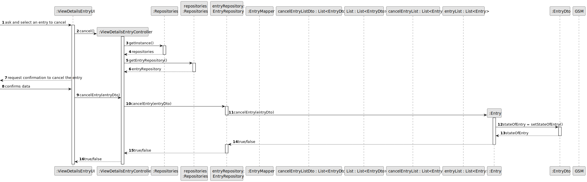
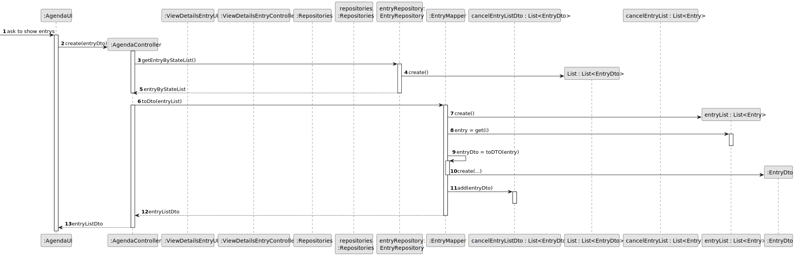
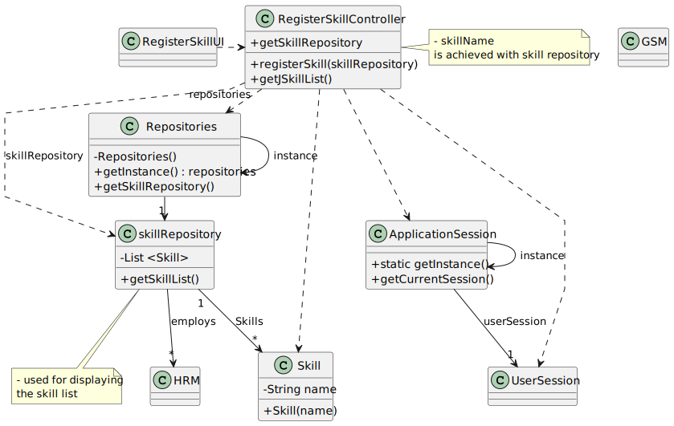

# US025 - Cancel an entry in the Agenda

## 3. Design - User Story Realization 

### 3.1. Rationale

_**Note that SSD - Alternative One is adopted.**_

| SSD Interaction ID                    | Question: Which class is responsible for... | Answer                     | Justification (with patterns)                                                                                                                                                                                                      |
|---------------------------------------|---------------------------------------------|----------------------------|------------------------------------------------------------------------------------------------------------------------------------------------------------------------------------------------------------------------------------|
| 1: createViewDetailsEntryController() | creator the controller                      | ViewDetailsEntryController | **Controller**: The `:ViewDetailsEntryController` handles the request to add a new controller, coordinating the necessary operations between the UI and the data layer without performing business logic or data retrieval itself. |
| 2: getInstance()                      | get the instance of repository              | Repositories               | **Information Expert**: The `Repositories` knows how to extract the information, as it holds the knowledge of data and structure.                                                                                                  |
| 3: getEntryRepository()               | get the entry repository                    | Repositories               | **Information Expert**: The `Repositories` knows how to extract the information, as it holds the knowledge of data and structure.                                                                                                  |
| 4: cancelEntry(entryDto)              | cancel the entry                            | EntryDto                   | **Information Expert**: The `EntryDto` is responsible for alter the state of the entry.                                                                                                                                            |

### Systematization ##

Other software classes (i.e Information Expert) identified:

* Repositories
* EntryDto

Other software classes (i.e. Pure Fabrication) identified:

* ViewDetailsEntryUI

## 3.2. Sequence Diagram (SD)

_**Note that SSD - Alternative Two is adopted.**_

### Full Diagram

This diagram shows the full sequence of interactions between the classes involved in the realization of this user story.

### Split Diagrams

The following diagram shows the same sequence of interactions between the classes involved in the realization of this user story, but it is split in partial diagrams to better illustrate the interactions between the classes.

It uses Interaction Occurrence (a.k.a. Interaction Use).

**Get Task Category List Partial SD**

**Get Task Category List Partial SD**

**Reference Get Agenda Entry's List SD**

## 3.3. Class Diagram (CD)

