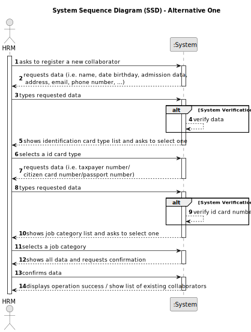

# US026 - Assign on or more Vehicles to an entry in the Agenda

## 1. Requirements Engineering

### 1.1. User Story Description

As a GSM, I want to assign one or more vehicles to an entry in the Agenda.

### 1.2. Customer Specifications and Clarifications 

**From the specifications document:**

>  The Agenda is made up of entries that relate to a task (which was previously in the To-Do List),the team that will carry out the task, the vehicles/equipment assigned to the task, expected duration, and the status (Planned, Postponed, Canceled, Done).

>	

>	

**From the client clarifications:**

> **Question:** 
>
> **Answer:**  

> **Question:**  
>
> **Answer:** 

> **Question:** 
>
> **Answer:** 

### 1.3. Acceptance Criteria

* **AC1:** 
* **AC2:** 
* **AC3:** 

### 1.4. Found out Dependencies

* There is a dependency on "US022 - As a GSM, I want to add a new entry in the Agenda" is needed to have an entry in the Agenda

### 1.5 Input and Output Data

**Input Data:**

* Selected data:
    * Vehicle's List

**Output Data:**

* **Confirmation of Assign:**
  - A success notification confirming that the vehicle have been successfully assigned to the Entry.
* **Warnings or Errors (if applicable):**
  - Error messages for any issues encountered during the assign vehicle process, such non-existent data or duplications ,etc...
* **Operational Feedback:**
  - Overall status of the operation (success or failure), with immediate feedback to the HRM.

### 1.6. System Sequence Diagram (SSD)

**_Other alternatives might exist._**

#### Alternative One

#### Alternative Two

### 1.7 Other Relevant Remarks

N/A