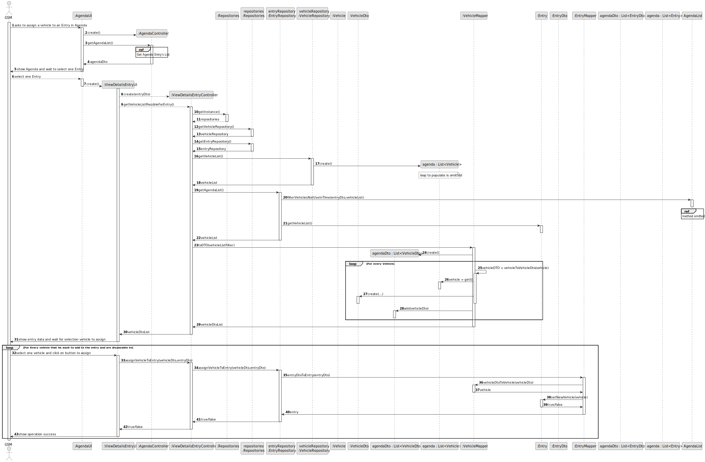
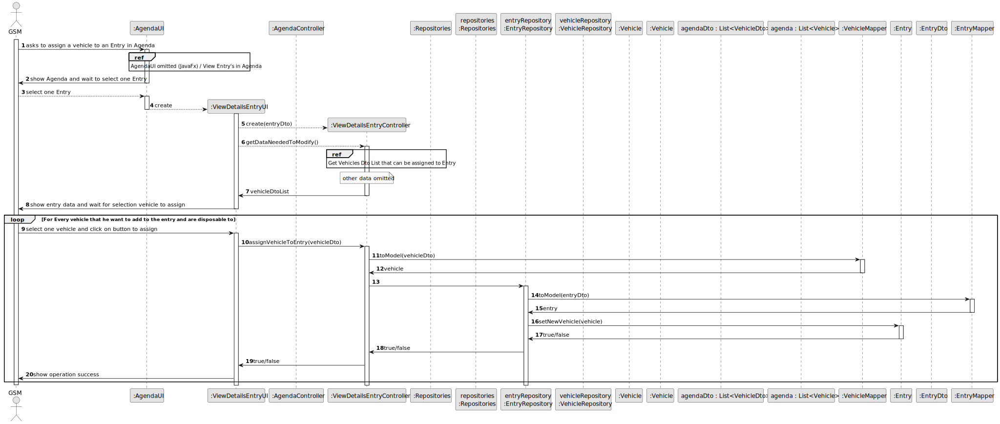
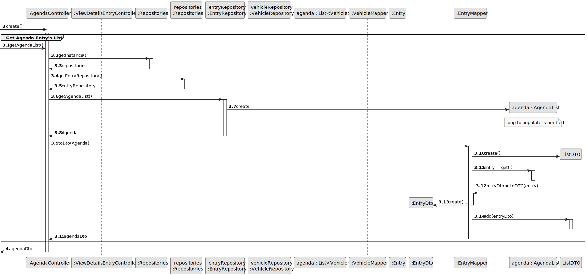
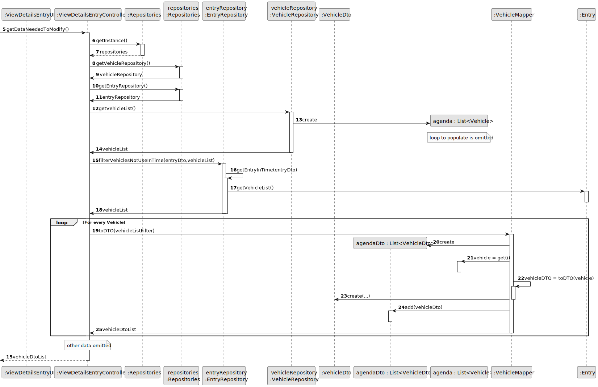
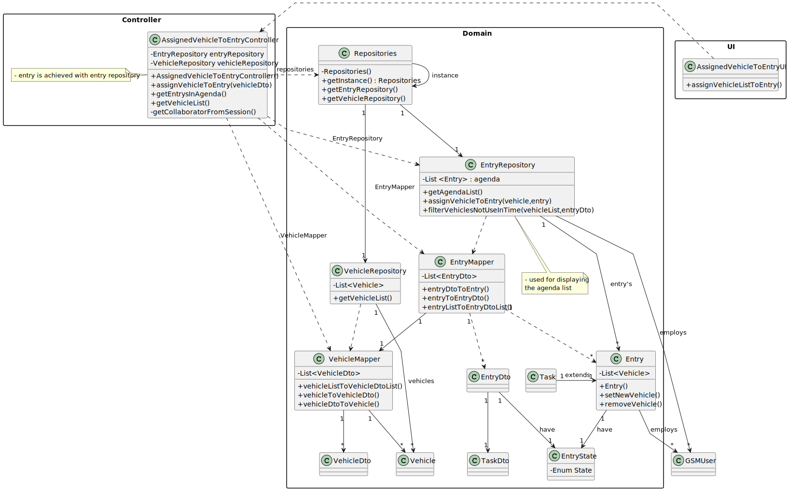

# US026 - Assign one or more Vehicles to an entry in the Agenda

## 3. Design - User Story Realization

### 3.1. Rationale

| Interaction ID                                       | Question: Which class is responsible for...                            | Answer                          | Justification (with patterns)                                                                                                                                                    |
|:-----------------------------------------------------|:-----------------------------------------------------------------------|:--------------------------------|:---------------------------------------------------------------------------------------------------------------------------------------------------------------------------------|
| 1: Asks to Assign a Team to the Selected Entry       | handling the user's request to assign a vehicle to a selected entry?   | ViewDetailsEntryAgendaUI        | **Pure Fabrication**: The `ViewDetailsEntryAgendaUI` manages user interaction to keep the UI logic separate from the business logic, ensuring high cohesion and low coupling.    |
| 1                                                    | delegating the request to get possible vehicles for the entry?         | ViewDetailsEntryController      | **Controller**: The `ViewDetailsEntryController` coordinates the process, delegating the request to appropriate handlers, ensuring separation of concerns and central control.   |
| 1                                                    | fetching the agenda list from the entry repository?                    | EntryRepository                 | **Information Expert**: The `EntryRepository` holds the agenda data and is responsible for providing it.                                                                         |
| 1                                                    | fetching the list of vehicles from the vehicle repository?             | VehicleRepository               | **Information Expert**: The `VehicleRepository` holds the vehicle data and is responsible for providing it.                                                                      |
| 1                                                    | filtering the team list based on the entry time?                       | AgendaList                      | **Information Expert**: The `AgendaList` knows the details and logic for filtering vehicles based on their activation times.                                                     |
| 1                                                    | converting the filtered vehicle list to a list of DTOs?                | VehicleMapper                   | **Pure Fabrication**: The `VehicleMapper` converts vehicles entities to DTOs, separating transformation logic from business logic.                                               |
| 2: Shows possible Vehicles for Entry Assignment List | displaying the possible vehicles for entry assignment to the user?     | AssignVehicleOnEntryUI          | **Pure Fabrication**: The `AssignVehicleOnEntryUI` presents the list of possible vehicles to the user, maintaining separation of concerns.                                       |
| 3: Selects a Vehicle and Assigns it                  | handling the user's selection of a vehicle and assignment to an entry? | AssignVehicleOnEntryUI          | **Pure Fabrication**: The `AssignVehicleOnEntryUI` manages user interaction for vehicle selection and assignment, ensuring UI responsibilities are distinct from business logic. |
| 3                                                    | delegating the request to assign the selected vehicle to the entry?    | AssignVehicleOnEntryController  | **Controller**: The `AssignVehicleOnEntryController` manages the assignment process, ensuring central control and coordination.                                                  |
| 3                                                    | delegating the task to update the entry in the repository?             | EntryRepository                 | **Information Expert**: The `EntryRepository` manages data persistence and is responsible for updating the entry with the assigned vehicle.                                      |
| 3                                                    | converting the entry DTO to an entry entity?                           | EntryMapper                     | **Pure Fabrication**: The `EntryMapper` handles the transformation of entry DTOs to domain entities, ensuring separation of concerns.                                            |
| 3                                                    | updating and vehicles in the entry?                                    | EntryMapper                     | **Pure Fabrication**: The `EntryMapper` updates the entry based on the provided DTO, applying domain logic appropriately.                                                        |
| 4: Displays Operation Success Message                | displaying the operation success message to the user?                  | AssignVehicleOnEntryUI          | **Pure Fabrication**: The `AssignVehicleOnEntryUI` presents feedback to the user, maintaining separation of concerns between UI and business logic.                              |

### Systematization

According to the taken rationale, the conceptual classes promoted to software classes are(i.e. Creator):

* EntryRepository
* Entry
* Task
* Vehicle

Other software classes (i.e. Information Expert) identified:

* Repositories
* EntryRepository
* VehicleRepository

Other software classes (i.e. Pure Fabrication) identified:

* AssignEntryOnAgendaUI
* AssignEntryOnAgendaController
* EntryMapper
* VehicleMapper

Other software classes (i.e. Use of Data Transfer Objects (DTO)) identified:

* EntryDTO
* TaskDTO
* VehicleDTO
* EntryMapper
* VehicleMapper

## 3.2. Sequence Diagram (SD)

_**Note that SSD - Alternative One is adopted.**_

### Full Diagram

This diagram shows the full sequence of interactions between the classes involved in the realization of this user story.

### Split Diagrams

The following diagram shows the same sequence of interactions between the classes involved in the realization of this user story, but it is split in partial diagrams to better illustrate the interactions between the classes.

It uses Interaction Occurrence (a.k.a. Interaction Use).

**Get Agenda Entry's List Partial SD**

**Get Vehicle Dto List Partial SD**

## 3.3. Class Diagram (CD)

