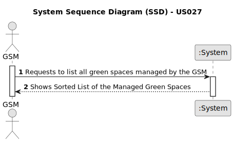

# US027 - To List All Green Spaces Managed by the GSM

(Tomás)

## 1. Requirements Engineering

### 1.1. User Story Description

As a GSM, I need to list all green spaces managed by me.

### 1.2. Customer Specifications and Clarifications

**From the Specifications Document:**v

> *A GSM is responsible for managing the green spaces in charge of the organization. Green spaces can vary significantly in dimensions and available amenities.*

**From the client clarifications:**

- A team can be assigned to multiple entries. However, an agenda entry cannot have more than one team assigned to it.
- The GSM (you can have many) should be registered in the app.
- GSM is a role that can be played by a registered user with the appropriate privileges.
- Yes, the app can have multiple GSMs registered (for instance, that can be done during using the bootstrap).
- A collaborator is a person (an employee) that has a name, birthdate, a salary, etc. A GSM is a role played by a collaborator. Depending on the size of the company, you can have a collaborator playing multiple roles like GSM, VFM or HRM or different persons playing the same role like GSM.

### 1.3. Acceptance Criteria
* **AC1: Sorted List of Green Spaces**
  - The list of green spaces must be sorted by size in descending order (area in hectares should be used).
  - The sorting algorithm to be used by the application must be defined through a configuration file.
  - At least two sorting algorithms should be available.

### 1.4. Found out Dependencies

* There is a dependency on **US20 - As a Green Space Manager (GSM), I want to register a green space (garden, medium-sized park, or large-sized park) and its respective area**. Before listing the green spaces, the green spaces themselves must exist. Thus, the functionality to register green spaces must be in place and operational.

### 1.5. Input and Output Data

**Output Data:**

* **Sorted List of Green Spaces:**
  - A list of green spaces sorted by size in descending order.

### 1.6. System Sequence Diagram (SSD)

