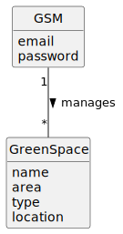

# US027 - To List All Green Spaces Managed by the GSM

## 2. Analysis

### 2.1. Relevant Domain Model Excerpt 

- **GSM**: The Green Space Manager responsible for managing green spaces. Key attributes include:
  - `email`: The GSM's email address for communication and notifications.
  - `password`: The GSM's password for system access.

- **GreenSpace**: Represents a green space managed by the GSM. Important attributes include:
  - `name`: The name of the green space.
  - `area`: The area of the green space in hectares.
  - `type`: The type of green space (e.g., garden, medium-sized park, large-sized park).
  - `location`: The location of the green space.

### 2.2 Associations:

- **manages**: This association indicates that a GSM is responsible for managing multiple green spaces. Each GSM can manage one or more green spaces, and each green space is managed by one GSM.
