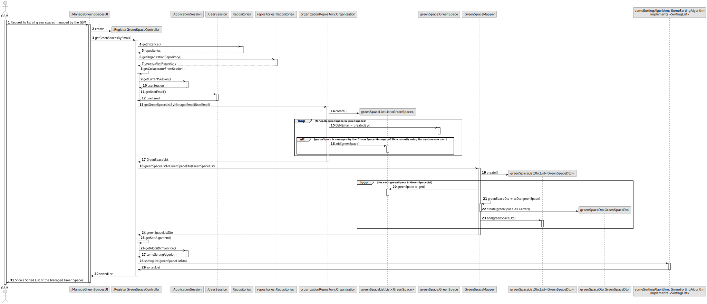
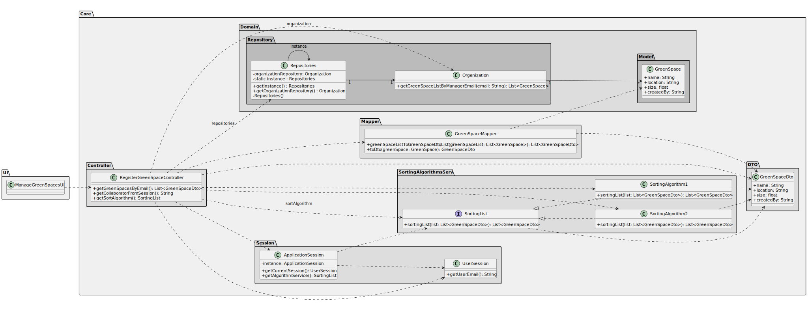

# US027 - To List All Green Spaces Managed by the GSM

## 3. Design - User Story Realization

### 3.1. Rationale

| SD Interaction ID | Question: Which class is responsible for...                                | Answer                    | Justification (with patterns)        |
|--------------------|----------------------------------------------------------------------------|---------------------------|--------------------------------------|
| 1: Request to list all green spaces managed by the GSM | managing the user interface for listing all green spaces? | ManageGreenSpacesUI         | **Pure Fabrication**: The `ManageGreenSpacesUI` handles the user interface logic, representing a layer separate from the domain logic to manage presentation and user interaction efficiently. |
| 1 | delegating the request to get green spaces by email? | RegisterGreenSpaceController | **Controller**: The `RegisterGreenSpaceController` coordinates the request to get green spaces by email, following the Controller pattern to delegate to the appropriate handler. |
| 1 | obtaining the user email from the session? | UserSession | **Information Expert**: The `UserSession` contains the user’s email information and is responsible for providing it when requested. |
| 1| retrieving the list of green spaces managed by the user email? | Organization | **Information Expert**: The `Organization` holds the data about green spaces managed by different users and provides the list based on the user email. |
| 1 | converting the green space list to a DTO list? | GreenSpaceMapper | **Pure Fabrication**: The `GreenSpaceMapper` converts green space entities to DTOs, separating transformation logic from business logic. |
| 1 | obtaining the algorithm service from the session? | ApplicationSession | **Information Expert**: The `ApplicationSession` knows about available services, including the algorithm service, and provides it when requested. |
| 1 | sorting the list of green space DTOs? | SomeSortingAlgorithm | **Polymorphism**: The `SomeSortingAlgorithm` implements the `SortingList` interface, demonstrating the use of polymorphism to sort the list of DTOs. |
| 2: Shows Sorted List of the Managed Green Spaces | displaying the sorted list of managed green spaces? | ManageGreenSpacesUI | **Pure Fabrication**: The `ManageGreenSpacesUI` is responsible for displaying the sorted list to the user, which aligns with its role of handling user interactions and presentation logic. |

### Systematization

Software classes (i.e. **Pure Fabrication**) identified

* ManageGreenSpacesUI
* GreenSpaceMapper

Other software classes (i.e. **Controller**) identified

* RegisterGreenSpaceController

Other software classes (i.e. **Information Expert**) identified

* UserSession
* Organization
* ApplicationSession

Other software classes (i.e. **Polymorphism**) identified

* SomeSortingAlgorithm¹

## 3.2. Sequence Diagram (SD)

### Full Diagram

This diagram shows the full sequence of interactions between the classes involved in the realization of this user story.

## 3.3. Class Diagram (CD)

## Other Relevant Remarks

¹ The `SomeSortingAlgorithm` class, referenced in this document and in the sequence diagram, represents a generalisation of specific sorting algorithm implementations within the system. This class implements the `SortingList` interface, which defines the contract for sorting lists of data. In practice, `SomeSortingAlgorithm` can be one of several concrete classes, such as `SortingAlgorithm1` or `SortingAlgorithm2`.