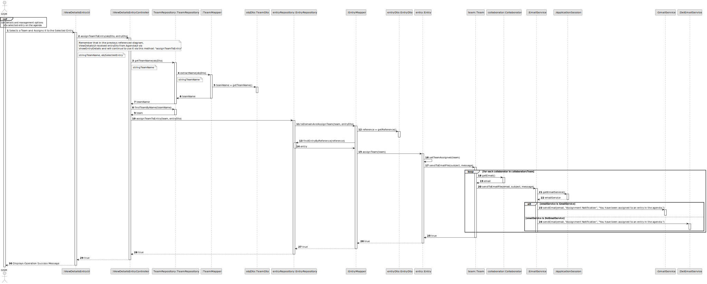
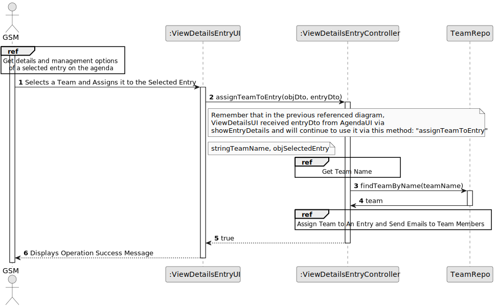
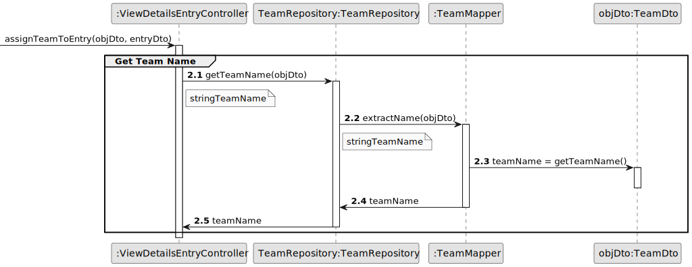
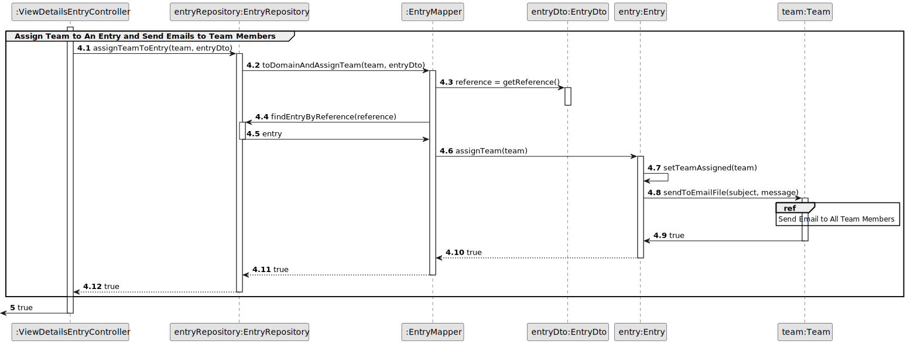
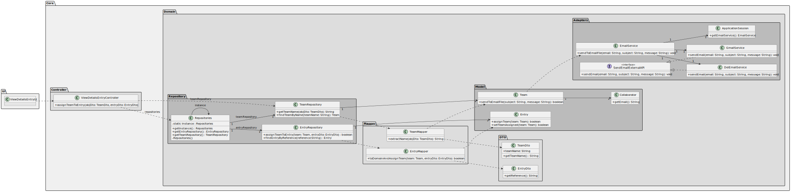

# US007 - To register a vehicle’s maintenance.

## 3. Design - User Story Realization

### 3.1. Rationale

| SSD Interaction ID                                                                                  | Question: Which class is responsible for...                                      | Answer                    | Justification (with patterns)                                                                                                                                                                                                                                                                                                                         |
|----------------------------------------------------------------------------------------------------|----------------------------------------------------------------------------------|---------------------------|----------------------------------------------------------------------------------------------------------------------------------------------------------------------------------------------------------------------------------------------------------------------------------------------------------------------------------------------------------|
| 1: GSM -> UI2: Selects a Team and Assigns it to the Selected Entry                                 | initiating the selection of a team for the entry?                                | ViewDetailsEntryUI        | **Pure Fabrication**: The `:ViewDetailsEntryUI` handles the user interaction for selecting a team and initiating the assignment process, keeping the interface responsibilities separate from business logic.                                                                                                                                          |
| 2: UI2 -> CTRL2: assignTeamToEntry(objDto, entryDto)                                               | handling the request to assign a team to an entry?                              | ViewDetailsEntryController| **Controller**: The `:ViewDetailsEntryController` handles the request to assign a team to an entry, coordinating the necessary operations between the UI and the data layer without performing business logic or data retrieval itself.                                                                                                                |
| 3: CTRL2 -> TeamRepo: getTeamName(objDto)                                                          | retrieving the team name from the DTO?                                           | TeamRepository            | **Information Expert**: The `TeamRepository` knows how to extract the team name from the team DTO, as it holds the knowledge of team data and structure.                                                                                                                                                                                               |
| 4: TeamRepo -> TeamMapper: extractName(objDto)                                                     | extracting the team name from the team DTO?                                      | TeamMapper                | **Pure Fabrication**: The `TeamMapper` is a utility class created to handle data transformation tasks, such as extracting the team name from the DTO, without adding complexity to the business logic.                                                                                                                                                 |
| 5: TeamMapper -> TeamDto: teamName = getTeamName()                                                 | providing the team name?                                                         | TeamDto                   | **Information Expert**: The `TeamDto` contains the team name, making it the expert on providing this piece of information when needed.                                                                                                                                                                                                                 |
| 6: CTRL2 -> TeamRepo: findTeamByName(teamName)                                                     | finding the team by name?                                                        | TeamRepository            | **Information Expert**: The `TeamRepository` is responsible for finding a team by its name, as it holds the data about teams and knows how to search for them.                                                                                                                                                                                         |
| 7: CTRL2 -> EntryRepo: assignTeamToEntry(team, entryDto)                                           | assigning the team to the entry?                                                 | EntryRepository           | **Information Expert**: The `EntryRepository` is responsible for managing entries and their assignments, making it the expert on how to assign a team to an entry.                                                                                                                                                                                     |
| 8: EntryRepo -> EntryMapper: toDomainAndAssignTeam(team, entryDto)                                 | converting the DTO and assigning the team in the domain model?                   | EntryMapper               | **Pure Fabrication**: The `EntryMapper` handles the conversion of DTOs to domain objects and performs the team assignment, ensuring low coupling and separation of concerns.                                                                                                                                                                          |
| 9: EntryMapper -> EntryDto: reference = getReference()                                             | retrieving the reference from the entry DTO?                                     | EntryDto                  | **Information Expert**: The `EntryDto` contains the reference information, making it the expert on providing this piece of information when needed.                                                                                                                                                                                                   |
| 10: EntryMapper -> EntryRepo: findEntryByReference(reference)                                       | finding the entry by its reference?                                              | EntryRepository           | **Information Expert**: The `EntryRepository` knows how to find an entry by its reference, as it holds and manages the entry data.                                                                                                                                                                                                                     |
| 11: EntryMapper -> Entry: assignTeam(team)                                                         | assigning the team to the entry?                                                 | Entry                     | **Information Expert**: The `Entry` class knows how to assign a team to itself, as it holds the data and methods for managing its state.                                                                                                                                                                                                               |
| 12: Entry -> Team: sendToEmailFile(subject, message)                                               | sending the assignment notification to the team?                                 | Team                      | **Information Expert**: The `Team` class knows about its collaborators and their contact details, making it the expert on sending notifications to its members.                                                                                                                                                                                       |
| 13: Team -> Collaborator: getEmail()                                                               | retrieving the email of a collaborator?                                          | Collaborator              | **Information Expert**: The `Collaborator` class knows its own email address, making it the expert on providing this piece of information.                                                                                                                                                                                                            |
| 14: Team -> EmailService: sendToEmailFile(email, subject, message)                                 | sending the email notification?                                                  | EmailService              | **Pure Fabrication**: The `EmailService` is a utility class responsible for sending email notifications, ensuring that communication logic is separated from business logic.                                                                                                                                                                           |
| 15: EmailService -> ApplicationSession: getEmailService()                                          | obtaining the email service instance?                                            | ApplicationSession        | **Information Expert**: The `ApplicationSession` knows which email service is currently in use, making it the expert on providing this instance.                                                                                                                                                                                                      |
| 16: ApplicationSession --> EmailService: emailService                                             | providing the email service instance?                                            | ApplicationSession        | **Information Expert**: The `ApplicationSession` returns the email service instance, as it is the expert on managing application-wide services.                                                                                                                                                                                                       |
| 17: EmailService -> GmailService: sendEmail(email, "Assignment Notification", "You have been assigned to an entry in the agenda.") | sending the email via Gmail?                                                     | GmailService              | **Information Expert**: The `GmailService` knows how to send emails via Gmail, making it the expert on handling Gmail-specific communication.                                                                                                                                                                                                         |
| 18: EmailService -> DeiEmailService: sendEmail(email, "Assignment Notification", "You have been assigned to an entry in the agenda.") | sending the email via DeiEmail?                                                  | DeiEmailService           | **Information Expert**: The `DeiEmailService` knows how to send emails via DeiEmail, making it the expert on handling DeiEmail-specific communication.                                                                                                                                                                                                |
| 19: Team -> Entry: confirming the assignment was successful?                                       | Entry                     | **Information Expert**: The `Entry` class confirms the assignment, as it manages its own state and knows whether the team was successfully assigned.                                                                                                                                                                                                               |
| 20: UI2 -> GSM: Displays Operation Success Message                                                 | displaying the operation success message?                                        | ViewDetailsEntryUI        | **Pure Fabrication**: The `:ViewDetailsEntryUI` handles displaying the success message to the user, keeping the interface responsibilities separate from business logic.                                                                                                                                                                              |

### Systematization

Software classes (i.e. **Pure Fabrication**) identified: 

* RegisterCheckUpUI

Other software classes (i.e. **Controller**) identified: 

* RegisterCheckUpController

Other software classes (i.e. **Information Expert**) identified: 

* VehicleRepository  

Other software classes (i.e **Creator**) identified:

* Vehicle

## 3.2. Sequence Diagram (SD)

### Full Diagram

This diagram shows the full sequence of interactions between the classes involved in the realization of this user story.

### Split Diagrams

**Get Team Name**

**Assign Team to an Entry and Send Email**

**Send Email To All Team Members**

## 3.3. Class Diagram (CD)

