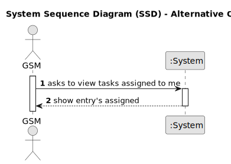

# US028 - View Tasks Assigned to Collaborator

## 1. Requirements Engineering

### 1.1. User Story Description

As a Collaborator, I wish to consult the tasks assigned to me.

### 1.2. Customer Specifications and Clarifications 

**From the specifications document:**

>  The Agenda is made up of entries that relate to a task (which was previously in the To-Do List), the team that will carry out the task, the vehicles/equipment assigned to the task, expected duration, and the status (Planned, Postponed, Canceled, Done).

>  Collaborator – a person who is an manager in the organization and carries out design, construction and/or maintenance tasks for green areas, depending on their skills.

>  Tasks are carried out on an occasional or regular basis, in one or more green spaces, for example: tree pruning, installation of an irrigation system, and installation of a lighting system.
Teams are temporary associations of employees who will carry out a determined set of tasks in one or more green spaces. When creating multipurpose teams, the number of members and the set of skills that must be covered are crucial.

**From the client clarifications:**

> **Question:** While consulting tasks, how specific should be data presented to collaborator? Should it be all entries from the agenda with collaborator's team assigned or generic tasks that these entries refer to? As there is agenda entry, to-do list entry and task.
>
> **Answer:** A "generic task" is something like "task type" or "template task", for instance "Prunning Trees".
When a GSM decides to insert a entry in the To-Do list, he selects a generic task, selects a park, defines the expected duration and the urgency.
Later, that To-do List entry will originate an Entry in the Agenda with a starting date/time. That Entry can be managed due to actions/events that happens, hence the Entry can be Canceled, Postponed or Completed.

> **Question:**  For a new entry in the agenda, if we assign it to a team, is this assigned to all members of the group? This could be contradictory because maybe one of the collaborators of the team doesn't have the skill to perform this task.
>
> **Answer:** It depends on the granularity of the task. If the task is Prunning Trees, besides the ones who will prune the tree, the team will need need someone who transports persons and machinery; someone who operates some kind of machinery; maybe a coordinator.

> **Question:** When a collaborator is registered, they are given an account with the registered email and a password? This allows them to log in and view their tasks later on. What should be the password for this collaborator's account?
>
> **Answer:** Yes, it makes sense. About the password, not important in this stage of the project

### 1.3. Acceptance Criteria

* **AC1:** The list of green spaces must be sorted by date, starting with the first to be performed.
* **AC2:** The Collaborator should be able to filter the results by the status of the task.

### 1.4. Found out Dependencies
* There is a dependency on **US22 - As a GSM, I want to add a new entry in the Agenda**. A task must exist in the Agenda before it can see the tasks assigned a collaborator.
* There is a dependency on **US23 - As a GSM, I want to assign a Team to an entry in the Agenda**. A task must be assigned to a team before it can see the tasks assigned.

### 1.5 Input and Output Data
**Output Data:**

* Shows entry assigned 

### 1.6. System Sequence Diagram (SSD)

**_Other alternatives might exist._**

#### Alternative One

### 1.7 Other Relevant Remarks

* 