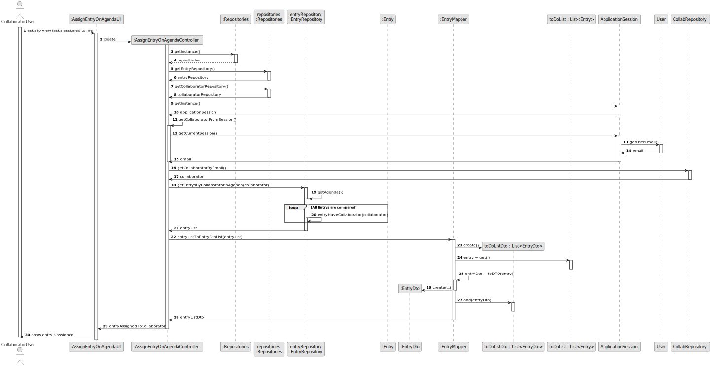
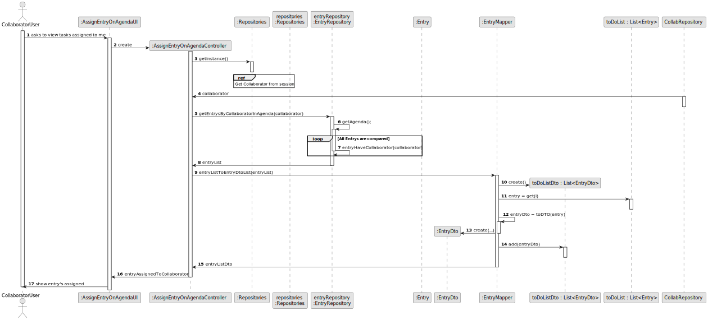
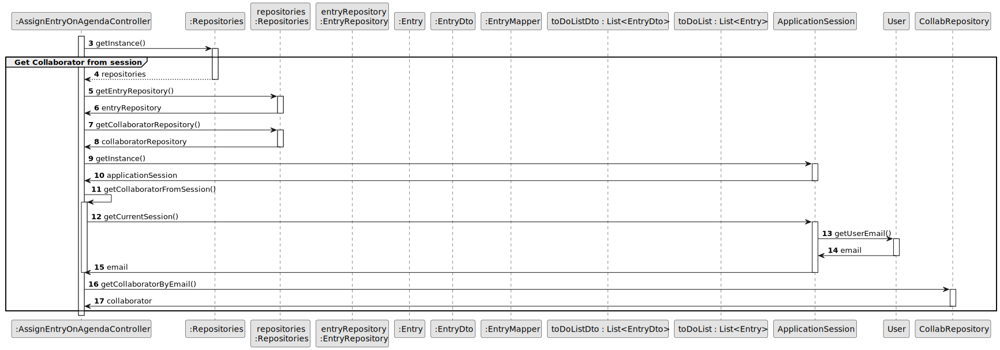
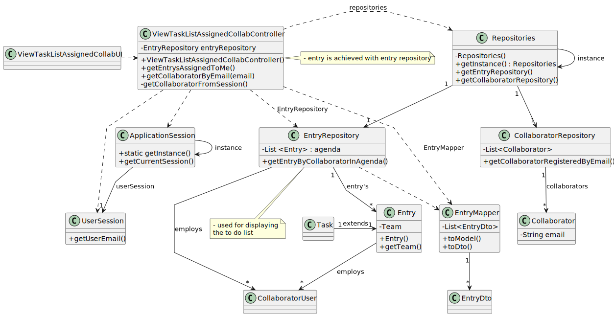

# US028 - View Tasks Assigned to Collaborator

## 3. Design - User Story Realization 

### 3.1. Rationale

_**Note that SSD - Alternative Two is adopted.**_

| Interaction ID                                                           | Question: Which class is responsible for...      | Answer                        | Justification (with patterns)                                                                                                                                                     |
|:-------------------------------------------------------------------------|:-------------------------------------------------|:------------------------------|:----------------------------------------------------------------------------------------------------------------------------------------------------------------------------------|
| Step 1: Ask to view tasks assigned to me		                               | 	... interacting with the actor?                 | AssignEntryOnAgendaUI         | **Pure Fabrication**: The `ViewDetailsEntryAgendaUI` manages user interaction to keep the UI logic separate from the business logic, ensuring high cohesion and low coupling.     |
| 			  		                                                                  | 	... coordinating the US?                        | AssignEntryOnAgendaController | **Controller**: The `AssignEntryOnAgendaController` coordinates the process, delegating the request to appropriate handlers, ensuring separation of concerns and central control. |
| 			  		                                                                  | ...knowing the collaborator email user session   | ApplicationSession            | **Information Expert**: The `ApplicationSession` knows the configure file for obtaining collaborator email.                                                                       |
| 		                                                                       | ...knowing the collaborator email	               | CollaboratorRepository        | **Information Expert**: The `CollaboratorRepository` manages data persistence and is responsible for knowing collaborator email.                                                  |
| 		                                                                       | 	...knowing the entries from collaborator        | EntryRepository               | **Information Expert**: The `CollaboratorRepository` manages data persistence and is responsible for knowing the entries from collaborator.                                       |
| 		                                                                       | ...converting the entry list to entry dto list?	 | EntryMapper                   | **Pure Fabrication**: The `EntryMapper` handles the transformation of entry list to entry dto list, ensuring separation of concerns.                                              |
| 	Step 2: shows entry's assigned		                                        | ...showing entry's assigned	                     | AssignEntryOnAgendaUI         | **Pure Fabrication**: The `AssignEntryOnAgendamUI` shows entry's assigned, maintaining separation of concerns between UI and business logic.                                      |
                

### Systematization ##

* Software classes (i.e. **Pure Fabrication**) identified

* ViewDetailsEntryAgendaUI
* EntryMapper

Other software classes (i.e. **Controller**) identified

* AssignEntryOnAgendaController

Other software classes (i.e. **Information Expert**) identified

* EntryRepository
* Entry
* ApplicationSession
* CollaboratorRepository

## 3.2. Sequence Diagram (SD)

_**Note that SSD - Alternative Two is adopted.**_

### Full Diagram

This diagram shows the full sequence of interactions between the classes involved in the realization of this user story.

### Split Diagrams

The following diagram shows the same sequence of interactions between the classes involved in the realization of this user story, but it is split in partial diagrams to better illustrate the interactions between the classes.

It uses Interaction Occurrence (a.k.a. Interaction Use).

**Get collaborator from session SD**

## 3.3. Class Diagram (CD)

