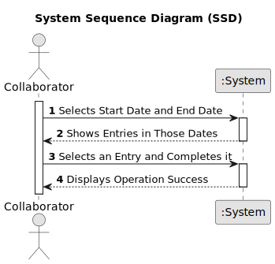

## US029 - To Record the Completion of a Task

### 1. Requirements Engineering

#### 1.1. User Story Description

As a Collaborator, I want to record the completion of a task.

#### 1.2. Customer Specifications and Clarifications 

**From the Specifications Document:**

> *The To-Do List comprises all pending tasks for all parks. The entries in this list describe the required task, the degree of urgency (High, Medium, and Low), and the approximate expected duration. The Agenda is made up of entries that relate to a task (which was previously in the To-Do List), the team that will carry out the task, the vehicles/equipment assigned to the task, expected duration, and the status (Planned, Postponed, Canceled, Done).*

**From the client clarifications:**

<u>The collaborator can change the status of any task, not just tasks assigned to them. However, only tasks with the status "Planned" can be changed to "Done". This means that if the task is in any other state (Postponed or Canceled), it cannot be marked as completed. The completion date must be recorded when the status is changed to "Done".</u>

#### 1.3. Acceptance Criteria

* **AC1: Status Update**
  - The status of the task must be updated to 'Done'.
* **AC2: Record Completion Date**
  - The system must record the date when the task was marked as completed.
* **AC3: Confirmation of Completion**
  - A message confirming that the task completion has been successfully recorded.

#### 1.4. Found out Dependencies

* There is a dependency on **US22 - As a GSM, I want to add a new entry in the Agenda**. A task must exist in the Agenda before it can be marked as completed.
* There is a dependency on **US23 - As a GSM, I want to assign a Team to an entry in the Agenda**. A task must be assigned to a team before it can be marked as completed.

#### 1.5. Input and Output Data

* **SelectedData:**
  - **Start Date:** The start date of the period for which tasks are to be retrieved.
  - **End Date:** The end date of the period for which tasks are to be retrieved.
  - **Entry:** The specific task entry to be completed.

* **Output Data:**
  - **Confirmation of Completion:** A message confirming that the task completion has been successfully recorded.

#### 1.6. System Sequence Diagram (SSD)

