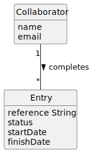

Claro, aqui está um documento com a estrutura solicitada, adaptado ao seu cenário específico de um colaborador completando uma entrada (Entry) relacionada a uma tarefa (Task) na agenda:

# US029 - To Complete a Task Entry by a Collaborator

## 2. Analysis

### 2.1. Relevant Domain Model Excerpt 

- **Collaborator**: The user responsible for completing tasks in the system. Key attributes include:
  - `name`: The name of the collaborator.
  - `email`: The collaborator's email address for communication and notifications.
  - `password`: The collaborator's password for system access.

- **Task**: Represents a task that needs to be completed by a collaborator. Important attributes include:
  - `greenSpaceAssigned`: The green space to which the task is assigned.
  - `degreeUrgency`: The urgency level of the task.
  - `timeExpected`: The expected time to complete the task.

- **Entry**: Represents an instance of a task that is scheduled in the collaborator's agenda. Key attributes include:
  - `startDate`: The date when the entry starts.
  - `finishDate`: The date when the entry is completed.
  - `status`: The current status of the entry (e.g., pending, completed).
  - `description`: A brief description of the entry.
  - `reference`: A unique identifier for the entry.

### 2.2 Associations:

- **Collaborator has many Tasks**: This association indicates that a collaborator can have multiple tasks assigned to them.
- **Collaborator completes many Entries**: This association indicates that a collaborator can complete multiple entries in their agenda.
- **Task relates to an Entry**: This association indicates that a task has an entry associated with it.
