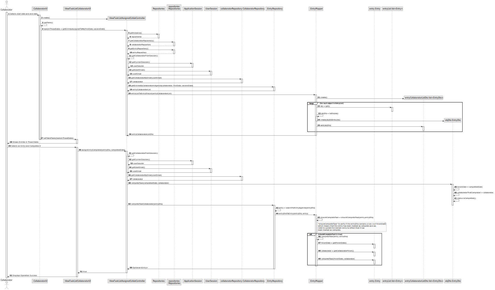
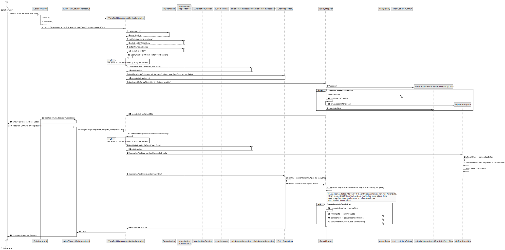
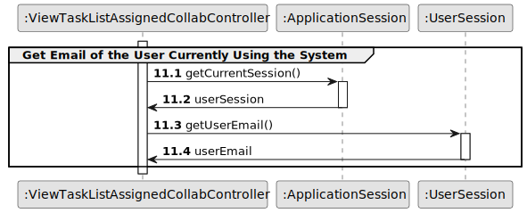
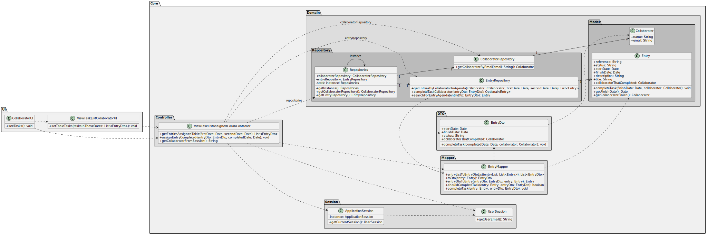

## US029 - To Record the Completion of a Task

## 3. Design - User Story Realization

### 3.1. Rationale

| SD Interaction ID | Question: Which class is responsible for... | Answer                    | Justification (with patterns)        |
|--------------------|---------------------------------------------|---------------------------|--------------------------------------|
| 1: Selects start date and end date | selecting the start date and end date? | CollaboratorUI           | **Pure Fabrication**: The `CollaboratorUI` handles the selection of dates, which is a task related to the user interface and does not directly involve domain logic, reducing coupling. |
| 1 | delegating the request to get entries for the selected dates? | ViewTaskListAssignedCollabController | **Controller**: The `ViewTaskListAssignedCollabController` coordinates the request for entries, following the Controller pattern to delegate to the appropriate handler. |
| 1 | obtaining the user email from the session? | UserSession             | **Information Expert**: The `UserSession` class provides the user email, as it contains user-specific session data. |
| 1 | fetching the collaborator by email? | CollaboratorRepository  | **Information Expert**: The `CollaboratorRepository` is responsible for retrieving collaborator information based on the email, as it contains the necessary data. |
| 1 | fetching entries for the collaborator within the given dates? | EntryRepository         | **Information Expert**: The `EntryRepository` handles the retrieval of entries for the specified collaborator and date range, as it maintains entry data. |
| 1 | converting entry list to DTO list? | EntryMapper             | **Pure Fabrication**: The `EntryMapper` converts entries to DTOs, facilitating data transfer without representing a domain concept, thereby adhering to single responsibility. |
| 1 | setting the table with the tasks in the UI? | ViewTaskListCollaboratorUI | **Pure Fabrication**: The `ViewTaskListCollaboratorUI` sets the table with the tasks, handling UI updates independently of business logic. |
| 2: Shows Entries in Those Dates | displaying the entries for the selected dates? | ViewTaskListCollaboratorUI | **Pure Fabrication**: The `ViewTaskListCollaboratorUI` displays the entries, ensuring the UI manages user interface tasks separately from the controller logic. |
| 3: Selects an Entry and Completes it | selecting an entry and marking it as complete? | ViewTaskListCollaboratorUI | **Pure Fabrication**: The `ViewTaskListCollaboratorUI` handles user interaction for selecting and completing an entry, managing UI-specific tasks separately from business logic. |
| 3 | delegating the request to complete the task in the repository? | ViewTaskListAssignedCollabController | **Controller**: The `ViewTaskListAssignedCollabController` coordinates the request to complete the task, ensuring the necessary updates are made in the repository. |
| 3 | converting the entry DTO to an entry object? | EntryMapper             | **Pure Fabrication**: The `EntryMapper` converts the entry DTO to an entry object, facilitating data transformation without representing a domain concept, thereby adhering to single responsibility. |
| 3 | updating the entry to reflect task completion? | EntryMapper             | **Pure Fabrication**: The `EntryMapper` handles the update process, maintaining the separation between domain logic and data transformation. |
| 4: Displays Operation Success | displaying the success message to the collaborator? | ViewTaskListCollaboratorUI | **Pure Fabrication**: The `ViewTaskListCollaboratorUI` shows the success message, managing the user interface independently of the business logic. |

### Systematization

**Software classes (i.e. Pure Fabrication) identified**

* CollaboratorUI
* EntryMapper
* ViewTaskListCollaboratorUI

**Other software classes (i.e. Controller) identified**

* ViewTaskListAssignedCollabController

**Other software classes (i.e. Information Expert) identified**

* UserSession
* CollaboratorRepository
* EntryRepository

## 3.2. Sequence Diagram (SD)

### Full Diagram

This diagram shows the full sequence of interactions between the classes involved in the realization of this user story.

### Split Diagrams

The following diagram shows the same sequence of interactions between the classes involved in the realization of this user story, but it is split in partial diagrams to better illustrate the interactions between the classes.

It uses Interaction Occurrence (a.k.a. Interaction Use).

**Get Email of the User Currently Using the System**

## 3.3. Class Diagram (CD)

